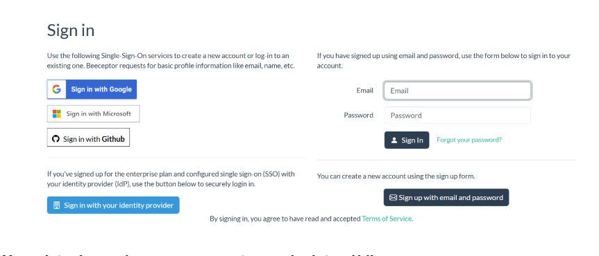
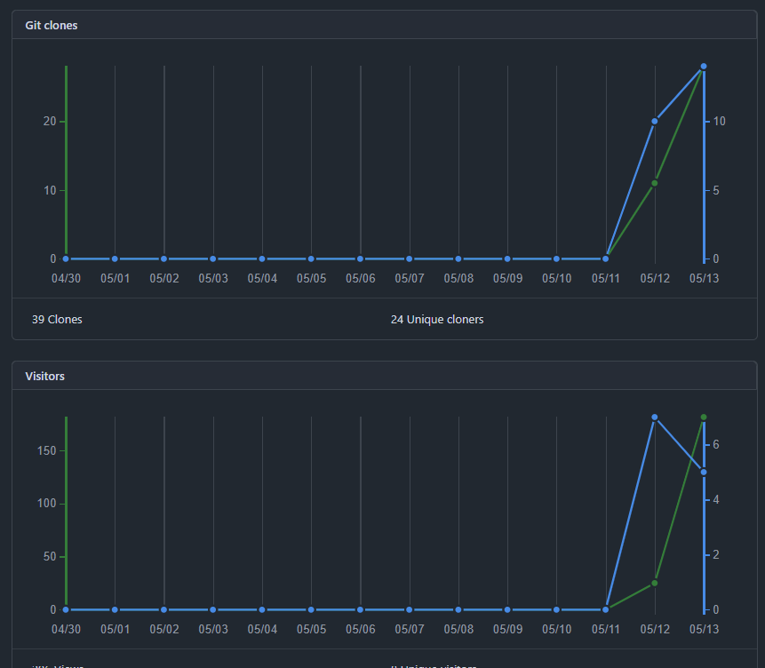
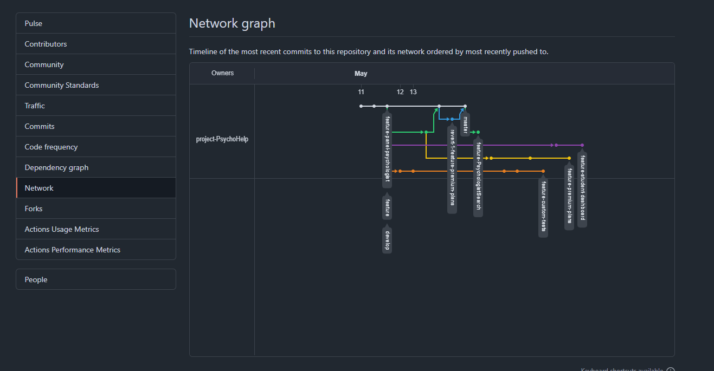

# PyschoMetric
<h3 align="center"> Universidad Peruana de Ciencias Aplicadas </h3>

<h3 align="center"> Ingeniería de Software </h3>
<h3 align="center"> Ciclo 2025 - 1 </h3>

 

 

    

 

<h3 align="center"> Desarrollo de Aplicaciones Open Source - 4341 </h3>
<h3 align="center"> Profesor del Curso: Juan Antonio Flores Moroco </h3>
<h3 align="center"> "INFORME DE TRABAJO FINAL"</h3>
<h3 align="center"> NOMBRE DE LA EMPRESA: PyschoHelp </h3>

<h3 align="center"> PRODUCTO: "PyschoMetric"</h3>

| 
Alumno
 | 
Código
 |
|:-------------------------------------:|:-------------------------------------:|
|     Joaquin Alberto Cuentas Peña      |              U20201f788               |
|      Walter Luis Fajardo Monrroy      |              U202221632               |
|      Eric Marlon Olivera Barzola      |              U202315032               |
|     Victor Manuel Rojas Reategui      |              U202123655               |                                
|     Geronimo Quispe Pablo Antonio     |              U202314304               |

 Abril 2025 

<h3 align="center"> 2024 </h3>

## Registro de Versiones del Informe

| Versión | Fecha       | Autor                          | Descripción de modificación                  |
|---------|-------------|--------------------------------|----------------------------------------------|
| 0.1     | 06/04/2025  | Todos los integrantes          | Desarrollo del capítulo 1 y 2             |
| 0.2     | 12/04/2025  | Todos los integrantes          | Desarrollo del capítulo 3                    |
| 0.3     | 18/04/2025  | Eric Olivera                   | Desarrollo del capítulo 4 y sprint 1         |

## Project Report Collaboration Insights  

Se han realizado todas las tareas asignadas para la entrega de la TB1, las cuales están en nuestro repositorio de Github: https://github.com/project-PsychoHelp/PyschoMetric

Aqui se pueden en la TB1 evidenciando el trabajo colaborativo

## Tabla de Contenidos

## Student Outcome

| Criterio específico                                                                                      | Acciones realizadas                                                                                                                                                                                                                                                                                                                                                                                                                                                                                                                                                                                                                                                                                                                                                                                                                                                                                                                                                                                                                                                                                                                                                                                                              | Conclusiones                                                                                                                                                                                                                       |
|----------------------------------------------------------------------------------------------------------|----------------------------------------------------------------------------------------------------------------------------------------------------------------------------------------------------------------------------------------------------------------------------------------------------------------------------------------------------------------------------------------------------------------------------------------------------------------------------------------------------------------------------------------------------------------------------------------------------------------------------------------------------------------------------------------------------------------------------------------------------------------------------------------------------------------------------------------------------------------------------------------------------------------------------------------------------------------------------------------------------------------------------------------------------------------------------------------------------------------------------------------------------------------------------------------------------------------------------------|------------------------------------------------------------------------------------------------------------------------------------------------------------------------------------------------------------------------------------|
| 1.c1. Identifica problemas complejos de ingeniería de software.                                          | Cuentas Peña Joaquin Alberto TB1: Se encargó de desarrollar los antecedentes y problemáticas del trabajo para proporcionar una base sólida que facilite el análisis y la formulación de soluciones para la problemática.  Fajardo Monrroy, Walter Luis TB1: Se encargó de desarrollar los antecedentes y problemáticas del trabajo para proporcionar una base sólida que facilite el análisis y la formulación de soluciones para la problemática.  Olivera Barzola, Eric Marlon TB1: Se encargó de desarrollar los antecedentes y problemáticas del trabajo para proporcionar una base sólida que facilite el análisis y la formulación de soluciones para la problemática  Geronimo Quispe ,Pablo Antonio TB1: Se centró en identificar un problema concreto que afecta a los usuarios y ofrecer una solución innovadora. En este caso, la descripción del problema, los usuarios potenciales y los objetivos del proyecto.  Rojas Reategui, Victor Manuel TB1: Se encargó de desarrollar los antecedentes y problemáticas del trabajo para proporcionar una base sólida que facilite el análisis y la formulación de soluciones para la problemática. | TB1: El trabajo realizado en TB1 contribuyó significativamente a la comprensión de la problemática, la formulación de soluciones innovadoras y la estructura de propuestas para resolver problemas específicos en el proyecto. |
| 1.c2. Formula problemas complejos de ingeniería de software aplicando ciencias,matemáticas e ingeniería  | Cuentas Peña Joaquin Alberto TB1: Aplicando la técnica 5W2H, le permitió identificar de manera precisa y brindar un enfoque claro y bien fundamentado para el desarrollo antecedente y problemáticas del trabajo.  Fajardo Monrroy, Walter Luis TB1: Se encargó de desarrollar los antecedentes y problemáticas del trabajo para proporcionar una base sólida que facilite el análisis y la formulación de soluciones para la problemática.  Olivera Barzola, Eric Marlon TB1: Se encargó de desarrollar los antecedentes y problemáticas del trabajo para proporcionar una base sólida que facilite el análisis y la formulación de soluciones para la problemática.  Geronimo Quispe ,Pablo Antonio TB1: Se encargó de desarrollar los antecedentes y problemáticas del trabajo para proporcionar una base sólida que facilite el análisis y la formulación de soluciones para la problemática.  Rojas Reategui, Victor Manuel TB1: Se encargó de desarrollar los antecedentes y problemáticas del trabajo para proporcionar una base sólida que facilite el análisis y la formulación de soluciones para la problemática.                             | TB1: El trabajo realizado en TB1 contribuyó significativamente a la comprensión de la problemática, la formulación de soluciones innovadoras y la estructura de propuestas para resolver problemas específicos en el proyecto. |
| 1.c3. Resuelve problemas complejos de ingeniería de software aplicando ciencias,matemáticas e ingeniería | Cuentas Peña Joaquin Alberto TB1: Se encargó de desarrollar los antecedentes y problemáticas del trabajo para proporcionar una base sólida que facilite el análisis y la formulación de soluciones para la problemática.  Fajardo Monrroy, Walter Luis TB1: Se encargó de desarrollar los antecedentes y problemáticas del trabajo para proporcionar una base sólida que facilite el análisis y la formulación de soluciones para la problemática.  Olivera Barzola, Eric Marlon TB1: Se encargó de desarrollar los antecedentes y problemáticas del trabajo para proporcionar una base sólida que facilite el análisis y la formulación de soluciones para la problemática.  Geronimo Quispe ,Pablo Antonio TB1: El proceso de definir una propuesta de valor refuerza la importancia del aprendizaje continuo en el análisis de problemas reales y en la creación de soluciones centradas en el usuario.  Rojas Reategui, Victor Manuel TB1:Se encargó de desarrollar los antecedentes y problemáticas del trabajo para proporcionar una base sólida que facilite el análisis y la formulación de soluciones para la problemática.                         | TB1: El trabajo realizado en TB1 contribuyó significativamente a la comprensión de la problemática, la formulación de soluciones innovadoras y la estructura de propuestas para resolver problemas específicos en el proyecto. |

    
<h3>Capítulo I: Introducción </h3>
    
        <ul>
            <li><a href="#11-Startup-Profile">1.1. Startup Profile</a></li>
            <li><a href="#111-Descripción-de-la-Startup">1.1.1. Descripción de la Startup</a></li>
            <li><a href="#112-Perfiles-de-Integrantes-del-Equipo">1.1.2. Perfiles de Integrantes del Equipo</a></li>
            <li><a href="#12-Solution-Profile">1.2. Solution Profile</a></li>
            <li><a href="#121-Antecedentes-y-Problemática">1.2.1. Antecedentes y Problemática</a></li>
            <li><a href="#122-Lean-UX-Process">1.2.2. Lean UX Process</a></li>
            <li><a href="#1221-Lean-UX-Problem-Statements">1.2.2.1. Lean UX Problem Statements</a></li>
            <li><a href="#1222-Lean-UX-Assumptions">1.2.2.2. Lean UX Assumptions</a></li>
            <li><a href="#1223-Lean-UX-Hypothesis-Statements">1.2.2.3. Lean UX Hypothesis Statements</a></li>
            <li><a href="#1224-Lean-UX-Canvas">1.2.2.4. Lean UX Canvas</a></li>
            <li><a href="#13-Segmentos-Objetivos">1.3. Segmentos Objetivos</a></li>
        </ul>    

    
<h3>Capítulo II: Requirements Elicitation & Analysis</h3>

        <ul>
            <li><a href="#21-competidores">2.1. Competidores</a></li>
            <li><a href="#211-Análisis-competitivo">2.1.1. Análisis competitivo</a></li>
            <li><a href="#212-Estrategias-y-tácticas-frente-a-competidores">2.1.2. Estrategias y tácticas frente a competidores</a></li>
            <li><a href="#22-Entrevistas">2.2. Entrevistas</a></li>
            <li><a href="#221-Diseño-de-entrevistas">2.2.1. Diseño de entrevistas</a></li>
            <li><a href="#222-Registro-de-entrevistas">2.2.2. Registro de entrevistas</a></li>
            <li><a href="#223-Análisis-de-entrevistas">2.2.3. Análisis de entrevistas</a></li>
            <li><a href="#23-Needfinding">2.3. Needfinding</a></li>
            <li><a href="#231-User-Personas">2.3.1. User Personas</a></li>
            <li><a href="#232-User-Task-Matrix">2.3.2. User Task Matrix</a></li>
            <li><a href="#233-User-Journey-Mapping">2.3.3. User Journey Mapping</a></li>
            <li><a href="#234-Empathy-Mapping">2.3.4. Empathy Mapping</a></li>
            <li><a href="#235-As-is-Scenario-Mapping">2.3.5. As-is Scenario Mapping</a></li>
            <li><a href="#24-Ubiquitous-Language">2.4. Ubiquitous Language</a></li>
        </ul>   

    
<h3>Capítulo III: Requirements Specification </h3>

        <ul>
            <li><a href="#31-To-Be-Scenario-Mapping">3.1. To-Be Scenario Mapping</a></li>
            <li><a href="#32-User-Stories">3.2. User Stories</a></li>
            <li><a href="#33-Impact-Mapping">3.3. Impact Mapping</a></li>
            <li><a href="#34-Product-Backlog">3.4. Product Backlog</a></li>
        </ul>    

    
<h3>Capítulo IV: Product Design </h3>

        <ul>
            <li><a href="#41-Style-Guidelines">4.1. Style Guidelines</a></li>
            <li><a href="#411-General-Style-Guidelines">4.1.1. General Style Guidelines</a></li>
            <li><a href="#412-Web-Style-Guidelines">4.1.2. Web Style Guidelines</a></li>
            <li><a href="#42-Information-Architecture">4.2. Information Architecture</a></li>
            <li><a href="#421-Organization-Systems">4.2.1. Organization Systems</a></li>
            <li><a href="#422-Labeling-Systems">4.2.2. Labeling Systems</a></li>
            <li><a href="#423-SEO-Tags-and-Meta-Tags">4.2.3. SEO Tags and Meta Tags</a></li>
            <li><a href="#424-Searching-Systems">4.2.4. Searching Systems</a></li>
            <li><a href="#425-Navigation-Systems">4.2.5. Navigation Systems</a></li>
            <li><a href="#43-Landing-Page-UI-Design">4.3. Landing Page UI Design</a></li>
            <li><a href="#431-Landing-Page-Wireframe">4.3.1. Landing Page Wireframe</a></li>
            <li><a href="#432-Landing-Page-Mock-up">4.3.2. Landing Page Mock-up</a></li>
            <li><a href="#44-Web-Applications-UXUI-Design">4.4. Web Applications UX/UI Design</a></li>
            <li><a href="#441-Web-Applications-Wireframes">4.4.1. Web Applications Wireframes</a></li>
            <li><a href="#442-Web-Applications-Wireflow-Diagrams">4.4.2. Web Applications Wireflow Diagrams</a></li>
            <li><a href="#443-Web-Applications-Mock-ups">4.4.3. Web Applications Mock-ups</a></li>
            <li><a href="#444-Web-Applications-User-Flow-Diagrams">4.4.4. Web Applications User Flow Diagrams</a></li>
            <li><a href="#45-Web-Applications-Prototyping">4.5. Web Applications Prototyping</a></li>
            <li><a href="#46-Domain-Driven-Software-Architecture">4.6. Domain-Driven Software Architecture</a></li>
            <li><a href="#461-Software-Architecture-Context-Diagrams">4.6.1. Software Architecture Context Diagrams</a></li>
            <li><a href="#462-Software-Architecture-Container-Diagrams">4.6.2. Software Architecture Container Diagrams</a></li>
            <li><a href="#463-Software-Architecture-Components-Diagrams">4.6.3. Software Architecture Components Diagrams</a></li>
            <li><a href="#47-Software-Object-Oriented-Design">4.7. Software Object-Oriented Design</a></li>
            <li><a href="#471-Class-Diagrams">4.7.1. Class Diagrams</a></li>
            <li><a href="#472-Class-Dictionary">4.7.2. Class Dictionary</a></li>
            <li><a href="#48-Database-Design">4.8. Database Design</a></li>
            <li><a href="#481-Database-Diagram">4.8.1. Database Dagram</a></li>
        </ul>    

    
<h3>Capítulo V: Product Implementation, Validation & Deployment</h3> 

        <ul>
            <li><a href="#51-software-configuration-management">5.1. Software Configuration Management</a></li>
            <li><a href="#511-software-development-environment-configuration">5.1.1. Software Development Environment Configuration</a></li>
            <li><a href="#512-source-code-management">5.1.2. Source Code Management</a></li>
            <li><a href="#513-source-code-style-guide-conventions">5.1.3. Source Code Style Guide & Conventions</a></li>
            <li><a href="#514-software-deployment-configuration">5.1.4. Software Deployment Configuration</a></li>
            <li><a href="#52-landing-page-services-applications-implementation">5.2. Landing Page, Services & Applications Implementation</a></li>
            <li><a href="#521-sprint-1">5.2.1. Sprint 1</a></li>
            <li><a href="#5211-sprint-planning-1">5.2.1.1. Sprint Planning 1</a></li>
            <li><a href="#5212-aspect-leaders-and-collaborators">5.2.1.2. Aspect Leaders and Collaborators</a></li>
            <li><a href="#5213-sprint-backlog-1">5.2.1.3. Sprint Backlog 1</a></li>
            <li><a href="#5214-development-evidence-for-sprint-review">5.2.1.4. Development Evidence for Sprint Review</a></li>
            <li><a href="#5215-execution-evidence-for-sprint-review">5.2.1.5. Execution Evidence for Sprint Review</a></li>
            <li><a href="#5216-services-documentation-evidence-for-sprint-review">5.2.1.6. Services Documentation Evidence for Sprint Review</a></li>
            <li><a href="#5217-software-deployment-evidence-for-sprint-review">5.2.1.7. Software Deployment Evidence for Sprint Review</a></li>
            <li><a href="#5218-team-collaboration-insights-during-sprint">5.2.1.8. Team Collaboration Insights during Sprint</a></li>
        </ul>        

## Capítulo I: Introducción 

### 1.1. Startup Profile
#### 1.1.1. Descripción de la Startup

Elegir una carrera profesional puede ser una de las decisiones más difíciles en la vida de un joven. Muchos estudiantes se sienten inseguros, confundidos o insatisfechos con la elección que han tomado, lo que puede llevar a la deserción o frustración académica.
PsychoMetric nace para responder a esta problemática con una plataforma integral que conecta a jóvenes de entre 15 y 19 años con psicólogos vocacionales. Nuestra aplicación PsychoHelp brindará acceso a distintos planes de nivel, en los cuales el estudiante podrá encontrar test psicométricos especializados, recibir orientación personalizada, y obtener planes académicos alineados a sus intereses. Con todo ello, ayudamos a que los estudiantes tomen decisiones informadas y conscientes sobre su futuro profesional.
Además, brindamos a los psicólogos una herramienta para gestionar sus servicios, atender estudiantes desde cualquier lugar y participar activamente en el desarrollo vocacional de los jóvenes.
Como resultado final, la aplicación mostrará la compatibilidad del usuario con programas académicos y universidades que se ajustan a su perfil, facilitando así la toma de decisiones de los estudiantes de manera responsable e informada para su futuro académico y profesional.

**Objetivo**
Desarrollar una plataforma digital que facilite la orientación vocacional de jóvenes entre 15 y 19 años, combinando pruebas psicométricas, sesiones con psicólogos certificados y generación de planes académicos personalizados. Al mismo tiempo, brindar a los profesionales en psicología un espacio para ofrecer sus servicios, conectar con estudiantes y contribuir activamente en su desarrollo vocacional.
**Misión**
Brindar a los jóvenes una orientación vocacional precisa, accesible y personalizada mediante herramientas tecnológicas y el acompañamiento de psicólogos vocacionales. Al mismo tiempo, potenciar el trabajo de los profesionales, facilitando su conexión con estudiantes y apoyando su labor mediante una plataforma intuitiva, segura y eficiente.
**Visión**
Ser la plataforma líder en orientación vocacional en el país, revolucionando la forma en que los jóvenes descubren su vocación y eligen su camino académico y profesional. Aspiramos a reducir la deserción educativa, empoderar a los psicólogos en su rol como guías, y formar una nueva generación de profesionales motivados con su propósito.

#### 1.1.2. Perfiles de Integrantes del Equipo
| Miembros del equipo                                                                  | Codigo Estudiante | Descripcion                                                                                                                                                                                                                                                                                                                                                                                                                                                                                                                                                                                                                                                                                                     |
|--------------------------------------------------------------------------------------|-------------------|-----------------------------------------------------------------------------------------------------------------------------------------------------------------------------------------------------------------------------------------------------------------------------------------------------------------------------------------------------------------------------------------------------------------------------------------------------------------------------------------------------------------------------------------------------------------------------------------------------------------------------------------------------------------------------------------------------------------|
| Eric Marlon Olivera Barzola	 | U202315032        | Soy Eric Marlon Olivera Barzola, actualmente estoy cursando el quinto ciclo académico correspondiente. Mi experiencia me ha dotado de la capacidad para abordar tareas relacionadas con el diseño, programación y resolución de problemáticas en el ámbito del lenguaje de programación C++. Asimismo, estoy en proceso de adquirir conocimientos en C# y JavaScript.                                                                                                                                                                                                                                                                                                                                           | 
| Joaquin Alberto Cuentas Peña             | U20201f788        | Soy estudiante de la UPC de la carrera de Ingeniería de Software y me encuentro cursando el 5to ciclo. Cuento con habilidades de programación en C++ y Python, así como aptitudes para el desarrollo en UX y UI. Asimismo, en cuanto a habilidades extracurriculares, he contribuido en proyectos con edición de video y fomentando una actitud colaborativa en equipo                                                                                                                                                                                                                                                                                                                                          |
| Walter Luis Fajardo Monrroy                | U202221632        | Soy Walter Luis Fajardo Monrroy, cuento con 20 años y por motivos de estudio resido en Lima. Soy estudiante de la carrera de ingeniería de software, en mi formación como estudiante durante estos ciclos adquirí conocimientos en programación principalmente con lenguaje C + + y python, También cuanto con conocimientos en patrones de software al momento de realizar mis proyectos, además de experiencia realizando diagramas de clases y empleando el DDD (Diseño orientado a objetos). Las habilidades primarias para resaltar serían la responsabilidad y resiliencia frente a las adversidades. Cuento con experiencia en organización y trabajo grupal lo cual emplearé para beneficio del equipo. |
| Victor Manuel Rojas Reategui               | U202123655        | Mi nombre es Victor Rojas y voy en el 5to ciclo de la carrera de Ingeniería de Software. Me gusta lo rápido que cambia la tecnología en la actualidad, por lo que este curso me ayudará a expandir mis conocimientos y a explorar nuevas aplicaciones de mi carrera que no había experimentado antes.                                                                                                                                                                                                                                                                                                                                                                                                           |
| Geronimo Quispe Pablo Antonio          | u202314304        | Mi nombre es Pablo,tengo 19 años y soy estudiante de Ingeniería de Software en la UPC, sede San Miguel. Soy una persona decidida, confiable, responsable y honesta con mi grupo de trabajo ,siendo lo más útil posible. Tengo conocimientos en C++ y java,python. Cada día trato de dar una mejor versión de mi y aprender de mis errores.                                                                                                                                                                                                                                                                                                                                                                      |
                                                                                                                                                                                                                                                                                                                                                                                                                                                                                                                                                                                                                                                                                                          

### 1.2. Solution Profile

#### 1.2.1. Antecedentes y Problemática (usando The 5W'S y 2 'H's)
Uno de los problemas más comunes entre los estudiantes de secundaria y universitarios de primeros ciclos es la dificultad para elegir una carrera profesional adecuada. Esta situación se debe a diversos factores interrelacionados. Muchos jóvenes no cuentan con un adecuado nivel de autoconocimiento, lo que impide que puedan identificar claramente sus intereses, habilidades, valores y motivaciones personales. Esta falta de claridad sobre sí mismos afecta directamente su capacidad para tomar decisiones vocacionales informadas.
De acuerdo con un informe de la UNESCO (2021), la orientación vocacional es clave para mejorar la satisfacción estudiantil. Sin embargo, en América Latina, más del 60 % de los estudiantes no recibe ningún tipo de acompañamiento en este proceso.
Nuestro objetivo es comprender las necesidades de nuestros usuarios, por lo tanto, hemos analizamos sus historiales y la problemática bajo el enfoque de las 5 ‘W’s y 2 ‘H’s.

**What (Qué)**
- ¿Cuál es el problema?
Muchos estudiantes de secundaria y universitarios de primeros ciclos enfrentan confusión, inseguridad o frustración al elegir una carrera profesional. Este problema está relacionado con la falta de autoconocimiento, la ausencia de orientación vocacional personalizada y el desconocimiento de la oferta académica. Como resultado, muchos jóvenes toman decisiones desinformadas que pueden derivar en abandono académico, cambios de carrera o baja satisfacción profesional.

**When (Cuando)**
Este problema se presenta en momentos decisivos del desarrollo académico:
- Al terminar la secundaria, cuando deben elegir una carrera o postular a una universidad.

- En el caso de los psicólogos, cuando buscan posicionarse profesionalmente y captar nuevos usuarios, pero no encuentran canales accesibles ni especializados.

**Where (Dónde)**
- ¿Dónde está el usuario cuando usa el producto?

El problema se origina en espacios educativos tradicionales, como colegios o universidades, donde la orientación vocacional es limitada. También surge en el entorno familiar, donde las expectativas externas pueden influir en la toma de decisiones sin una base personal sólida.
Los psicólogos enfrentan este problema desde sus entornos laborales, donde muchas veces carecen de herramientas digitales para ampliar su alcance.

**Who (Quién)**
- Usuarios principales: Jóvenes estudiantes, de secundaria (últimos años) y universitarios de primeros ciclos.
- Profesionales involucrados: Psicólogos vocacionales y consejeros certificados que brindan asesoramiento personalizado.

**Why (Por qué)**
- ¿Cuál es la causa del problema?
Las causas clave del problema incluyen:
- Ausencia de programas de orientación vocacional en escuelas.

- Falta de autoconocimiento y herramientas para explorarlo desde edades tempranas.

- Presión social o familiar que dificulta una elección libre e informada.

- Falta de acceso a profesionales especializados.

- Limitaciones para que los psicólogos vocacionales accedan a canales de difusión eficientes.

**How (Cómo)**
- ¿Cómo prefieren los usuarios que sea el producto?
Los estudiantes deben tomar decisiones críticas sin información adecuada, ni guía profesional, y sin entender sus propios intereses y aptitudes. Esto los lleva a elegir por moda, influencia externa o presión, sin un proceso reflexivo.
Al mismo tiempo, los psicólogos enfrentan una baja visibilidad digital, barreras tecnológicas y limitaciones para conectar con personas que realmente necesitan su orientación.

 **How much (Cuánto)**
- ¿Cuánto?
El problema es ampliamente prevalente: según la UNESCO (2021), más del 60 % de los estudiantes en América Latina no recibe orientación vocacional formal. Esta falta de apoyo tiene consecuencias a nivel académico, psicológico y profesional.
Además, muchos psicólogos tienen dificultades para escalar su impacto, a pesar de contar con experiencia. La magnitud de la problemática sugiere una necesidad insatisfecha crítica y constante, tanto en el sistema educativo como en el ejercicio profesional de la psicología vocacional.

#### 1.2.2. Lean UX Process

##### 1.2.2.1. Lean UX Problem Statements

Muchos estudiantes de secundaria enfrentan incertidumbre, confusión o insatisfacción al elegir una carrera profesional, debido a la falta de autoconocimiento, orientación vocacional personalizada y acceso a información clara sobre programas académicos. Esta situación puede llevar a decisiones mal fundamentadas, abandono de estudios o frustración profesional a largo plazo.
Actualmente, no existen soluciones digitales completas, confiables y accesibles que integren evaluaciones psicométricas especializadas, sesiones con psicólogos certificados, informes vocacionales interactivos en PDF y recomendaciones académicas personalizadas dentro de un solo ecosistema.
Además, los psicólogos vocacionales certificados enfrentan dificultades para encontrar espacios digitales que les permitan visibilizar su trabajo, acceder a herramientas especializadas, atraer nuevos clientes potenciales y desarrollarse profesionalmente. No existen plataformas que les ofrezcan beneficios escalables a través de una membresía profesional que valore su expertise y potencie su alcance.

##### 1.2.2.2. Lean UX Assumptions

Los estudiantes de secundaria y universitarios de primeros ciclos experimentan inseguridad y confusión al momento de elegir una carrera profesional.

Su falta de autoconocimiento, la presión social y el desconocimiento de la oferta académica son factores que dificultan una elección adecuada.

Los jóvenes están dispuestos a utilizar herramientas digitales como apoyo para su orientación vocacional.

Dado su nivel de familiaridad con la tecnología, una app móvil o web es un canal accesible y cómodo para este público.

Los usuarios confiarán en los resultados de pruebas psicométricas si estas se presentan de manera clara, profesional y con respaldo especializado.

Una metodología basada en psicología vocacional validada tendrá mayor aceptación que simples tests genéricos disponibles en línea.

El acompañamiento de psicólogos o consejeros certificados será valorado positivamente por los estudiantes.

Las sesiones con especialistas aportan valor agregado a la orientación y aumentan la confianza en la toma de decisiones.

Los estudiantes están dispuestos a pagar por beneficios adicionales como acceso a psicólogos, reportes vocacionales interactivos y detallados, y tests avanzados mediante una suscripción premium.

Los psicólogos certificados están interesados en un modelo de suscripción premium que les permita acceder a herramientas digitales, obtener mayor visibilidad frente a potenciales pacientes y expandir su red de trabajo dentro de una comunidad profesional.

Los estudiantes y psicólogos cuentan con dispositivos y acceso a internet que les permiten interactuar con la plataforma.

Padres de familia, colegios e instituciones educativas valorarán soluciones que apoyen a los jóvenes en sus decisiones vocacionales.

Existe una oportunidad de mercado debido a la falta de soluciones digitales completas, integradas y personalizadas de orientación vocacional.

##### 1.2.2.3. Lean UX Hypothesis Statements

Hypothesis Statement para Estudiantes

**Creemos que** los estudiantes de secundaria necesitan una herramienta digital confiable, intuitiva y profesional que les facilite su decisión vocacional, reduzca su confusión al elegir una carrera y los conecte con especialistas que puedan guiarlos en este proceso.
**Si desarrollamos** una plataforma que incluya:
- Tests psicométricos validados, con versiones gratuitas y premium más profundas.
- Un sistema de recomendaciones de carreras alineado a sus resultados e intereses.
- Reportes vocacionales detallados, visuales y descargables en PDF.
- La opción de agendar sesiones con psicólogos vocacionales directamente desde la app.
- Un seguimiento visual de su progreso vocacional en un dashboard personalizado.

**Entonces:**
- Los estudiantes tomarán decisiones académicas más informadas.
- Se reducirá la decepción por las malas elecciones de carrera.
- Aumentará su confianza, satisfacción y claridad sobre su futuro profesional.
- Se fomentará una cultura de exploración vocacional acompañada, desde etapas tempranas.

Hypothesis Statement para psicólogo

**Creemos que** los psicólogos vocacionales certificados necesitan una plataforma que les permita mostrar su experiencia profesional, atraer nuevos pacientes, gestionar su trabajo vocacional de forma digital y formar parte de una comunidad especializada.
**Si desarrollamos** una app que les ofrezca:
- Un perfil profesional editable con visibilidad dentro del buscador de psicólogos.
- Un sistema de suscripción premium que les brinde posicionamiento destacado.
- Acceso a herramientas digitales para atender, evaluar y generar reportes vocacionales.
- Un panel de control para agendar, revisar y gestionar citas.
- Estadísticas sobre su impacto, sesiones y satisfacción de estudiantes.

**Entonces:**
- Aumentarán sus oportunidades de captar nuevos pacientes.
- Tendrán una herramienta profesional para modernizar su práctica vocacional.
- Se sentirán parte de una comunidad profesional sólida y con valor agregado.

##### 1.2.2.4. Lean UX Canvas

https://miro.com/welcomeonboard/SkxvZDZOSkVFd0p2b0hRLzJiM0ttR0N2MkZRbFdCQld3bkl0VFVUKzZjYlFGQWxLNEk4MkFNZUxlQmdBN3M0K2I0bXhGbUM4UEVZQlVzS21pdFZ0bGtnVG5ZTlRaT1J2bUlsSWxoV3lwTUxyeENGYS9pS1BTTGhGc2tDS3JvcTdBS2NFMDFkcUNFSnM0d3FEN050ekl3PT0hdjE=?share_link_id=110904466604

### 1.3. Segmentos Objetivos

**Jóvenes estudiantes de 15 - 19 años**

**Descripción:**
Adolescentes que se encuentran en la etapa final de la educación secundaria o que recientemente la han terminado. Están próximos a tomar decisiones clave sobre su futuro académico y profesional, pero en muchos casos enfrentan incertidumbre, presión externa e indecisión sobre qué carrera seguir o dónde estudiar.
**Objetivo principal:**
Definir su carrera profesional ideal y elegir la institución educativa alineada a su perfil vocacional.
**Características clave:**
 - En etapa activa de exploración de intereses y habilidades.

 - Sienten presión para tomar decisiones importantes a corto plazo.

 - Influenciados por padres, docentes, amigos y su entorno.

 - Buscan orientación clara, confiable y personalizada.

**Necesidades específicas:**
Identificar sus fortalezas, talentos e intereses mediante herramientas confiables.

 - Recibir sugerencias de carreras compatibles con su perfil.

 - Explorar universidades, carreras y rutas educativas adaptadas a su vocación.

 - Recibir orientación profesional de calidad.

**Psicólogos enfocados en orientación vocacional**

**Descripción:**
Profesionales titulados en psicología con experiencia en orientación vocacional. Buscan digitalizar sus servicios, llegar a más jóvenes, y aprovechar plataformas tecnológicas para ofrecer asesorías personalizadas de manera remota.
**Objetivo principal:**
Ofrecer orientación vocacional personalizada en línea, generar ingresos y ampliar su impacto profesional.
**Características clave:**
 - Formación especializada en psicometría, vocación y asesoramiento juvenil.

 - Interés en plataformas digitales que les permitan crecer profesionalmente.

 - Buscan mayor visibilidad, acceso a nuevos clientes y autonomía en su gestión.

 - Valoran herramientas que faciliten y eleven la calidad de su servicio.

**Necesidades específicas:**
 - Acceder a una red de estudiantes que requieren apoyo vocacional.

 - Contar con una plataforma que centralice la gestión de citas, evaluaciones y reportes.

 - Aplicar pruebas psicométricas y generar informes personalizados de forma digital.

 - Obtener ingresos justos y sostenibles por cada sesión brindada a través de la app.

**Segmentación Geográfica:**
Región: Áreas urbanas de Lima con acceso a internet y una alta concentración de instituciones educativas de nivel secundario y superior.

Distribución: Ciudades grandes y medianas con presencia de colegios, academias preuniversitarias y universidades, donde existe una mayor competitividad académica y presión por tomar decisiones vocacionales acertadas.

**Segmentación Demográfica:**
Edad: Estudiantes entre 15 y 19 años (secundaria y primeros ciclos universitarios).

Nivel Socioeconómico: Clase media y media - alta, con acceso a dispositivos móviles, conectividad y recursos para invertir en orientación personalizada.

Ocupación: Estudiantes activos de secundaria, egresados de colegio en búsqueda de carrera, y universitarios en etapa inicial de estudios.

**Segmentación Psicográfica:**
Estilo de Vida: Jóvenes que utilizan tecnología diariamente, familiarizados con apps educativas, redes sociales y plataformas digitales de aprendizaje.

Valores y creencias: Buscan autoconocimiento, claridad sobre su futuro y una toma de decisiones responsable. Valoran la personalización, la orientación profesional y el acompañamiento humano en procesos importantes de su vida.

## Capítulo II: Requirements Elicitation & Analysis

# 2.1.1. Análisis Competitivo

En esta sección identificamos los principales competidores directos con productos digitales similares.
### Competitive Analysis Landscape 

| Por qué llevar a cabo este análisis? | Este análisis es clave para entender el mercado, las necesidades de los usuarios y cómo Psychometric puede ofrecer soluciones innovadoras y efectivas para poder contrarrestar y mejorar el producto. |
|--------------------------------------|-----------------------------------------------------------------------------------------------------------------------------------------------------------------------------------|

| Características | PsychoHelp | Orientum | Edutest | Universia |
|-----------------|------------|----------|---------|-----------|
| **Perfil**      | **Overview:** PsychoHelp es una aplicación digital que ayuda a estudiantes de secundaria y primeros ciclos universitarios a descubrir su vocación profesional. | Plataforma especializada en orientación vocacional, dirigida a jóvenes que están por elegir carrera. | Ofrece test vocacionales interactivos y herramientas para explorar distintas opciones académicas. Está dirigido a estudiantes de último año de secundaria. | Portal web con test vocacionales gratuitos y contenidos informativos sobre carreras y universidades. Su enfoque está en estudiantes de secundaria. |
| **Ventaja competitiva** ¿Qué valor ofrece a los clientes? | PsychoHelp ofrece una experiencia completa y personalizada, combinando test vocacionales avanzados con asesoría profesional en vivo, lo que permite a los estudiantes tomar decisiones informadas con base en su perfil real y emocional. | Ofrece test vocacionales y asesoría personalizada para ayudar a los jóvenes a identificar la carrera que mejor se adapta a sus intereses. | Brinda test vocacionales interactivos y fáciles de usar para orientar a estudiantes en la elección de una carrera, de forma rápida y gratuita. | Proporciona herramientas vocacionales básicas y contenido informativo sobre universidades y programas académicos en distintos países. |
| **Overview**                 | Aplicación digital que ayuda a estudiantes de secundaria y primeros ciclos universitarios a descubrir su vocación profesional.             | Plataforma especializada en orientación vocacional, dirigida a jóvenes que están por elegir carrera. | Ofrece test vocacionales interactivos y herramientas para explorar distintas opciones académicas. | Portal web con test vocacionales gratuitos y contenidos informativos sobre carreras y universidades. |
| **Ventaja competitiva**      | Experiencia completa y personalizada, combinando test vocacionales avanzados con asesoría profesional en vivo.                            | Ofrece test vocacionales y asesoría personalizada.                                              | Brinda test vocacionales interactivos de forma rápida y gratuita.       | Herramientas vocacionales básicas y contenido informativo sobre universidades y programas académicos. |
| **Mercado objetivo**         | Estudiantes de secundaria y jóvenes universitarios en primeros ciclos con dudas sobre su carrera.                                          | Estudiantes de secundaria, bachillerato, padres y colegios.                                    | Jóvenes de secundaria y preuniversitarios que buscan conocer sus intereses. | Estudiantes de secundaria y universitarios, principalmente en países de habla hispana.                |
| **Estrategias de marketing** | Marketing de contenido, alianzas con colegios y universidades.                                                                             | Charlas y talleres en instituciones educativas, presencia en buscadores.                       | Estrategia freemium, correos y boletines informativos.                  | Alianzas con universidades, contenido web gratuito.                                      |
| **Precios & Costos**         | Freemium: test básico gratuito. Informe detallado: S/ 30 – S/ 50. Sesión con psicólogo: S/ 70 – S/ 100.                                     | Test y asesoría personalizada: S/ 50 – S/ 150.                                                  | Acceso pago: S/ 30 – S/ 50.                                            | Totalmente gratis; financiado por alianzas con universidades y patrocinadores.          |
| **Productos & Servicios**    | Test psicométricos, informes personalizados, recomendaciones de carreras, sesiones con psicólogos.                                         | Test vocacionales psicométricos y asesoría personalizada.                                      | Test vocacionales interactivos con informes detallados de pago.        | Test vocacional gratuito, buscador de carreras, artículos y blogs sobre orientación.     |
| **Canales de distribución**  | Integración en plataformas educativas, plataforma web y aplicación móvil.                                                                  | Plataforma web con agendamiento de sesiones.                                                   | Plataforma web para acceso a tests.                                    | Web y app móvil para facilitar acceso.                                                   |
  | **Fortalezas** | Combina tecnología con atención humana personalizada y una plataforma flexible, desde cualquier lugar. | Ofrece orientación personalizada con psicólogos profesionales, brindando un enfoque más humano y confiable a los usuarios. | Su modelo permite atraer a muchos estudiantes, ofreciendo acceso gratuito a tests básicos. | Cuenta con una sólida red de universidades y amplia presencia en países hispanohablantes. |
| **Debilidades**| Necesita inversión constante en marketing y captación de usuarios. | El modelo de pago limita el acceso a estudiantes con pocos recursos. | No ofrece asesoría profesional, lo que limita su valor agregado. | El test vocacional es básico y carece de personalización. |
| **Oportunidades**| Alta demanda de orientación vocacional entre jóvenes. | Puede expandir su presencia digital y llegar a más estudiantes mediante plataformas en línea. | Integrar servicios de orientación personalizada para diferenciarse de otras plataformas. | Refuerza su servicio vocacional con más tecnología para atraer a una audiencia más joven. |
| **Amenazas**   | Competencia con plataformas consolidadas y gratuitas como Universia y Edutest. | La competencia de plataformas gratuitas puede reducir su cuota de mercado. | La falta de seguimiento humano puede llevar a que los usuarios busquen alternativas más completas. | Startups más especializadas pueden ofrecer servicios más personalizados y dinámicos. |

# 2.1.2. Estrategias y Tácticas frente a Competidores

Estas son las principales estrategias que aplicará **PsychoHelp**:

- Ofrecer orientación personalizada y humana combinada con test psicométricos avanzados.
- Ofrecer una versión básica gratuita con opciones de pago para resultados más detallados y servicios adicionales.
- Establecer alianzas con colegios, universidades y centros educativos para integrar **PsychoHelp** como herramienta oficial de orientación vocacional.
- Desarrollar una app móvil atractiva y fácil de usar, optimizada para el público joven.
- Proponer test vocacionales basados en psicometría confiable, más allá de simples cuestionarios de personalidad.

# 2.2. Entrevistas

## 2.2.1. Diseño de Entrevistas

### Preguntas para estudiantes de últimos años de colegio (4to y 5to de secundaria)

1. ¿Has pensado qué carrera te gustaría seguir después del colegio? ¿Por qué?
2. ¿Cuál es tu mayor motivación al pensar en tu futuro? ¿Y tu mayor miedo?
3. ¿Qué tan seguro/a te sientes sobre tu elección profesional?
4. ¿Has hecho alguna vez un test vocacional? ¿Cómo fue tu experiencia?
5. ¿A quién acudes cuando necesitas orientación sobre tu futuro académico?
6. ¿Qué tipo de herramientas digitales usas con frecuencia (apps, redes, plataformas educativas)?
7. ¿Qué características valoras en una plataforma que te ayude a elegir tu carrera?
8. ¿Qué te frustra o preocupa al pensar en tu futuro profesional?
9. ¿Cómo te gustaría que te ayuden a descubrir tu vocación? ¿Qué formato prefieres?

### Preguntas para Psicólogos y Consejeros Vocacionales Certificados

1. ¿Cuánto tiempo llevas trabajando en orientación vocacional?
2. ¿Qué tipo de estudiantes atiendes con más frecuencia? ¿Edad, nivel educativo?
3. ¿Cómo es el proceso que sigues para orientar a un estudiante?
4. ¿Qué herramientas digitales usas actualmente en tus sesiones?
5. ¿Qué tipo de dificultades encuentras al orientar a jóvenes?
6. ¿Qué aspectos consideras esenciales en un test vocacional?
7. ¿Qué tan abierto estás a colaborar con plataformas digitales de orientación?
8. ¿Qué te parecería tener una app que te conecte directamente con estudiantes?
9. ¿Qué necesitarías para confiar en una plataforma como **PsychoHelp**?

### 2.2.2. Registro de entrevistas
#### Segmento 1:Jóvenes estudiantes de 15 - 19 años ####

- Entrevista N°1: Adrian Valera
- Sexo: Masculino
- Edad: 17 años

- Ubicación en la que vive olivos, Lima, Perú

#### Entrevista: ####
link: https://upcedupe-my.sharepoint.com/:v:/g/personal/u202314304_upc_edu_pe/EbkmdeLghNhGjq4V5uYy5esBiOXestT9hokV-ZV7bz5WRg?e=UARbDo&nav=eyJyZWZlcnJhbEluZm8iOnsicmVmZXJyYWxBcHAiOiJTdHJlYW1XZWJBcHAiLCJyZWZlcnJhbFZpZXciOiJTaGFyZURpYWxvZy1MaW5rIiwicmVmZXJyYWxBcHBQbGF0Zm9ybSI6IldlYiIsInJlZmVycmFsTW9kZSI6InZpZXcifX0%3D

- Momento en el que inicia: 0:02

- Duración: 7:07

**Resumen:**
Adrián es un joven que actualmente cursa el quinto año de secundaria en el colegio Trilce, sede Los Olivos. Nos comparte que, aunque todavía no ha decidido con claridad qué carrera le gustaría seguir, una de las opciones que más le atrae es Psicología, ya que considera que es una profesión interesante y, en sus palabras, "bastante tranquila".
Además, Adrián nos comentó que en alguna ocasión realizó un test vocacional con el acompañamiento de un psicólogo, sin embargo, la experiencia no resultó tan útil o reveladora como él esperaba. A pesar de ello, mantiene la curiosidad y apertura por seguir explorando su vocación.
En ese sentido, está dispuesto a probar nuevas alternativas y le parece una idea interesante la posibilidad de realizar un test vocacional en línea, siempre y cuando exista la guía de un profesional que pueda orientarlo adecuadamente durante el proceso. Considera que contar con una plataforma digital o aplicación que combine tecnología con asesoramiento humano sería una buena forma de ayudar a estudiantes como él a descubrir una carrera que realmente se ajuste a sus intereses y personalidad.

- Entrevista N°2: Elvis Larico
- Sexo: Masculino
- Edad: 17 años
- Ubicación en la que vive magdalena, Lima, Perú

#### Entrevista: ####
link:https://drive.google.com/file/d/12zpl-imeFKodLIK2MSkcLZRE6kfCeG6q/view?usp=sharing
- Momento en el que inicia: 0:00
- Duración: 6:08
  
**Resumen:**
Nuestro entrevistado, quien actualmente cursa el 5to grado de secundaria, nos comentó que siente un marcado interés por la carrera de Matemáticas Puras, aunque aún presenta cierta ambivalencia respecto a otras opciones profesionales, ya que no ha tomado una decisión definitiva.
Durante la conversación, mencionó que los test vocacionales que ha realizado hasta el momento han sido ofrecidos únicamente por su colegio y que, lamentablemente, no han contado con un seguimiento personalizado por parte de un psicólogo, lo que ha dificultado obtener resultados más claros y confiables.
Por otro lado, resaltó que sus padres le brindan flexibilidad al momento de elegir su futura carrera, ya que su principal consejo es que tome una decisión libre y sin presiones, buscando siempre lo que lo haga sentir realizado.
Además, expresó su interés en probar una plataforma digital que no solo ofrezca test vocacionales, sino que también proporcione un acompañamiento continuo, algo que hasta ahora siente que ha faltado en su proceso de orientación. Señaló que, al contar con este tipo de ayuda, sentiría mayor seguridad en su elección de carrera.
Finalmente, manifestó que estaría totalmente dispuesto a contactar con un psicólogo a través de la plataforma, ya que considera que el seguimiento profesional es clave para asegurarse de elegir una carrera que realmente se ajuste a sus intereses y habilidades.

**Entrevista N°3: Alejandro Bravo**
- Sexo: Masculino
- Edad: 17 años
- Ubicación en la que vive   San miguel, Lima, Perú
  

#### Entrevista: #####
link:https://upcedupe-my.sharepoint.com/:v:/g/personal/u202314304_upc_edu_pe/EdFC8tauorhEuMi__ESOCRgBaBfZJhHZCFduqWM33oQudg?e=6k7wes

- Momento en el que inicia: 0:00
- Duración: 4:56
  
**Resumen:**
En esta oportunidad, se entrevistó a Alejandro Bravo Castillo, un estudiante que está próximo a culminar su grado de secundaria. Durante la conversación, Alandro compartió que ya ha pensado en su futura carrera profesional y se siente bastante atraído por el mundo del Derecho, ya que le interesa mucho todo lo relacionado con las leyes y sueña con convertirse en abogado.
Al preguntarle sobre sus motivaciones y temores, Alandro comentó que su mayor motivación es poder construir un futuro aprendiendo sobre una carrera que le apasione. Sin embargo, también reconoció que su mayor miedo es cometer errores en el camino, aunque entiende que es algo natural en cualquier proceso de aprendizaje.
Respecto a la seguridad sobre su elección, mencionó que se siente seguro por ahora, aunque es consciente de que solo al iniciar la carrera podrá confirmar si realmente es lo que le gusta. Cuando necesita orientación o apoyo sobre su futuro académico, suele acudir principalmente a sus padres, su abuela y en ocasiones también a sus amigos para conocer sus opiniones.
Finalmente, mencionó que acceder a una videollamada con un psicólogo sería algo sencillo para él, ya que considera que es una opción práctica, cómoda y accesible desde cualquier lugar, sin necesidad de salir de casa.

#### Segmento 2:Psicólogos enfocados en orientación vocacional ####

**Entrevista N°1: MarCielo Rugel**
- Sexo: Femenino
- Edad: 23 años
- Ubicación en la que vive olivos, Lima, Perú
  

#### Entrevista: ####

link:https://upcedupe-my.sharepoint.com/:v:/g/personal/u202314304_upc_edu_pe/EcVMA4GvuX5PiYD6y-ZQDQoBMpOEFHInTl34d-NKVHWzAA?e=Xkc9TW
- Momento en el que inicia: 0:00
- Duración: 7:49
  
**Resumen:**
Maricielo es licenciada en Psicología y cuenta con experiencia trabajando en el área de orientación vocacional para estudiantes. Actualmente, se desempeña en el sector de Recursos Humanos, pero conserva un fuerte interés por los procesos de acompañamiento a jóvenes que están en búsqueda de su vocación.
Durante nuestra conversación, Maricielo nos compartió información valiosa sobre cómo se orienta a los estudiantes que aún no han iniciado un proceso vocacional o que no están familiarizados con los test vocacionales. Nos explicó detalladamente el paso a paso que debería seguir un estudiante para realizar un test vocacional de manera adecuada, desde la preparación previa hasta la interpretación de resultados con apoyo profesional.
Además, resaltó que una plataforma vocacional debería contar con un sistema de comunicación rápido y eficaz entre el estudiante y el orientador, para garantizar una mejor conexión y acompañamiento personalizado. También hizo énfasis en que, para generar confianza en el producto, sería fundamental implementar un sistema de filtrado o validación de profesionales, que asegure que quienes orientan a los estudiantes cuenten con la preparación y experiencia necesarias.
Su perspectiva refuerza la importancia de unir la tecnología con un enfoque humano y profesional para ofrecer una experiencia vocacional confiable, útil y accesible.

**Entrevista N°2:  Antonella Rugel**
- Sexo: Femenino
- Edad: 28 años
- Ubicación en la que vive olivos, Lima, Perú

#### Entrevista: ####

link:https://upcedupe-my.sharepoint.com/:v:/g/personal/u202314304_upc_edu_pe/EfgU6lkVBSdAu4djjhTMSGABFNyjN-QAbxvux7EK8lC03w?e=HzHUxX&nav=eyJyZWZlcnJhbEluZm8iOnsicmVmZXJyYWxBcHAiOiJTdHJlYW1XZWJBcHAiLCJyZWZlcnJhbFZpZXciOiJTaGFyZURpYWxvZy1MaW5rIiwicmVmZXJyYWxBcHBQbGF0Zm9ybSI6IldlYiIsInJlZmVycmFsTW9kZSI6InZpZXcifX0%3D
- Momento en el que inicia: 0:00
-Duración: 7:49

**Resumen:**
Antonella Rugel es licenciada en Psicología y actualmente se desempeña en el área de salud psicológica. Cuenta con más de tres años de experiencia brindando orientación a jóvenes en la búsqueda de su vocación, utilizando herramientas como los test de Holland y Kuder.
Sin embargo, Antonella nos comentó que, a pesar de ser herramientas útiles, estos test presentan una limitación importante: no incluyen todas las carreras que existen actualmente, lo que puede restringir las opciones para los estudiantes y limitar su visión sobre el amplio abanico de posibilidades profesionales.
Durante su experiencia, ha observado que las carreras que los jóvenes suelen descartar con mayor frecuencia son las relacionadas con humanidades, así como algunas otras que, en muchos casos, no cuentan con la aprobación o respaldo de sus padres. En contraste, las carreras que suelen tener más interés y demanda son aquellas vinculadas a las ingenierías, la medicina y la arquitectura, debido a su prestigio social y las expectativas familiares.
Antonella también resaltó la importancia del rol que cumplen los padres en este proceso, ya que, en varias situaciones, no solo se orienta al estudiante, sino que también se trabaja con la familia para que exista un entendimiento y acompañamiento adecuado.En algunos casos la desinformación de los jóvenes puede ser muy preocupante para los psicólogos al evaluarlos.

**Entrevista N°3  Juan Requejo**
- Sexo: Másculino
- Edad: 24 años
- Ubicación en la que vive: Pueblo Libre, Lima, Perú

#### Entrevista: ####
- link:https://youtu.be/IuQXwxSmHgA 
- Momento en el que inicia: 0:00
- Duración: 3:39

**Resumen:**
El psicólogo Juan Requejo  entrevistado tiene 2 años de experiencia en orientación vocacional, trabajando con jóvenes de 15 a 20 años que suelen estar en sus últimos años de secundaria o en los primeros ciclos universitarios.El proceso que sigue empieza con una entrevista inicial, luego aplica pruebas psicométricas, conversa los resultados y termina elaborando un plan de acción personalizado.
Actualmente usa Google Meet, Zoom y formularios online, aunque considera que estas herramientas están muy dispersas y sería mejor tener todo en una plataforma integrada.
Considera que un buen test vocacional debe ser científicamente valido,visualmente claro y atractivo, relacion de  los resultados con carreras y opciones reales y adaptable a diferentes edades y con análisis cualitativo.
Está muy a favor de usar plataformas digitales y considera que una app que conecte psicólogos con estudiantes sería ideal para facilitar todo el proceso. Para confiar en una plataforma como Psycho Hell pide que tenga respaldo ético y profesional,tests integrados y confiables,confidencialidad garantizada,un servicio premium que ofrezca valor real.

 ### 2.2.3. Análisis de entrevista
 **Segmento 1:Jóvenes estudiantes de 15 - 19 años**
 **Entrevista 1:** Adrian Valera
**Análisis de la entrevista:** Adrián nos comentó que le gustaría contar con una plataforma de orientación vocacional, siempre y cuando esta cuente con certificaciones oficiales y ofrezca una guía personalizada durante todo el proceso. Además, señaló que los test vocacionales en formato físico que ha realizado anteriormente no le han resultado útiles ni satisfactorios, por lo que considera que una plataforma bien estructurada y acompañada por profesionales podría brindarle mayor confianza y mejores resultados.

 **Entrevista 2: Elvis Liraco**
 **Análisis de la entrevista:**  Elvis nos comento que estaria dispuesto a intentar usar la plataforma en un futuro ya que los test que le realizaban eran muy generales siempre y cuando tenga la seguridad que sean confiables 

 **Entrevista 3: Alejandro bravo**
**Análisis de la entrevista:** Alejandro bravo nos comento que uno de sus mayores temores seria al equivocarse de carrera aunque le guste mucho la carrera de derecho tiene miedo de dejarlo tambien nos comentó que estaria dispuesto a entablar un seguimiento de test vocacional con un psicólogo de guia a traves de la plataforma.
Gráficos Complementarios al análisis

**Segmento 2:Psicólogos enfocados en orientación vocacional**

**Entrevista 1:  Maricielo Rugel**
**Análisis de la entrevista:** Maricielo destaca la importancia de combinar herramientas digitales con acompañamiento profesional en los procesos de orientación vocacional. Subraya que la confianza del estudiante depende tanto de la calidad del seguimiento humano como de un sistema seguro y validado, lo que confirma la necesidad de plataformas que integren tecnología con respaldo ético y profesional.
 **Entrevista 2: Antonella Rugel**
 **Análisis de la entrevista:** El testimonio de Antonella Rugel resalta la importancia de contar con acompañamiento constante y profesional durante la orientación vocacional. Subraya que la falta de seguimiento y la poca personalización en los test tradicionales afectan la confianza del estudiante, lo que refuerza la necesidad de crear plataformas que integren soporte humano y tecnología confiable para guiar de forma efectiva a los jóvenes en su elección de carrera.
 **Entrevista 3: Juan Requejo**
 **Análisis de la entrevista:** El testimonio de Juan Requejo evidencia que muchos jóvenes enfrentan inseguridad y desinformación al momento de elegir una carrera, especialmente cuando no reciben un acompañamiento adecuado. Su experiencia resalta la importancia de que las plataformas vocacionales combinen herramientas digitales confiables con orientación profesional personalizada, facilitando así decisiones más claras y seguras para los estudiantes.
Gráficos Complementarios al análisis

## 2.3. Needfinding

#### 2.3.1. User Personas
Los User personas se realizaron en base a las distintas personas que entrevistamos según nuestros segmentos objetivos.
**Estudiante de 4to año de secundaria:**

**Psicólogo certificado:**

#### 2.3.2. User Task Matrix
En esta sección vamos a detallar las tareas que realizan los diferentes segmentos de usuarios representados por los User Personas de PsychoHealth.
**Estudiante de 4to año de secundaria: Enrique Gonzalo**

| Actividades                                         | Frecuencia     | Importancia |
|-----------------------------------------------------|----------------|-------------|
| Realizar un test vocacional interactivo             | Frecuentemente | Alta        |
| Obtener recomendaciones de carreras y programas     | Ocasionalmente | Alta        |
| Ver universidades compatibles con su perfil         | Frecuentemente | Media       |
| Ver experiencias o testimonios de otros estudiantes | Ocasionalmente | Media       |
| Pedir recomendaciones a vecinos o conocidos         | Rara vez       | Baja        |

**Psicólogo certificado: Luiz Ramirez**

| Actividades                                                | Frecuencia     | Importancia |
|------------------------------------------------------------|----------------|-------------|
| Brindar sesiones de orientación vocacional                          | Frecuentemente  | Alta        |
| Coordinar fechas y horarios con estudiantes           | Frecuentemente  | Alta        |
| Promocionar sus servicios profesionalmente                    | Ocasional     | Media       |
| Analizar resultados de pruebas psicométricas          | Ocasional     | Alta       |
| Actualizar certificaciones profesionales o colegiaturas              | Rara vez       | Media       |

#### 2.3.3. User Journey Mapping

**USER PERSONA: Enrique Gonzalo**

Enrique Gonzales atraviesa un camino marcado por la incertidumbre y la presión, con decisiones que percibe como determinantes para su futuro pero con muy poca orientación personalizada. Aunque intenta buscar ayuda en internet, en su entorno o en charlas del colegio, su experiencia es confusa, genérica y poco útil.
Sus mayores frustraciones están en:

    * La sobrecarga de información sin una guía clara para filtrar opciones.

    * La falta de autoconocimiento sobre sus fortalezas, intereses y talentos.

    * La presión externa de padres y entorno que opacan su propio criterio.

    * La ausencia de herramientas accesibles que le ayuden a tomar decisiones de forma objetiva y emocionalmente segura.

A pesar de esto, Valeria tiene una actitud abierta al aprendizaje, interés en construir su camino y una necesidad genuina de orientación. Esto la convierte en una usuaria ideal para una solución como PsychoHelp

**USER PERSONA: Luis Ramirez**

Luis transita un recorrido profesional donde su vocación de ayudar está limitada por los medios tradicionales con los que trabaja. Aunque tiene formación, experiencia y motivación, su impacto es reducido por tareas administrativas y tecnológicas que lo sobrecargan.
Sus mayores frustraciones están en:
La dificultad para llegar a nuevos pacientes, especialmente jóvenes.

    * Los procesos manuales y poco escalables para agendar, evaluar y cobrar.

    * La falta de una plataforma profesional que centralice sus funciones.

    * La sensación de estar desperdiciando tiempo valioso en lo no clínico.

Aun así, Luis tiene disposición, habilidades y un alto compromiso con su labor como orientador vocacional. Esto lo convierte en un aliado ideal para PsychoHelp.

#### 2.3.4. Empathy Mapping

**USER PERSONA: Enrique Gonzalo**

**USER PERSONA: Luis Ramirez**
.png)

### 2.3.5. As-is Scenario Mapping

**USER PERSONA: Enrique Gonzalo**

Enrique atraviesa un proceso emocionalmente abrumador y poco estructurado. La sobrecarga de información, la presión externa y la falta de autoconocimiento lo llevan a decisiones inseguras y apresuradas. Su necesidad de orientación personalizada y confiable es urgente, convirtiéndo en un usuario ideal para una solución como PsychoHelp que lo guíe con claridad y empatía.

**USER PERSONA: Luis Ramirez**

Luis trabaja con compromiso, pero se enfrenta a procesos manuales, herramientas poco eficientes y limitaciones para escalar su impacto. Esto afecta su motivación y profesionalismo. Una plataforma como PsychoHelp representaría una oportunidad clave para optimizar su práctica, ampliar su alcance y ofrecer un servicio vocacional de mayor calidad y eficiencia.

## 2.4. Ubiquitous Language

| Término en inglés           | Término en español          | Definición                                                                                                           |
|----------------------------|-----------------------------|----------------------------------------------------------------------------------------------------------------------|
| Career Doubt               | Orientación vocacional      | Estado de confusión o inseguridad que siente un estudiante al no tener claridad sobre qué profesión desea seguir.   |
| Premium Subscription       | Suscripción premium         | Plan de pago que permite al usuario acceder a tests avanzados, reportes personalizados y sesiones privadas.         |
| Psychometric Profile       | Perfil psicométrico         | Informe que resume los rasgos psicológicos, habilidades cognitivas y tendencias conductuales de un estudiante.      |
| Vocational Test            | Test vocacional             | Evaluación psicométrica diseñada para identificar intereses, aptitudes y rasgos de personalidad del estudiante.     |
| Career Compatibility       | Compatibilidad vocacional   | Nivel de alineación entre los intereses, habilidades y personalidad del estudiante con determinadas carreras.       |
| Vocational Report          | Informe vocacional          | Documento detallado en PDF con sugerencias de carrera tras una evaluación o sesión de orientación.                  |
| Career Guidance            | Orientación vocacional      | Apoyo personalizado para ayudar a los estudiantes a explorar y decidir su camino académico o profesional.           |

## Capítulo III: Requirements Specification
### 3.1. To-Be Scenario Mapping

El mapeo de escenarios "To-Be" nos permite visualizar cómo será el proceso o flujo de trabajo deseado en el futuro después de implementar las mejoras propuestas. 

**USER PERSONA: Enrique Gonzalo**

Enrique atraviesa un proceso más claro, guiado y confiable para decidir su futuro académico. Gracias a la suscripción premium, accede a tests avanzados, reportes detallados y sesiones con especialistas. Además, adquiere un informe vocacional personalizado que le ofrece una visión integral de su perfil y recomendaciones de universidades. El proceso le genera alivio, seguridad y motivación, ayudándole a tomar decisiones informadas y alineadas a sus intereses.

**USER PERSONA: Luis Ramirez**

Luis se incorpora a PsychoHelp como profesional verificado, gestionando su disponibilidad y tarifas. Brinda orientación vocacional apoyado por reportes psicométricos y recibe pagos directos por sus sesiones, lo que le permite obtener ingresos adicionales y ganar visibilidad profesional. Se siente satisfecho, valorado y reconocido, convirtiendo a la plataforma en una herramienta de crecimiento personal y económico.

### 3.2. User Stories
| User story ID | Título                                 | Descripción                                                                                                                                     | Criterios de aceptación                                                                                                                                                                                                                                                                                                                                                       | Epic    |
|---------------|-----------------------------------------|--------------------------------------------------------------------------------------------------------------------------------------------------|----------------------------------------------------------------------------------------------------------------------------------------------------------------------------------------------------------------------------------------------------------------------------------------------------------------------------------------------------------------------------------|---------|
| US-01         | Registro con correo y contraseña        | Como estudiante nuevo, quiero registrarme en la aplicación con mi correo electrónico y una contraseña, para crear mi perfil personal.          | - Escenario 1: Dado que soy un nuevo usuario, cuando ingreso mi correo válido y una contraseña segura, entonces el sistema debe crear mi cuenta y mostrarme un mensaje de bienvenida.   - Escenario 2: Dado que estoy en la pantalla de registro, cuando ingreso datos inválidos, entonces el sistema debe mostrar mensajes de error claros.                          | EPIC01  |
| US-02         | Inicio de sesión con credenciales       | Como usuario registrado, quiero iniciar sesión con mis credenciales, para acceder con mis actividades en la app.                                | - Escenario 1: Dado que soy un usuario registrado, cuando ingreso mi correo y contraseña correctos, entonces el sistema debe permitirme acceder a mi cuenta.   - Escenario 2: Dado que ingreso una contraseña incorrecta, cuando intento iniciar sesión, entonces el sistema debe indicarme que las credenciales son incorrectas.             | EPIC01  |
| US-03         | Recuperación de contraseña              | Como usuario, quiero poder recuperar mi contraseña si la olvido, para no perder el acceso a mi cuenta.                                          | - Escenario 1: Dado que olvidé mi contraseña, cuando hago clic en “¿Olvidaste tu contraseña?”, entonces el sistema debe solicitar mi correo electrónico.   - Escenario 2: Dado que ingreso un correo válido, cuando el sistema verifica mi cuenta, entonces debe enviarme un enlace para restablecer mi contraseña.                        | EPIC01  |
| US-04         | Registro rápido con Google              | Como estudiante, quiero tener la opción de registrarme con Google, para facilitar el ingreso.                                                   | - Escenario 1: Dado que soy un nuevo usuario, cuando hago clic en "Registrarme con Google", entonces el sistema debe mostrarme una ventana de autenticación de Google.   - Escenario 2: Dado que autorizo el acceso con Google, cuando se complete la autenticación, entonces el sistema debe crear mi perfil automáticamente.             | EPIC01  |
| US-05         | Acceso al menú principal intuitivo      | Como estudiante, quiero acceder a un menú con íconos claros, para navegar fácilmente por la app.                                                | - Escenario 1: Dado que veo el menú, cuando selecciono una opción, entonces el sistema debe llevarme a la funcionalidad correspondiente.   - Escenario 2: Dado que el menú está activo, cuando cambio de sección, entonces el menú debe mantenerse accesible.                                                                      | EPIC02  |
| US-06         | Ingreso a tests psicométricos           | Como estudiante, quiero acceder desde el menú a los tests, para iniciar o continuar mi evaluación vocacional.                                   | - Escenario 1: Dado que estoy en el menú, cuando selecciono "Realizar Test", entonces debo ser redirigido a la pantalla del test.   - Escenario 2: Dado que ya empecé un test antes, cuando ingreso a esa sección, entonces debo ver la opción de continuar desde donde lo dejé.                                                        | EPIC02  |
| US-07         | Agendamiento de sesiones                | Como estudiante, quiero agendar una sesión con un psicólogo desde el menú, para recibir orientación.                                            | - Escenario 1: Dado que estoy en el menú, cuando selecciono "Agendar sesión", entonces el sistema debe mostrarme la disponibilidad de psicólogos.   - Escenario 2: Dado que elijo una fecha y hora, cuando confirmo la reserva, entonces el sistema debe guardarla y enviarme una confirmación.                                 | EPIC02  |
| US-08         | Consulta de resultados anteriores       | Como estudiante, quiero ver mis resultados anteriores desde el menú, para revisar mis áreas de afinidad vocacional.                             | - Escenario 1: Dado que accedo al menú, cuando selecciono "Mis resultados", entonces el sistema debe mostrar un resumen de mis tests completados.   - Escenario 2: Dado que veo mis resultados, cuando selecciono uno, entonces debo acceder al detalle del perfil vocacional y sugerencias académicas.                               | EPIC02  |
| US-09         | Edición de información personal         | Como estudiante, quiero editar mi información personal, para mantener mis datos actualizados.                                                   | - Escenario 1: Dado que accedo al menú, cuando selecciono "Mi perfil", entonces debo ver mis datos actuales.   - Escenario 2: Dado que realizo cambios, cuando guardo la información, entonces el sistema debe actualizar los datos y mostrar un mensaje de éxito.                                                                | EPIC02  |
| US-10         | Menú personalizado para psicólogos      | Como psicólogo, quiero acceder a un menú personalizado, para ver solo las funciones relevantes a mi rol.                                       | - Escenario 1: Dado que soy psicólogo, cuando inicio sesión, entonces debo ver un menú con secciones como “Citas agendadas”, “Estudiantes”, “Resultados” y “Disponibilidad”.   - Escenario 2: Dado que accedo al menú, cuando hago clic en una opción, entonces debo ser redirigido a la sección correspondiente sin errores.        | EPIC03  |
| US-11         | Visualización del calendario de citas           | Como psicólogo, quiero ver un calendario con mis citas agendadas, para organizar mejor mis sesiones.                                                  | - Escenario 1: Dado que accedo a la opción “Citas agendadas”, cuando abro la sección, entonces debo ver un calendario con mis sesiones futuras.   - Escenario 2: Dado que selecciono una cita, cuando hago clic en ella, entonces debo ver detalles como nombre del estudiante, fecha, hora y enlace a la sesión.                 | EPIC03  |
| US-12         | Acceso a perfiles de estudiantes                | Como psicólogo, quiero revisar el perfil de los estudiantes asignados, para conocer su información antes de la orientación.                           | - Escenario 1: Dado que accedo a “Estudiantes”, cuando selecciono un nombre, entonces debo ver información básica.   - Escenario 2: Dado que veo su perfil, cuando accedo a su historial, entonces también debo visualizar sus resultados previos de tests y citas anteriores.                                                 | EPIC03  |
| US-13         | Consulta de resultados psicométricos de estudiantes | Como psicólogo, quiero ver los resultados de los tests psicométricos de cada estudiante, para brindar una orientación más personalizada.           | - Escenario 1: Dado que estoy en el perfil de un estudiante, cuando selecciono “Resultados”, entonces debo ver los datos resumidos del test vocacional.   - Escenario 2: Dado que el estudiante ha completado el test, cuando visualizo los resultados, entonces debo ver niveles de afinidad y sugerencias académicas.           | EPIC03  |
| US-14         | Actualización de disponibilidad                 | Como psicólogo, quiero actualizar mi disponibilidad, para que los estudiantes puedan agendar sesiones conmigo en los horarios adecuados.              | - Escenario 1: Dado que estoy en el menú, cuando selecciono “Disponibilidad”, entonces debo poder añadir o editar días y horarios.   - Escenario 2: Dado que guardo mis cambios, entonces los estudiantes deben ver solo mis horarios actualizados.                                                                             | EPIC03  |
| US-15         | Introducción explicativa al test                | Como estudiante, quiero ver una introducción antes del test, para entender su propósito y cómo responder correctamente.                               | - Escenario 1: Dado que accedo al test, cuando no lo he iniciado, entonces el sistema debe mostrar una pantalla de introducción.   - Escenario 2: Dado que leo la introducción, cuando hago clic en “Comenzar Test”, entonces debo acceder a la primera pregunta.                                                                | EPIC04  |
| US-16         | Interfaz de preguntas clara y simple            | Como estudiante, quiero que el test muestre una pregunta por pantalla con opciones claras, para que sea fácil de responder.                          | - Escenario 1: Dado que estoy en el test, cuando se carga una pregunta, entonces debe mostrarse una sola pregunta con opciones claras.   - Escenario 2: Dado que selecciono una opción, cuando hago clic en “Siguiente”, entonces el sistema debe guardar la respuesta y mostrar la siguiente pregunta.                           | EPIC04  |
| US-17         | Opción para pausar y retomar el test            | Como estudiante, quiero poder pausar el test y retomarlo más adelante, para no perder mis respuestas.                                                 | - Escenario 1: Dado que realizo un test, cuando presiono “Pausar”, entonces el sistema debe guardar automáticamente mi progreso.   - Escenario 2: Dado que regreso al test pausado, cuando selecciono “Continuar Test”, entonces debo retomar desde donde lo dejé.                                                               | EPIC04  |
| US-18         | Resumen inmediato de resultados al finalizar el test | Como estudiante, quiero recibir un resumen al finalizar el test, para conocer mis áreas de afinidad vocacional.                                   | - Escenario 1: Dado que completo el test, cuando finalizo, entonces el sistema debe mostrar un resumen con niveles de afinidad.   - Escenario 2: Dado que veo mis resultados, cuando selecciono una afinidad, entonces el sistema debe mostrar una descripción y carreras relacionadas.                                         | EPIC04  |
| US-19         | Notificación de test completado                 | Como estudiante, quiero recibir una notificación al completar un test, para saber que se guardaron mis resultados.                                   | - Escenario 1: Dado que termino un test, cuando se guarden los resultados, entonces el sistema debe mostrar una notificación en pantalla.   - Escenario 2: Dado que tengo habilitadas las notificaciones, cuando finalizo el test, entonces también debo recibir una notificación por correo o en la app.                           | EPIC04  |
| US-20         | Repetición de tests vocacionales                | Como estudiante, quiero poder repetir un test vocacional, para explorar cambios en mis intereses.                                                    | - Escenario 1: Dado que ya completé un test, cuando accedo a la sección de tests, entonces debo ver la opción de “Repetir Test”.   - Escenario 2: Dado que inicio un nuevo test, cuando lo termino, entonces el sistema debe guardar los nuevos resultados sin eliminar los anteriores.                                              | EPIC04  |
| US-21  | Visualización de diferencias entre plan Free y Premium | Como estudiante, quiero ver las diferencias entre el plan Free y el plan Premium, para elegir el que mejor se adapte a mis necesidades.                     | - Escenario 1: Dado que ingreso a la sección de planes, cuando se cargue la pantalla, entonces debo ver una tabla comparativa clara con los beneficios de ambos planes.   - Escenario 2: Dado que reviso la tabla, cuando selecciono un plan, entonces el sistema debe mostrarme un resumen y el botón para activarlo.                                      | EPIC04 |
| US-22  | Activación del plan Premium                      | Como estudiante, quiero activar el plan Premium desde la app, para acceder a beneficios como tests de mayor nivel, acceso a citas con psicólogos y certificado con mi plan académico adecuado. | - Escenario 1: Dado que estoy en la pantalla de suscripción, cuando selecciono el plan Premium, entonces el sistema debe mostrarme las opciones de pago disponibles.   - Escenario 2: Dado que completo el pago correctamente, cuando se confirme la transacción, entonces mi cuenta debe actualizarse a Premium y mostrar un mensaje de éxito.             | EPIC04 |
| US-23  | Uso continuo del plan Free sin pago              | Como estudiante, quiero seguir usando el plan Free si no deseo pagar, para continuar con funcionalidades de tests vocacionales básicos.                     | - Escenario 1: Dado que no selecciono un plan de pago, cuando ingreso a la app, entonces el sistema debe mantenerme en el plan Free con acceso limitado.   - Escenario 2: Dado que intento acceder a una funcionalidad Premium desde el plan Free, cuando no tengo acceso, entonces el sistema debe mostrarme un aviso que me invite a actualizar mi plan. | EPIC04 |
| US-24  | Comparación de planes desde perfil del psicólogo | Como psicólogo, quiero ver qué incluye el plan Free y Premium para mi perfil profesional, para decidir si necesito actualizar mi cuenta.                    | - Escenario 1: Dado que ingreso como psicólogo, cuando voy a la sección de planes, entonces debo ver una comparativa específica con funcionalidades relevantes para mi rol (número de sesiones, herramientas de análisis, visibilidad, etc.).   - Escenario 2: Dado que visualizo los planes, cuando selecciono uno, entonces el sistema debe mostrarme los beneficios exactos y los pasos para activarlo. | EPIC04 |
| US-25  | Contratación del plan Premium como psicólogo     | Como psicólogo, quiero contratar el plan Premium, para mejorar mi alcance, ofrecer más sesiones y acceder a herramientas de análisis vocacional avanzadas. | - Escenario 1: Dado que selecciono el plan Premium, cuando ingreso los datos de pago y confirmo, entonces el sistema debe procesar la transacción de manera segura.   - Escenario 2: Dado que la suscripción se activa, cuando regreso a mi cuenta, entonces debo ver reflejado el nuevo plan y sus beneficios habilitados.                            | EPIC04 |
| US-26  | Listado de psicólogos con perfil resumido        | Como estudiante, quiero ver un listado de psicólogos disponibles con sus fotos, nombres y descripciones breves, para elegir con quién agendar una sesión.   | - Escenario 1: Dado que ingreso a la pantalla del catálogo, cuando se carga la sección, entonces debo ver una lista con las tarjetas de los psicólogos, incluyendo su nombre, foto, especialidad y una descripción corta.   - Escenario 2: Dado que veo la lista, cuando hago clic en un psicólogo, entonces el sistema debe mostrarme su perfil detallado y horarios disponibles. | EPIC05 |
| US-27  | Filtro por especialidad o disponibilidad          | Como estudiante, quiero filtrar psicólogos por especialidad o disponibilidad, para encontrar más fácilmente uno que se ajuste a mis necesidades.           | - Escenario 1: Dado que estoy en el catálogo, cuando uso el filtro por especialidad (por ejemplo: ansiedad, vocacional, etc.), entonces el sistema debe mostrar solo psicólogos con esa área de enfoque.   - Escenario 2: Dado que activo el filtro por disponibilidad, cuando selecciono un rango de días u horas, entonces debo ver solo a los psicólogos que tienen citas disponibles en ese periodo.         | EPIC05 |
| US-28  | Edición del perfil profesional del psicólogo     | Como psicólogo, quiero editar la descripción de mi perfil en el catálogo, para comunicar mejor mi enfoque terapéutico y experiencia.                        | - Escenario 1: Dado que estoy en mi perfil profesional, cuando selecciono la opción “Editar descripción”, entonces el sistema debe permitirme modificar el texto que ven los estudiantes.   - Escenario 2: Dado que realizo cambios, cuando guardo la descripción, entonces el sistema debe actualizar la información en el catálogo y mostrar un mensaje de confirmación.                         | EPIC05 |
| US-29  | Actualización de disponibilidad en el catálogo   | Como psicólogo, quiero actualizar mi disponibilidad desde el catálogo, para que los estudiantes solo vean horarios reales para agendar sesiones.           | - Escenario 1: Dado que estoy en mi perfil, cuando accedo a “Editar disponibilidad”, entonces el sistema debe mostrarme un calendario editable con días y horas seleccionables.   - Escenario 2: Dado que modifico mi disponibilidad, cuando guardo los cambios, entonces el catálogo debe reflejar las actualizaciones al instante.                            | EPIC05 |
| US-30  | Marcado de psicólogos como favoritos             | Como estudiante, quiero marcar a psicólogos como “favoritos”, para guardar mis opciones preferidas y agendar con ellos más fácilmente en el futuro.        | - Escenario 1: Dado que estoy viendo el perfil de un psicólogo, cuando hago clic en el ícono de “favorito”, entonces el sistema debe guardarlo en mi lista personal de favoritos.   - Escenario 2: Dado que regreso al catálogo, cuando abro mi lista de favoritos, entonces debo ver solo los psicólogos que he marcado previamente, con acceso rápido a su disponibilidad.               | EPIC05 |
| US-31  | Ver de qué trata la página                                | Como visitante de la landing, quiero entender rápidamente de qué trata la plataforma, para saber si me interesa seguir explorando sus servicios.                       | - Escenario 1: Dado que soy un usuario nuevo, cuando ingreso a la página principal, entonces debo ver una sección introductoria con un mensaje claro sobre la plataforma.   - Escenario 2: Dado que estoy haciendo scroll, cuando avanzo por la página, entonces debo encontrar más información sobre la propuesta de valor de PsychoHelp.                        | EPIC06 |
| US-32  | Opiniones de otros usuarios                                | Como usuario, quiero leer opiniones de otros usuarios, para generar confianza antes de registrarme o pagar.                                                              | - Escenario 1: Dado que quiero conocer experiencias, cuando accedo a la sección de testimonios, entonces debo ver comentarios y valoraciones con nombres o perfiles visibles.   - Escenario 2: Dado que estoy explorando reseñas, cuando reviso varios testimonios, entonces debo notar que expresan resultados positivos reales de la plataforma.                  | EPIC06 |
| US-33  | Visualización del apartado: Por qué elegir PsychoHelp     | Como usuario que compara opciones, quiero ver razones claras para elegir esta plataforma, para tomar una decisión informada.                                            | - Escenario 1: Dado que estoy explorando ventajas, cuando accedo a la sección “¿Por qué elegirnos?”, entonces debo ver beneficios destacados respecto a otras soluciones.   - Escenario 2: Dado que leo los puntos comparativos, cuando analizo los beneficios, entonces debo entender qué hace única a la plataforma.                                            | EPIC06 |
| US-34  | Visualización de apartado de cómo funciona la plataforma  | Como usuario nuevo, quiero entender cómo funciona PsychoHelp, para saber qué pasos debo seguir para comenzar.                                                            | - Escenario 1: Dado que quiero saber el proceso, cuando accedo a la sección “Cómo funciona”, entonces debo ver un paso a paso visual e informativo.   - Escenario 2: Dado que reviso los pasos, cuando leo cada descripción, entonces debo tener claridad sobre el flujo de uso del servicio.                                                                | EPIC06 |
| US-35  | Encabezado de navegación                                  | Como usuario de la landing, quiero un menú de navegación visible, para acceder fácilmente a distintas secciones.                                                         | - Escenario 1: Dado que ingreso a la landing, cuando visualizo la parte superior de la página, entonces debo ver un encabezado con enlaces como "Inicio", "Precios", "Psicólogos", "Contacto" y "Login".                                                                                                                 | EPIC06 |
| US-36  | Pie de página de la landing page                          | Como usuario que llega al final de la landing, quiero encontrar información útil en el pie de página, para acceder a soporte, contacto y redes sociales.               | - Escenario 1: Dado que estoy al final de la landing, cuando visualizo el footer, entonces debo encontrar enlaces como contacto, políticas y redes sociales.   - Escenario 2: Dado que hago clic en un enlace del footer, cuando interactúo con los elementos, entonces los enlaces deben funcionar correctamente y abrir según corresponda.                   | EPIC06 |
| TS-37        | Gestión de usuarios registrados                    | Como administrador, quiero ver un listado completo de usuarios registrados (estudiantes y psicólogos), para monitorear su actividad y gestionar cuentas. | - Escenario 1: Cuando accedo al panel de administración, entonces debo ver una tabla con nombre, correo, rol, y estado de cuenta (activo/inactivo).   - Escenario 2: Cuando selecciono un usuario, entonces debo poder ver detalles de su perfil y un historial básico de su actividad.                                                                     | EPIC07  |
| TS-38        | Activación o desactivación de cuentas              | Como administrador, quiero activar o desactivar cuentas de usuario, para mantener el control del acceso a la plataforma.                                | - Escenario 1: Cuando hago clic en una cuenta activa, entonces debo ver la opción de desactivarla con confirmación.   - Escenario 2: Cuando una cuenta es desactivada, entonces el usuario no debe iniciar sesión.                                                                                                                                        | EPIC07  |
| TS-39        | Gestión de sesiones agendadas                      | Como administrador, quiero visualizar todas las sesiones agendadas entre psicólogos y estudiantes, para asegurarme de que el servicio se está prestando adecuadamente. | - Escenario 1: Cuando accedo al panel de citas, entonces debo ver un calendario con todas las sesiones organizadas por fecha y hora.   - Escenario 2: Cuando selecciono una sesión, entonces debo ver detalles como nombres, rol del psicólogo y estatus de la cita.                                                                                      | EPIC07  |
| TS-40        | Estadísticas de uso de la plataforma               | Como administrador, quiero acceder a estadísticas generales de uso (registro, tests completados, sesiones agendadas), para evaluar el desempeño de la app. | - Escenario 1: Cuando accedo al módulo de estadísticas, entonces debo ver gráficos con datos de registros diarios, tests completados y sesiones realizadas.   - Escenario 2: Cuando filtro por rango de fechas, entonces los datos deben actualizarse correctamente.                                                                                       | EPIC07  |
| TS-41        | Gestión de planes y suscripciones                  | Como administrador, quiero gestionar los planes Free y Premium, para modificar beneficios, precios o reglas de acceso.                                  | - Escenario 1: Cuando ingreso a la sección de planes, entonces debo ver todos los planes activos con su configuración actual.   - Escenario 2: Cuando edito un plan, entonces los cambios deben aplicarse de inmediato a los usuarios correspondientes.                                                                                                    | EPIC07  |
| TS-42        | Auditoría de actividad de usuarios                 | Como administrador, quiero tener acceso a un historial de acciones por usuario (inicio de sesión, agendamientos, cambios de perfil), para garantizar trazabilidad. | - Escenario 1: Cuando selecciono un usuario en el panel de administración, entonces debo ver un historial con fecha, hora y tipo de acción realizada.   - Escenario 2: Cuando se produzca una acción crítica (como cambio de plan), debe quedar registrada en el historial.                                                                              | EPIC07  |
| TS-43        | Gestión de reportes y soporte                      | Como administrador, quiero ver y gestionar reportes o solicitudes de soporte enviadas por los usuarios, para darles respuesta oportuna.                 | - Escenario 1: Cuando ingreso a la sección de soporte, entonces debo ver una lista de reportes organizados por prioridad.   - Escenario 2: Cuando resuelvo un reporte, entonces debo marcarlo como cerrado y dejar un comentario.                                                                                                                         | EPIC07  |
| TS-44        | Notificaciones globales del sistema                | Como administrador, quiero enviar notificaciones generales a los usuarios (actualizaciones, mantenimiento), para mantenerlos informados.                | - Escenario 1: Cuando ingreso al módulo de notificaciones, entonces debo redactar y enviar mensajes a todos o por tipo de usuario.   - Escenario 2: Cuando un usuario recibe la notificación, debe aparecer en su bandeja de entrada o en la interfaz principal de la app.                                                                                | EPIC07  |
| TS-45        | Inicio de sesión exitoso con API                   | Como administrador, quiero registrar y validar a los nuevos usuarios mediante una API para que puedan acceder de forma segura a sus respectivas cuentas. | - Escenario 1: Cuando ingreso un correo y contraseña válidos y hago clic en “Iniciar sesión”, entonces la aplicación debe enviar una solicitud POST a la API.   - Escenario 2: Cuando la API responde con éxito (HTTP 200) y devuelve un token, entonces el sistema debe guardar el token y redirigirme con un mensaje de bienvenida.                      | EPIC07  |
| TS-46        | Manejo de error en login fallido mediante API      | Como administrador, quiero llamar a una API que valide si las credenciales de inicio de sesión son incorrectas para que los usuarios sepan qué datos deben corregir. | - Escenario 1: Cuando la API responde con un error (HTTP 401 o 400), entonces el sistema debe mostrar el mensaje “Correo o contraseña incorrectos” y no guardar ningún token.   - Escenario 2: Cuando ocurre un intento fallido, el campo de contraseña se vacía y el botón de login queda deshabilitado hasta nueva respuesta.                   | EPIC07  |
| TS-47        | Visualización de historial de estudiantes          | Como desarrollador, quiero ver la lista de estudiantes con quienes he trabajado para revisar antecedentes.                                               | - Escenario 1: El desarrollador puede acceder a una lista con nombres y fechas de sesiones.   - Escenario 2: La lista permite buscar por nombre o filtrar por fecha.                                                                                                                                                                                    | EPIC07  |
| TS-48        | Registro de nuevos psicólogos                      | Como administrador, quiero registrar un nuevo psicólogo en el sistema para ampliar la oferta de profesionales.                                           | - Escenario 1: El administrador puede ingresar nombre, email y especialización del psicólogo.   - Escenario 2: El nuevo perfil se activa solo después de validación y aprobación.                                                                                                                                                                     | EPIC07  |
| TS-49        | Actualización de la descripción de planes          | Como administrador, quiero actualizar la descripción de un plan de suscripción para reflejar cambios en el servicio.                                     | - Escenario 1: El administrador puede editar nombre, beneficios y precio del plan.   - Escenario 2: Los cambios aparecen en la vista de planes para los estudiantes.                                                                                                                                                                                    | EPIC07  |
| TS-50        | Gestión de opciones de test psicométrico obsoleto | Como administrador, quiero eliminar, agregar o editar opciones de un test psicométrico obsoleto para evitar confusión entre los usuarios.               | - Escenario 1: El administrador puede seleccionar y eliminar un test desde el panel.   - Escenario 2: El test eliminado deja de estar visible para nuevos usuarios, pero se conserva en el historial de quienes ya lo tomaron.                                                                                                                           | EPIC07  |
| TS-51        | Eliminación de suscripciones vencidas              | Como administrador, quiero eliminar una suscripción vencida para mantener actualizada la base de datos.                                                 | - Escenario 1: El administrador puede eliminar suscripciones con estado "vencida" y más de 30 días de antigüedad.   - Escenario 2: Al eliminar, el sistema registra la acción en el log de auditoría.                                                                                                                                                | EPIC07  |

| Épica    | Descripción breve                                                                 |
|----------|------------------------------------------------------------------------------------|
| EPIC01   | Registro e inicio de sesión: funcionalidades básicas de acceso a la plataforma.   |
| EPIC02   | Navegación de estudiantes: menú, acceso a tests, agendamientos y perfil.           |
| EPIC03   | Funcionalidades para psicólogos: citas, estudiantes, resultados y disponibilidad. |
| EPIC04   | Gestión de tests psicométricos y sus resultados, junto a planes Free y Premium.   |
| EPIC05   | Catálogo de psicólogos: listado, filtros, edición de perfil y favoritos.          |
| EPIC06   | Landing page: navegación pública, idiomas, contacto e información.                |
| EPIC07   | Administración: usuarios, sesiones, estadísticas, soporte, notificaciones.        |

### 3.3. Impact Mapping
Impact Mapping nos ayudará a visualizar y planificar cómo nuestro proyecto puede generar un impacto significativo en nuestros usuarios y en nuestro objetivo final. 

### 3.4. Product Backlog
# Product Backlog

| #Orden | UserStory ID | Título                              | Descripción                                                                                                                                   | StoryPoints |
|--------|--------------|-------------------------------------|-----------------------------------------------------------------------------------------------------------------------------------------------|-------------|
| 1   | US-31  | Ver de qué trata la página                           | Como visitante de la landing, quiero entender rápidamente de qué trata la plataforma, para saber si me interesa seguir explorando sus servicios.                                                                  | 5      |
| 2   | US-32  | Opiniones de otros usuarios                          | Como usuario, quiero leer opiniones de otros usuarios, para generar confianza antes de registrarme o pagar.                                                                                                       | 3      |
| 3   | US-33  | Visualización del apartado: Por qué elegir PsychoHelp | Como usuario que compara opciones, quiero ver razones claras para elegir esta plataforma, para tomar una decisión informada.                                                                                      | 3      |
| 4   | US-34  | Visualización de apartado de cómo funciona           | Como usuario nuevo, quiero entender cómo funciona PsychoHelp, para saber qué pasos debo seguir para comenzar.                                                                                                     | 3      |
| 5   | US-35  | Encabezado de navegación                             | Como usuario de la landing, quiero un menú de navegación visible, para acceder fácilmente a distintas secciones.                                                                                                  | 3      |
| 6   | US-36  | Pie de página de la landing page                     | Como usuario que llega al final de la landing, quiero encontrar información útil en el pie de página, para acceder a soporte, contacto y redes sociales.                                                         | 3      |
| 7   | US-21  | Visualización de diferencias entre plan Free y Premium| Como estudiante, quiero ver las diferencias entre el plan Free y el plan Premium, para elegir el que mejor se adapte a mis necesidades.                                                                           | 3      |
| 8   | US-22  | Activación del plan Premium                          | Como estudiante, quiero activar el plan Premium desde la app, para acceder a beneficios como tests de mayor nivel, acceso a citas con psicólogos y certificado con mi plan académico adecuado.                    | 3      |
| 9   | US-23  | Uso continuo del plan Free sin pago                  | Como estudiante, quiero seguir usando el plan Free si no deseo pagar, para continuar con funcionalidades de tests vocacionales básicos.                                                                           | 3      |
| 10  | US-24  | Comparación de planes desde perfil del psicólogo     | Como psicólogo, quiero ver qué incluye el plan Free y Premium para mi perfil profesional, para decidir si necesito actualizar mi cuenta.                                                                          | 3      |
| 11  | US-25  | Contratación del plan Premium como psicólogo         | Como psicólogo, quiero contratar el plan Premium, para mejorar mi alcance, ofrecer más sesiones y acceder a herramientas de análisis vocacional avanzadas.                                                        | 3      |
| 12  | US-05  | Acceso al menú principal intuitivo                   | Como estudiante, quiero acceder a un menú principal con íconos claros y opciones organizadas, para navegar fácilmente por la app.                                                                                 | 5      |
| 13  | US-06  | Ingreso a tests psicométricos desde el menú          | Como estudiante, quiero acceder desde el menú a la sección de tests psicométricos, para iniciar o continuar mi evaluación vocacional.                                                                             | 5      |
| 14  | US-07  | Agendamiento de sesiones desde el menú               | Como estudiante, quiero agendar una sesión con un psicólogo desde el menú, para recibir orientación personalizada.                                                                                                | 3      |
| 15  | US-08  | Consulta de resultados anteriores desde el menú      | Como estudiante, quiero ver mis resultados de test anteriores desde el menú, para revisar mis áreas de afinidad vocacional.                                                                                       | 3      |
| 16  | US-09  | Edición de información personal                      | Como estudiante, quiero editar mi información personal desde el menú, para mantener mis datos actualizados.                                                                                                        | 3      |
| 17  | US-10  | Menú personalizado para psicólogos                   | Como psicólogo, quiero acceder a un menú personalizado al iniciar sesión, para ver solo las funciones relevantes a mi rol.                                                                                        | 3      |
| 18  | US-11  | Visualización del calendario de citas                | Como psicólogo, quiero ver un calendario con mis citas agendadas, para organizar mejor mis sesiones.                                                                                                              | 3      |
| 19  | US-12  | Acceso a perfiles de estudiantes                     | Como psicólogo, quiero revisar el perfil de los estudiantes asignados, para conocer su información antes de la orientación.                                                                                       | 5      |
| 20  | US-13  | Consulta de resultados psicométricos de estudiantes  | Como psicólogo, quiero ver los resultados de los tests psicométricos de cada estudiante, para brindar una orientación más personalizada.                                                                          | 5      |
| 21  | US-14  | Actualización de disponibilidad                      | Como psicólogo, quiero actualizar mi disponibilidad desde el menú, para que los estudiantes puedan agendar sesiones conmigo en los horarios adecuados.                                                            | 5      |
| 22  | US-15  | Introducción explicativa al test                     | Como estudiante, quiero ver una breve introducción antes de comenzar el test, para entender su propósito y cómo responder correctamente.                                                                          | 5      |
| 23  | US-16  | Interfaz de preguntas clara y simple                 | Como estudiante, quiero que el test muestre una pregunta por pantalla con opciones claras, para que sea fácil de responder.                                                                                       | 3      |
| 24  | US-17  | Opción para pausar y retomar el test                 | Como estudiante, quiero pausar el test y retomarlo más adelante, para no perder mis respuestas si tengo que interrumpir la actividad.                                                                             | 3      |
| 25  | US-18  | Resumen inmediato de resultados al finalizar el test | Como estudiante, quiero recibir un resumen con mis resultados apenas finalice el test, para conocer mis áreas de afinidad vocacional.                                                                             | 5      |
| 26  | US-19  | Notificación de test completado                      | Como estudiante, quiero recibir una notificación cuando haya completado un test, para saber que se guardaron correctamente mis resultados.                                                                         | 5      |
| 27  | US-20  | Repetición de tests vocacionales                     | Como estudiante, quiero repetir un test vocacional si lo deseo, para explorar posibles cambios en mis intereses a lo largo del tiempo.                                                                            | 3      |
| 28  | US-26  | Listado de psicólogos con perfil resumido            | Como usuario, quiero ver un listado de psicólogos con un resumen de su perfil, para elegir con quién agendar una sesión.                                                                                          | 3      |
| 29  | US-27  | Filtro por especialidad o disponibilidad             | Como usuario, quiero filtrar los psicólogos por especialidad o disponibilidad, para encontrar al profesional más adecuado para mis necesidades.                                                                   | 5      |
| 30  | US-28  | Edición del perfil profesional del psicólogo         | Como psicólogo, quiero editar mi perfil profesional, para mantener actualizada mi presentación y atraer más estudiantes.                                                                                           | 3      |
| 31  | US-29   | Actualización de disponibilidad en el catálogo     | Como psicólogo, quiero que mi disponibilidad se refleje en el catálogo, para que los estudiantes vean cuándo pueden agendar conmigo.                                                                             | 3      |
| 32  | US-30   | Marcado de psicólogos como favoritos               | Como estudiante, quiero marcar a psicólogos como “favoritos”, para guardar mis opciones preferidas y agendar con ellos más fácilmente en el futuro.                                                             | 5      |
| 33  | US-1    | Registro con correo y contraseña                   | Como estudiante nuevo, quiero registrarme en la aplicación con mi correo electrónico y una contraseña, para crear mi perfil personal y comenzar a usar la plataforma.                                           | 8      |
| 34  | US-2    | Inicio de sesión con credenciales                  | Como usuario registrado, quiero iniciar sesión con mis credenciales, para acceder con mis actividades en la app.                                                                                                 | 5      |
| 35  | US-3    | Recuperación de contraseña                         | Como usuario, quiero recuperar mi contraseña si la olvido, para no perder el acceso a mi cuenta y a mis datos guardados.                                                                                        | 3      |
| 36  | US-4    | Registro rápido con Google                         | Como estudiante, quiero tener la opción de registrarme rápidamente usando mi cuenta de Google, para evitar llenar formularios largos y facilitar el ingreso.                                                    | 5      |
| 37  | TS-37   | Gestión de usuarios registrados                    | Como administrador, quiero ver un listado completo de usuarios registrados (estudiantes y psicólogos), para monitorear su actividad y gestionar cuentas.                                                        | 5      |
| 38  | TS-38   | Activación o desactivación de cuentas              | Como administrador, quiero activar o desactivar cuentas de usuario, para mantener el control del acceso a la plataforma.                                                                                        | 3      |
| 39  | TS-39   | Gestión de sesiones agendadas                      | Como administrador, quiero visualizar todas las sesiones agendadas entre psicólogos y estudiantes, para asegurarme de que el servicio se está prestando adecuadamente.                                          | 3      |
| 40  | TS-40   | Estadísticas de uso de la plataforma               | Como administrador, quiero acceder a estadísticas generales de uso (registro, tests completados, sesiones agendadas), para evaluar el desempeño de la app.                                                      | 3      |
| 41  | TS-41   | Gestión de planes y suscripciones                     | Como administrador, quiero gestionar los planes Free y Premium, para modificar beneficios, precios o reglas de acceso.                                                                                      | 3      |
| 42  | TS-42   | Auditoría de actividad de usuarios                    | Como administrador, quiero tener acceso a un historial de acciones por usuario (inicio de sesión, agendamientos, cambios de perfil), para garantizar trazabilidad.                                         | 3      |
| 43  | TS-43   | Gestión de reportes y soporte                         | Como administrador, quiero ver y gestionar reportes o solicitudes de soporte enviadas por los usuarios, para darles respuesta oportuna.                                                                    | 3      |
| 44  | TS-44   | Notificaciones globales del sistema                   | Como administrador, quiero enviar notificaciones generales a los usuarios (actualizaciones, mantenimiento), para mantenerlos informados.                                                                   | 3      |
| 45  | TS-45   | Inicio de sesión exitoso con API                      | Como administrador, quiero registrar y validar a los nuevos usuarios mediante una API para que puedan acceder de forma segura a sus respectivas cuentas.                                                   | 3      |
| 46  | TS-46   | Manejo de error en login fallido mediante API         | Como administrador, quiero llamar a una API que valide si las credenciales de inicio de sesión son incorrectas para que los usuarios sepan qué datos ingresados deben corregir.                            | 3      |
| 47  | TS-47   | Visualización de historial de estudiantes             | Como desarrollador quiero ver la lista de estudiantes con quienes he trabajado para revisar antecedentes.                                                                                                   | 3      |
| 48  | TS-48   | Registro de nuevos psicólogos                         | Como administrador quiero registrar un nuevo psicólogo en el sistema para ampliar la oferta de profesionales.                                                                                               | 3      |
| 49  | TS-49   | Actualización de la descripción de planes de suscripción | Como administrador quiero actualizar la descripción de un plan de suscripción para reflejar cambios en el servicio.                                                                                         | 3      |
| 50  | TS-50   | Gestión de opciones de test psicométrico obsoleto     | Como administrador quiero eliminar, agregar o editar una opción para el test psicométrico obsoleto para evitar confusión entre los usuarios.                                                               | 3      |
| 51  | TS-51   | Eliminación de suscripciones vencidas                 | Como administrador quiero eliminar una suscripción vencida para mantener actualizada la base de datos.                                                                                                      | 3      |

Para el product Backlog usamos la aplicación de trello:

https://trello.com/b/nhHnQhhc/si729-pyschohelp

## Capítulo IV: Product Design
### 4.1. Style Guidelines
#### 4.1.1. General Style Guidelines
Es necesario estas guías de estilo para la plataforma de orientación vocacional, diseñadas para mantener una presentación consistente y profesional en todos los elementos de la interfaz.

**Branding**

Un cerebro estilizado, pero con un diseño amigable (líneas curvas suaves), integrado con un corazón o una mano que simboliza apoyo y guía.. Este logo representa lo cálida, confiable, profesional y moderna y además transmite la confianza, orientación, descubrimiento y progreso personal.

**Typography**

- Fuente principal: Inter (sans-serif)
- Jerarquía de títulos: H1-H5 con tamaños y pesos específicos
- Texto de cuerpo: Tres tamaños (base, small, caption)
- Estilos especiales: Énfasis, itálica y enlaces

**Colors**

Brand Colors:
- Primary: `#4361EE` (azul vibrante)
- Primary Dark: `#3A0CA3` (azul oscuro)
- Secondary: `#4CC9F0` (azul claro)
- Accent: `#F72585` (rosa vibrante)

**State Colors**

- Success: `#10B981` (verde)
- Warning: `#F59E0B` (ámbar)
- Error: `#EF4444` (rojo)
- Info: `#3B82F6` (azul)

**Black/grey Colors**

- Gray 900: `#111827` (texto principal)
- Gray 700: `#374151` (texto secundario)
- Gray 500: `#6B7280` (texto terciario, iconos)
- Gray 300: `#D1D5DB` (bordes, divisores)
- Gray 100: `#F3F4F6` (fondos, estados hover)

**Spacing**
- Sistema basado en incrementos de 4px
- Escala: 4px (xs), 8px (sm), 16px (md), 24px (lg), 32px (xl), 48px (2xl), 64px (3xl)
- Espaciado adaptativo para diferentes tamaños de pantalla:
- Móvil: Espaciado reducido, elementos apilados verticalmente
- Tablet: Espaciado estándar
- Desktop: Espaciado amplio para mejor legibilidad

El tono de comunicación y lenguaje aplicado se está usando es para tener un tono Formal/Casual

#### 4.1.2. Web Style Guidelines
Para PsychoHelp, estamos desarrollando una plataforma web orientada a la orientación vocacional personalizada, para que los estudiantes y psicólogos puedan navegar de forma cómoda, clara y eficiente, mejorando significativamente su experiencia de usuario.

Decidimos incorporar el patrón de diseño en forma de Z en nuestro sitio web. Esta técnica de diseño web es altamente efectiva para guiar visualmente la atención del usuario hacia los elementos clave, lo que potencia la comprensión del contenido y facilita la interacción. Normalmente, colocaremos el logotipo de PsychoHelp en la esquina superior izquierda, asegurando que sea el primer elemento que capte la atención del visitante.

### 4.2. Information Architecture
#### 4.2.1. Organization Systems
En PsychoHelp, aplicaremos distintos sistemas de organización de la información dependiendo del tipo de contenido y la experiencia deseada para el usuario. Nuestro objetivo es asegurar que tanto estudiantes como psicólogos accedan fácilmente a la información relevante, en el momento adecuado.

**Menú principal:**

| Sección        | Etiqueta             | Descripción                                                                                    |
|----------------|----------------------|------------------------------------------------------------------------------------------------|
| Menú de inicio | Inicio               | Página principal con visión general de la plataforma y CTA para comenzar.                      |
| Menú de inicio | Sobre Nosotros       | Información sobre la misión, visión y equipo de PsychoHelp.                                    |
| Menú de inicio | Test Vocacional      | Botón para acceso a los distintos tipos de test vocacionales (gratuito y premium).             |
| Menú de inicio | Psicólogos           | Botón para ver el listado y perfiles de psicólogos certificados, con opción de agendar sesión. |
| Menú de inicio | Planes y Suscripción | Comparación entre versión gratuita y premium para estudiantes y psicólogos.                    |
| Menú de inicio | Iniciar sesión       | Botón para que usuarios registrados accedan a su cuenta.                                       |
| Menú de inicio | Registrarse          | Opción para crear una nueva cuenta (estudiante o psicólogo).                                   |

**Inicio de sesión y registro:**

| Sección       | Etiqueta                    | Descripción                                          |
|---------------|-----------------------------|------------------------------------------------------|
| Autenticación | Iniciar sesión              | Botón donde los usuarios acceden a su cuenta.        |
| Autenticación | Iniciar sesión con Google   | Inicio de sesión a través de una cuenta de Google.   |
| Autenticación | Iniciar sesión con Facebook | Inicio de sesión a través de una cuenta de Facebook. |
| Autenticación | Registrarse                 | Formulario de registro como estudiante o psicólogo.  |

**Panel del Estudiante (Dashboard)**

| Sección              | Etiqueta                   | Descripción                                                         |
|----------------------|----------------------------|---------------------------------------------------------------------|
| Dashboard Estudiante | Resultados de test         | Visualización de resultados y análisis básicos.                     |
| Dashboard Estudiante | Reporte vocacional (PDF)   | Acceso y descarga del reporte detallado si es usuario premium.      |
| Dashboard Estudiante | Historial de sesiones      | Registro de sesiones pasadas con psicólogos.                        |
| Dashboard Estudiante | Recomendaciones académicas | Universidades sugeridas según perfil psicométrico( usuario premium) |
| Dashboard Estudiante | Editar perfil              | Permite modificar sus datos personales                              |

**Panel del Psicólogo (Dashboard)**

| Sección             | Etiqueta               | Descripción                                                      |
|---------------------|------------------------|------------------------------------------------------------------|
| Dashboard Psicólogo | Perfil profesional     | Visualización y edición del perfil público.                      |
| Dashboard Psicólogo | Disponibilidad         | Configuración de horarios y fechas para agendar citas.           |
| Dashboard Psicólogo | Citas agendadas        | Vista y gestión de sesiones con estudiantes.                     |
| Dashboard Psicólogo | Estadísticas de perfil | Métricas de visualización, citas programadas, reseñas recibidas. |
| Dashboard Psicólogo | Acceso Premium         | Gestión de la suscripción premium y sus beneficios.              |

**Página de Planes y Suscripción**

| Sección          | Etiqueta            | Descripción                                                                  |
|------------------|---------------------|------------------------------------------------------------------------------|
| Planes y precios | Estudiante Gratuito | Plan básico con test inicial gratuito y visualización parcial de resultados. |
| Planes y precios | Estudiante Premium  | Acceso a tests avanzados, reporte PDF y sesiones con psicólogos.             |
| Planes y precios | Psicólogo Gratuito  | Registro en la plataforma y perfil básico visible.                           |
| Planes y precios | Psicólogo Premium   | Mayor visibilidad, herramientas, estadísticas y agenda destacada.            |

**Página de Test Vocacional**

| Sección         | Etiqueta              | Descripción                                                                              |
|-----------------|-----------------------|------------------------------------------------------------------------------------------|
| Test Vocacional | Tipos de Test         | Sección que compara el test básico gratuito con el test premium más profundo.            |
| Test Vocacional | Realizar Test         | Botón que llama a la acción para iniciar el test. Pide login/registro si aún no accedió. |
| Test Vocacional | Resultados inmediatos | Muestra resumen básico de perfil vocacional.                                             |
| Test Vocacional | CTA Premium           | Botón o mensaje para animar a suscribirse y desbloquear el test avanzado y el PDF.       |

**Página de Psicólogos**

| Sección             | Etiqueta            | Descripción                                                                             |
|---------------------|---------------------|-----------------------------------------------------------------------------------------|
| Busqueda Psicólogos | Lista de Psicólogos | Muestra todos los psicólogos registrados con filtros por especialidad, enfoque, etc.    |
| Busqueda Psicólogos | Ficha de Psicólogo  | Botón que muestra la información profesional, educación, certificaciones y testimonios. |
| Busqueda Psicólogos | Agendar sesión      | Botón o formulario para reservar una cita (requiere estar registrado y ser premiun).    |

#### 4.2.2. Labeling Systems

Para garantizar una experiencia clara y sin confusión, utilizaremos etiquetas simples, consistentes y directas en todas las interfaces de usuario.

| Sección                  | Etiqueta                     | Asociación / Función                                    |
|--------------------------|------------------------------|---------------------------------------------------------|
| Página de inicio         | Inicio                       | Entrada principal al sitio, visión general              |
| Cómo funciona            | ¿Cómo funciona?              | Explicación paso a paso del servicio                    |
| Test vocacional          | Realizar test                | Acceso directo al test básico o premium                 |
| Resultados del test      | Mis resultados               | Acceso a resultados anteriores y descarga del PDF       |
| Página de psicólogos     | Psicólogos disponibles       | Lista filtrable de especialistas certificados           |
| Perfil del psicólogo     | Ver perfil                   | Información de experiencia, estudios, valoraciones      |
| Citas / sesiones         | Agendar sesión               | Acción para programar una sesión                        |
| Panel del estudiante     | Mi panel                     | Dashboard personalizado del estudiante                  |
| Panel del psicólogo      | Panel profesional            | Dashboard de gestión del psicólogo                      |
| Planes y precios         | Planes y suscripción         | Comparación y elección entre planes gratuitos y premium |
| Registro e inicio sesión | Iniciar sesión / Registrarse | Acceso o creación de cuenta                             |
| Cerrar sesión            | Salir                        | Finalizar la sesión actual                              |
| Testimonios              | Opiniones de usuarios        | Comentarios y experiencias de estudiantes               |
| Contacto                 | Contáctanos                  | Formulario de consulta o soporte                        |

#### 4.2.3. SEO Tags and Meta Tags

1.Menú Principal
- Title: "PsychoHelp - Plataforma de Orientación Vocacional para Estudiantes"

- Meta Description: "Accede a la plataforma PsychoHelp para explorar tests psicométricos, sesiones con psicólogos certificados y reportes detallados. Descubre la mejor orientación vocacional."

- Meta Keywords: "orientación vocacional, tests psicométricos, psicólogos certificados, plataforma vocacional, PsychoHelp"

- Meta Author: "PsychoHelp Team"

2.Inicio de Sesión y Registro
- Title: "Iniciar Sesión / Registrarse - PsychoHelp"

- Meta Description: "Inicia sesión en PsychoHelp o regístrate para obtener acceso a tests vocacionales, sesiones con psicólogos certificados y reportes detallados."

- Meta Keywords: "iniciar sesión, registrarse, acceso PsychoHelp, cuenta estudiante, cuenta psicólogo"

- Meta Author: "PsychoHelp Team"

3.Panel del Estudiante (Dashboard)
- Title: "Panel del Estudiante - PsychoHelp"

- Meta Description: "Accede a tu panel personal en PsychoHelp, donde podrás ver tus resultados de test vocacionales, agendar sesiones con psicólogos certificados y consultar tus reportes vocacionales."

- Meta Keywords: "panel estudiante, resultados de test, psicólogos certificados, agendar sesión, reporte vocacional"

- Meta Author: "PsychoHelp Team"

4.Panel del Psicólogo (Dashboard)
- Title: "Panel del Psicólogo - PsychoHelp"

- Meta Description: "Accede al panel de psicólogo en PsychoHelp para gestionar tu disponibilidad, interactuar con estudiantes, ver estadísticas de tus sesiones y obtener más visibilidad."

- Meta Keywords: "panel psicólogo, gestionar disponibilidad, estadísticas de sesiones, psicólogos certificados, orientación vocacional"

- Meta Author: "PsychoHelp Team"

5.Página de Planes y Suscripción
- Title: "Planes y Suscripción Premium - PsychoHelp"

- Meta Description: "Descubre los planes y suscripción premium de PsychoHelp. Obtén acceso a tests avanzados, sesiones con psicólogos y reportes vocacionales interactivos."

- Meta Keywords: "plan premium, suscripción premium, tests avanzados, orientación vocacional, reporte vocacional, psicólogos certificados"

- Meta Author: "PsychoHelp Team"

6.Página de Test Vocacional
- Title: "Test Vocacional Gratuito y Avanzado - PsychoHelp"

- Meta Description: "Realiza tu test vocacional gratuito o premium en PsychoHelp. Obtén recomendaciones de carrera, perfil psicométrico y acceso a reportes detallados."

- Meta Keywords: "test vocacional, test gratuito, test avanzado, orientación vocacional, perfil psicométrico, carrera profesional"

- Meta Author: "PsychoHelp Team"

7.Página de Psicólogos
- Title: "Psicólogos Certificados - PsychoHelp"

- Meta Description: "Conecta con psicólogos vocacionales certificados. Encuentra el profesional adecuado para recibir orientación vocacional y tomar decisiones académicas informadas."

- Meta Keywords: "psicólogos certificados, orientación vocacional, psicólogos en línea, sesión con psicólogos, psicología vocacional"

#### 4.2.4. Searching Systems

| Filtro                            | Opciones de búsqueda                                                                                                                                                                                                                                                                                                                                                                                                                                                                                                                                                                          |
|-----------------------------------|-----------------------------------------------------------------------------------------------------------------------------------------------------------------------------------------------------------------------------------------------------------------------------------------------------------------------------------------------------------------------------------------------------------------------------------------------------------------------------------------------------------------------------------------------------------------------------------------------|
| Búsqueda de Psicólogos            | Búsqueda por nombre: Los usuarios podrán buscar a un psicólogo por su nombre o apellido.    Búsqueda por especialidad: Los usuarios podrán filtrar psicólogos según áreas de especialización, como orientación vocacional, terapia psicológica, etc.   Búsqueda por disponibilidad: Los usuarios podrán filtrar psicólogos según su disponibilidad para agendar citas.  Búsqueda por ubicación (opcional): Si se planea incluir una opción de ubicación, los usuarios podrían buscar psicólogos en su área geográfica (opcional si se implementan consultas físicas). |
| Búsqueda de Tests Vocacionales    | Búsqueda por tipo de test: Los usuarios podrán elegir entre el test gratuito básico y los test avanzados (premium).   Búsqueda por objetivo: El usuario podrá filtrar por el objetivo del test, como "Descubrir intereses profesionales" o "Identificar habilidades y fortalezas".                                                                                                                                                                                                                                                                                                    |
| Búsqueda de Reportes Vocacionales | Búsqueda por carrera: Los usuarios podrán buscar reportes que correspondan a áreas o carreras específicas.   Búsqueda por tipo de reporte: Por ejemplo, reporte de perfil psicométrico, recomendación de carreras, análisis de fortalezas y debilidades  Nivel de detalle: Los usuarios podrán seleccionar entre reportes básicos o detallados.  Áreas de recomendación: Filtro por áreas de interés (arte, ciencias, tecnología, salud, etc.).                                                                                                                       |
| Sistema de Búsqueda Global        | Opciones de Búsqueda:     Búsqueda global: Un campo de búsqueda ubicado en la parte superior de la plataforma que permita a los usuarios realizar una búsqueda rápida de cualquier contenido (psicólogos, tests, reportes, artículos, etc.).    Filtros Disponibles:     Los resultados de búsqueda global estarán divididos en categorías como "Psicólogos", "Tests", "Reportes", "Planes", etc.                                                                                                                                                                     |

#### 4.2.5. Navigation Systems
1.Navegación en la Landing Page
- Objetivo: Guiar a los usuarios para que exploren las características clave de la plataforma.

- Acciones: Menú claro con acceso a secciones importantes (test vocacional, psicólogos, planes), llamadas a la acción destacadas (suscripción, prueba gratis).

2.Navegación en el Panel del Estudiante
- Objetivo: Facilitar el acceso a tests, psicólogos y reportes.

- Acciones: Menú lateral con accesos directos, notificaciones de citas y reportes, filtros para tests y psicólogos.

3.Navegación en el Panel del Psicólogo
- Objetivo: Gestionar perfil, citas y estadísticas.

- Acciones: Menú lateral con opciones clave (agenda, reportes, pagos), calendario interactivo, herramientas de visibilidad.

4.Navegación en la Página de Test Vocacional
- Objetivo: Facilitar el acceso y realización de tests.

- Acciones: Botones de inicio claro para tests, instrucciones paso a paso, acceso a resultados y opción de suscripción para reportes premium.

5.Navegación en la Página de Psicólogos
- Objetivo: Ayudar a los estudiantes a encontrar psicólogos adecuados.

- Acciones: Filtros de búsqueda, perfiles detallados de psicólogos, botón para agendar citas.

6.Navegación en la Página de Planes y Suscripción

- Objetivo: Guiar a los usuarios en la selección de su plan.

- Acciones: Comparativa de planes, botones claros para suscribirse, explicaciones de beneficios.

### 4.3. Landing Page UI Design
La Landing Page de PsychoHelp se diseñará con el objetivo de ser clara, accesible y fácil de navegar, tanto para estudiantes como para psicólogos.

Elementos Clave:
- Header: Logotipo, menú de navegación (Inicio, Test Vocacional, Psicólogos, Planes, Contacto), botones de login/registro.

- Sección Principal: Imagen atractiva, mensaje inspirador y CTA de "Empieza ahora".

- Beneficios: Tres bloques visuales con los beneficios de la plataforma (test vocacional, psicólogos certificados, reportes interactivos).

- Testimonios: Opiniones de usuarios y psicólogos.

- Planes y Suscripción: Comparativa de planes gratuitos y premium, con CTA para suscribirse.

- Footer: Información de contacto, enlaces adicionales y opción de suscripción al boletín.

Estrategias de Diseño:
- Responsive Design para una experiencia óptima en todos los dispositivos.

- Jerarquía Visual clara para una navegación intuitiva.

- Colores y tipografía profesionales y fáciles de leer.

#### 4.3.1. Landing Page Wireframe

#### 4.3.2. Landing Page Mock-up
La Landing Page de PsychoHelp tiene como objetivo principal presentar la propuesta de valor de la plataforma a estudiantes, psicólogos e instituciones educativas. Está diseñada para informar, convencer y convertir visitantes en usuarios registrados.
 Justificación del Diseño:
Este mock-up educa y convence al visitante desde el primer scroll.

Sigue una estructura de embudo: atracción, explicación, diferenciación.

Refuerza la confianza mediante contenido profesional y claridad.

### 4.4. Web Applications UX/UI Design
#### 4.4.1. Web Applications Wireframes
**LOGIN**

**REGISTRO**

**PERFIL DE ESTUDIANTE**

**PERFIL DE PSICÓLOGO**

**INTERFAZ DE TESTS**

**PÁGINA DE PLANES Y SUSCRIPCIÓN**

**BUSQUEDA DE PSICÓLOGOS**

**PÁGINA DE SELECCIÓN DE TESTS**

**PANEL DE ESTUDIANTE**

**PANELL DE PSICÓLOGO**

#### 4.4.2. Web Applications Wireflow Diagrams

Cada diagrama muestra las interacciones y cambios de pantalla a lo largo de los flujos típicos, utilizando las herramientas indicadas para ilustrar el nuevo estado tras cada

https://miro.com/app/board/uXjVI_Bs754=/?share_link_id=481809337224

#### 4.4.3. Web Applications Mock-ups

LOGIN / REGISTER:
Esto en pantalla representa el control de usuarios, es lo primero que llegas a ver cuando entras a nuestra página web y para asegurarnos de que nuestros usuarios lleguen a identificarse de una manera correcta.
	En esta parte, tenemos diferentes botones, para registrarnos y para loguearnos. En la sección de registro, tenemos dos opciones distintas, escoger si eres un estudiante o escoger si eres un psicólogo (Los datos que te piden son diferentes respecto al apartado que escogiste)

PÁGINA DE PLANES Y SUBSCRIPCIÓN:

Su objetivo principal es permitir a los usuarios (estudiantes o psicólogos certificados) visualizar y comparar los diferentes planes de suscripción disponibles, destacando los beneficios que cada uno ofrece.
- Tenemos una visualización clara de los planes gratuitos y premium, organizados en tarjetas comparativas.
- Tenemos un detalle en tablas de los beneficios incluidos en cada plan.
- Botones de acción como “Suscribirse” o “Más información”, que facilitan la conversión del usuario.

Propósito del mock-up:
Este diseño es clave para el modelo de negocio de suscripción freemium, ya que presenta de manera visualmente atractiva y funcional los incentivos para que los usuarios pasen del plan gratuito al premium

PÁGINA DE BÚSQUEDA DE PSICÓLOGOS

Este mock-up representa la pantalla de exploración y búsqueda de psicólogos vocacionales certificados, donde los estudiantes pueden filtrar, revisar perfiles y agendar sesiones directamente desde la plataforma.
Algunas funcionalidades que podemos ver:
Barra de búsqueda y filtros por criterios como:

- Lista de psicólogos disponibles.
- Botón con la opción de “Agendar cita” directamente.

Propósito del mock-up:
Esta pantalla es esencial para el acceso a orientación personalizada, permitiendo a los estudiantes elegir al profesional que mejor se adapte a sus necesidades. Dando un valor agregado a nuestro plan premium.

PANEL DE ESTUDIANTE:

Este mock-up muestra el panel principal que ve el estudiante al iniciar sesión en la plataforma, está  diseñado para mostrar su avance dentro del proceso de orientación vocacional además de un acceso directo a funcionalidades clave y recomendaciones personalizadas.
Funcionalidades mostradas:
Barra de progreso general, que indica qué porcentaje del proceso vocacional ha completado (por ejemplo: tests realizados, sesiones agendadas, reporte generado).

Sección de carreras recomendadas, basada en los resultados de sus tests psicométricos y preferencias registradas.

Acceso rápido a:

- Mi perfil: datos personales, intereses, historial de resultados.
- Tests pendientes o “Volver a hacer test”.
- Agenda: próximas sesiones con psicólogos.
- Reportes vocacionales descargables en PDF.

Propósito del mock-up:
Este dashboard centraliza toda la experiencia del estudiante y le permite seguir su proceso de autoconocimiento y toma de decisiones de forma estructurada y personalizada. Refuerza el valor del sistema mostrando avances tangibles y resultados claros, al mismo tiempo que ofrece una navegación intuitiva hacia los distintos módulos de la plataforma. Su diseño está pensado para fomentar la continuidad en el uso y el compromiso activo del usuario.

PANEL DE PSICÓLOGO:

Este mock-up muestra la pantalla principal que visualiza el psicólogo certificado al iniciar sesión, diseñada para ofrecer un control claro y eficiente sobre su actividad profesional dentro de la plataforma.
Funcionalidades mostradas:

- Agenda del día: listado de las sesiones programadas para la jornada, con hora, nombre del estudiante y botón de “Iniciar sesión” o “Ver detalles”.
- Calendario completo de sesiones futuras, con posibilidad de bloquear horarios o ajustar disponibilidad.
- Sección de valoración o reputación profesional, basada en feedback recibido de los estudiantes (puntuación y comentarios).

Acceso rápido a:

    - Mi perfil profesional: editable, con datos académicos, experiencia, horarios, especialidades.
    - Informes vocacionales generados: acceso a reportes PDF asociados a cada estudiante, con posibilidad de añadir observaciones o firmarlos digitalmente.

Propósito del mock-up:
Este dashboard está diseñado para facilitar la gestión profesional del psicólogo dentro de la plataforma, permitiéndole organizar su agenda, hacer seguimiento a sus estudiantes y consultar documentos clave.

PÁGINA DE LOS TEST:

Este mock-up representa la pantalla de catálogo de los tests psicométricos, donde el estudiante puede explorar, acceder y hacer seguimiento a todas las pruebas disponibles en la plataforma.
Funcionalidades mostradas:
- Listado de tests disponibles, organizados en tarjetas individuales, cada una con:
    - Nombre del test
    - Breve descripción de su propósito.
    - Etiquetas de estado:

- Filtros para buscar por categoría o estado
- Indicador de progreso dentro del test (si está en curso).
- Botón de “Iniciar test”, “Volver a ver resultados” o “Actualizar test”, según el caso.

Propósito del mock-up:
Esta pantalla organiza la experiencia de evaluación del estudiante de forma clara y estructurada, facilitando el acceso a pruebas clave para el proceso vocacional. Refuerza la propuesta de valor de la suscripción premium al mostrar los tests exclusivos de forma visible pero restringida, incentivando el cambio a premium.

PÁGINA WEB DE RESOLUCION DE TEST:

Este mock-up representa la pantalla en la que el estudiante realiza un test psicométrico dentro de la plataforma.
Funcionalidades mostradas:

- Título del test en la parte superior (ej. “Test de Intereses Profesionales”).
- Progreso visual (barra o número de pregunta actual).
- Preguntas en formato de opción múltiple, con botones o casillas seleccionables.
- Botón de “Siguiente” para avanzar entre preguntas.
- Al finalizar, botón de “Ver resultados” o redirección automática al resumen del test.

Propósito del mock-up:
Este diseño básico permite a los estudiantes completar sus tests de manera sencilla, clara y sin distracciones. Es una parte central del proceso de orientación vocacional, ya que los resultados de estos tests alimentan el sistema de recomendaciones y reportes de la plataforma.

#### 4.4.4. Web Applications User Flow Diagrams

1) User Goal: Como estudiante de secundaria, quiero realizar un test psicométrico 
Task Flow:

Wireflow:

User Flow:

2) User Goal: Como estudiante, quiero buscar y encontrar psicólogos vocacionales disponibles para agendar una sesión personalizada

Task Flow:

Wireflow:

User Flow:

3) User Goal: Como psicólogo vocacional, quiero ver mi agenda de sesiones
Task Flow: 

Wireflow:

User Flow:

**DIAGRAMA GENERAL:**

https://miro.com/app/board/uXjVI_BJbCA=/?share_link_id=200559940870 
### 4.5. Web Applications Prototyping

VIDEO SOBRE EL PROTOTIPO:
https://upcedupe-my.sharepoint.com/:v:/g/personal/u202315032_upc_edu_pe/EXuC3iWdqVZLvpQqu9WhDfMBrjcR5ysAYxonwmYJhobSLQ?e=sOcdoI&nav=eyJyZWZlcnJhbEluZm8iOnsicmVmZXJyYWxBcHAiOiJTdHJlYW1XZWJBcHAiLCJyZWZlcnJhbFZpZXciOiJTaGFyZURpYWxvZy1MaW5rIiwicmVmZXJyYWxBcHBQbGF0Zm9ybSI6IldlYiIsInJlZmVycmFsTW9kZSI6InZpZXcifX0%3D
=======

https://miro.com/app/board/uXjVI_Bs754=/?share_link_id=481809337224

#### 4.4.3. Web Applications Mock-ups

**LOGIN / REGISTER:**

**PÁGINA DE PLANES Y SUBSCRIPCIÓN:**

**PÁGINA DE BÚSQUEDA DE PSICÓLOGOS**

**PANEL DE ESTUDIANTE:**

**PANEL DE PSICÓLOGO**

**BUSQUEDA DE LOS TESTS**

**INTERFAZ DE LOS TESTS**

#### 4.4.4. Web Applications User Flow Diagrams

https://miro.com/app/board/uXjVI_BJbCA=/?share_link_id=200559940870

### 4.5. Web Applications Prototyping

https://upcedupe-my.sharepoint.com/:v:/g/personal/u202315032_upc_edu_pe/EXuC3iWdqVZLvpQqu9WhDfMBrjcR5ysAYxonwmYJhobSLQ?e=sOcdoI&nav=eyJyZWZlcnJhbEluZm8iOnsicmVmZXJyYWxBcHAiOiJTdHJlYW1XZWJBcHAiLCJyZWZlcnJhbFZpZXciOiJTaGFyZURpYWxvZy1MaW5rIiwicmVmZXJyYWxBcHBQbGF0Zm9ybSI6IldlYiIsInJlZmVycmFsTW9kZSI6InZpZXcifX0%3D

### 4.6. Domain-Driven Software Architecture
#### 4.6.1. Software Architecture Context Diagrams

#### 4.6.2. Software Architecture Container Diagrams

#### 4.6.3. Software Architecture Components Diagrams

**Diagrama de Componentes - User Management Bounded Context**

**Diagrama de Componentes - Messaging Management Bounded Context**

 

**Diagrama de Componentes - Payment Bounded Context**

**Diagrama de Componentes - Notification Bounded Context**

**Diagrama de Componentes - Appointment Bounded Context**

**Diagrama de Componentes - Test Bounded Context**

### 4.7. Software Object-Oriented Design
#### 4.7.1. Class Diagrams

#### 4.7.2. Class Dictionary

# Documentación de Clases

## Clase: `User`

| Nombre de Atributo | Descripción                             | Tipo de Dato        |
|--------------------|-----------------------------------------|---------------------|
| `id`               | Identificador único del usuario         | UUID                |
| `name`             | Nombre del usuario                      | String              |
| `mail`             | Correo electrónico del usuario          | String              |
| `password`         | Contraseña del usuario                  | String              |
| `rol`              | Rol del usuario (ej. estudiante, psicólogo) | RolUsuario (enum) |
| `profile`          | Perfil asociado del usuario             | Profile             |

**Métodos**
- `login()` — Iniciar sesión del usuario
- `recoverPassword()` — Recuperar la contraseña del usuario

---

## Clase: `Profile`

| Nombre de Atributo | Descripción                     | Tipo de Dato |
|--------------------|---------------------------------|--------------|
| `idProfile`        | Identificador del perfil        | int          |
| `name`             | Nombre del perfil               | String       |
| `typeUser`         | Tipo de usuario del perfil      | enum         |
| `mail`             | Correo del perfil               | String       |
| `photoProfil`      | Foto del perfil (URL o ruta)    | String       |

**Métodos**
- `modifyName()` — Modificar el nombre del perfil

---

## Clase: `Student`

Usuario con rol de estudiante.  
Hereda de: `User`

**Métodos**
- `updateStudent()` — Actualiza los datos del estudiante

---

## Clase: `Psychologist`

Usuario con rol de psicólogo.  
Hereda de: `User`

**Métodos**
- `updatePsychologist()` — Actualiza los datos del psicólogo

---

## Clase: `Appointment`

| Nombre de Atributo | Descripción                     | Tipo de Dato       |
|--------------------|---------------------------------|--------------------|
| `id`               | Identificador único de la cita  | UUID               |
| `student`          | Estudiante que participa        | Student            |
| `psychologist`     | Psicólogo que participa         | Psychologist       |
| `dateTime`         | Fecha y hora de la cita         | DateTime           |
| `state`            | Estado de la cita               | StateAppointment (enum) |

---

## Clase: `Session`

| Nombre de Atributo | Descripción                    | Tipo de Dato  |
|--------------------|--------------------------------|---------------|
| `id`               | Identificador único de la sesión | UUID        |
| `student`          | Estudiante participante        | Student       |
| `psychologist`     | Psicólogo participante         | Psychologist  |
| `notes`            | Notas tomadas en la sesión     | String        |

**Métodos**
- `startSession()` — Iniciar la sesión  
- `endSession()` — Finalizar la sesión  
- `addNotes()` — Agregar notas a la sesión

---

## Clase: `Test`

| Nombre de Atributo | Descripción                  | Tipo de Dato      |
|--------------------|------------------------------|-------------------|
| `id`               | Identificador del test       | UUID              |
| `name`             | Nombre del test              | String            |
| `description`      | Descripción del test         | String            |
| `questions`        | Lista de preguntas           | List<Question>    |
| `dateStart`        | Fecha de inicio del test     | Date              |
| `dateEnd`          | Fecha de fin del test        | Date              |

**Métodos**
- `start()` — Iniciar el test  
- `pause()` — Pausar el test  
- `finish()` — Finalizar el test

---

## Clase: `Question`

| Nombre de Atributo | Descripción               | Tipo de Dato    |
|--------------------|---------------------------|-----------------|
| `id`               | Identificador de la pregunta | UUID         |
| `text`             | Texto de la pregunta      | String          |
| `options`          | Opciones de respuesta     | List<Opcion>     |

---

## Clase: `Results_test`

| Nombre de Atributo | Descripción                       | Tipo de Dato           |
|--------------------|-----------------------------------|------------------------|
| `id`               | Identificador del resultado       | UUID                   |
| `testId`           | Identificador del test asociado   | UUID                   |
| `studentId`        | Identificador del estudiante      | UUID                   |
| `points`           | Puntos por categoría              | Map<String, Double>    |
| `summary`          | Resumen del resultado             | String                 |
| `date`             | Fecha del resultado               | Date                   |

**Métodos**
- `castResult()` — Método para procesar el resultado

---

## Clase: `Planning`

| Nombre de Atributo | Descripción                  | Tipo de Dato |
|--------------------|------------------------------|--------------|
| `idPlan`           | Identificador del plan       | UUID         |
| `type`             | Tipo de plan (mensual, anual)| String       |

**Métodos**
- `showPlan()` — Mostrar detalles del plan  
- `suscribePlan()` — Suscribirse a un plan  
- `renewPlan()` — Renovar el plan

---

## Clase: `Payment`

| Nombre de Atributo | Descripción              | Tipo de Dato                              |
|--------------------|--------------------------|-------------------------------------------|
| `amount`           | Monto del pago           | Double                                    |
| `status`           | Estado del pago          | enum (`PENDING`, `COMPLETED`, `FAILED`)   |
| `paymentDate`      | Fecha del pago           | DateTime                                  |
| `paymentMethod`    | Método de pago           | String                                    |

**Métodos**
- `cancelPayment()` — Cancelar un pago  
- `getReceipt()` — Obtener recibo de pago

---

## Clase: `Notification`

| Nombre de Atributo | Descripción                       | Tipo de Dato              |
|--------------------|-----------------------------------|---------------------------|
| `id`               | Identificador de la notificación | UUID                      |
| `recipient`        | Usuario destinatario             | User                      |
| `message`          | Mensaje de la notificación       | String                    |
| `dateTime`         | Fecha y hora de la notificación  | DateTime                  |
| `type`             | Tipo de notificación             | TypeNotification (enum)   |
| `status`           | Estado de la notificación        | StatusNotification (enum) |

**Métodos**
- `sendNotification()` — Enviar la notificación

---

## Clase: `Chat`

| Nombre de Atributo | Descripción               | Tipo de Dato                  |
|--------------------|---------------------------|-------------------------------|
| `id`               | Identificador del mensaje | UUID                          |
| `message`          | Contenido del mensaje     | String                        |
| `dateTime`         | Fecha y hora del mensaje  | DateTime                      |
| `status`           | Estado del mensaje        | ChatStatus (enum: SENT, DELIVERED, READ) |

**Métodos**
- `sendMessage()` — Enviar un mensaje de chat  
- `markAsRead()` — Marcar un mensaje como leído

### 4.8. Database Design
#### 4.8.1. Database Diagram

## Capítulo V: Product Implementation, Validation & Deployment
### 5.1. Software Configuration Management

#### 5.1.1. Software Development Environment Configuration
## Project Management

| Plataforma   | Descripción                                                                                                                                      | Enlace                                   |
|--------------|--------------------------------------------------------------------------------------------------------------------------------------------------|------------------------------------------|
| Trello       | Esta plataforma de gestión de proyectos ofrece funcionalidades para el seguimiento detallado del progreso                                      | [Inicio \| Trello](https://trello.com)   |
| Uxpressia    | Herramienta en línea que ayuda en el proceso de mapeo.                                                                                           | [https://uxpressia.com](https://uxpressia.com) |
| Canva        | Es una aplicación web de diseño y comunicación visual donde los usuarios pueden diseñar lo que deseen y publicarlo.                             | [https://www.canva.com](https://www.canva.com) |
| Lucidchart   | Sirve como un lienzo visual versátil para representar cualquier tipo de información estructurada o proceso, facilitando la comprensión.         | [https://www.lucidchart.com](https://www.lucidchart.com) |
| Structurizr  | "Diagramas como código", lo que permite crear múltiples diagramas de arquitectura de software a partir de un único modelo.                     | [https://structurizr.com](https://structurizr.com) |

Product UX/UI Desing
| Plataforma   | Descripción                                                                                                                                      | Enlace                                   |
|--------------|--------------------------------------------------------------------------------------------------------------------------------------------------|------------------------------------------|
|Figma     | Herramienta para el diseño de productos digitales que fomenta la colaboración, agiliza el flujo de trabajo  | [www.figma.com](www.figma.com) |

## Software Development

| Plataforma          | Descripción                                                                                                                                 | Link                                                                 |
|---------------------|---------------------------------------------------------------------------------------------------------------------------------------------|----------------------------------------------------------------------|
| HTML                | Sirve para definir la estructura y el contenido de una página web.                                                                         | [HTML Tutorial](https://www.w3schools.com/html/)                     |
| CSS                 | Se encarga de la presentación visual y el estilo de la página web.                                                                         | [CSS Tutorial](https://www.w3schools.com/css/)                       |
| JS                  | Añade interactividad y dinamismo a la página web.                                                                                           | [JavaScript Tutorial](https://www.w3schools.com/js/)                |
| Visual Studio Code  | Entorno de desarrollo que facilita la escritura, edición, depuración y gestión de código para una amplia gama de lenguajes y proyectos.     | [Visual Studio Code - Code Editing. Redefined](https://code.visualstudio.com/) |

---

## Software Documentation

| Plataforma | Descripción                                                                                          | Link                                                                                     |
|------------|------------------------------------------------------------------------------------------------------|------------------------------------------------------------------------------------------|
| GitHub     | Gestión de la documentación en función a repositorios y organizaciones                              | [https://github.com](https://github.com)                                                 |
| Markdown   | Formato base para la presentación y documentación del proyecto                                       | [Markdown - La guía definitiva en español](https://markdown.es/sintaxis-markdown/)      |

#### 5.1.2. Source Code Management

Tenemos una organización en github para partir nuestro proyecto: https://github.com/project-PsychoHelp

En el cual se parten en varios repositorios:
- Web Services: https://github.com/project-PsychoHelp/Web-Services
- Informe del proyecto: https://github.com/project-PsychoHelp/PyschoMetric
- Landing page: https://github.com/project-PsychoHelp/Landing-page
- Frontend Web Applications: https://github.com/project-PsychoHelp/Frontend-Web-Applications

Modelo de ramas Git Flow: 
main: rama principal donde siempre está el código estable y listo para producción.
develop: rama de desarrollo donde se integran todas las nuevas funcionalidades antes de pasar a producción.
feature/: ramas para trabajar nuevas funcionalidades.
release/: ramas temporales para preparar una nueva versión estable.
hotfix/: ramas para corregir errores en producción.

Versionado semántico (Semantic Versioning):
Se aplicará el versionado semántico (Semantic Versioning 2.0.0), siguiendo el esquema: MAJOR.MINOR.PATCH.  
1.0.0 → versión estable inicial

1.1.0 → agregaste nuevas funcionalidades

1.1.1 → arreglos de bugs

Convención de mensajes de commits
El equipo seguirá la convención de mensajes de commits definida en “Conventional Commits”.  
Ejemplos de mensajes:
- feat: agregar nuevo sistema de login
- fix: corregir validación en formulario de registro
- docs: actualizar README con instrucciones de despliegue

Nomenclatura de numeración de las versiones:
Major changes: Cuando el código o versión nueva del proyecto a implementar presenta cambios significativos con la versión anterior, estos cambios llegan a ser incompatibles con la versión anterior.
Minor changes: Cuando el código o versión nueva del proyecto a implementar presenta cambios con respecto a alguna característica
Patch: Cuando se solucionan bugs menores.

Sufijos asignados a las versiones:
-alpha: versión no estable con características básicas o no funcionales, ejemplo : versión 1.0.0 -alpha.
-beta: versión no apta para la publicación, aún así ya presenta características funcionales en el estado base, ejemplo versión 1.0.0 –beta.
-rc: versión apta para la publicación y uso de los usuarios, es candidata para publicar, ejemplo versión 1.0.0 -rc.

#### 5.1.3. Source Code Style Guide & Conventions

El equipo adoptará nomenclatura en inglés para todas las variables, funciones, clases y archivos del proyecto, con el objetivo de mantener flexibilidad, escalabilidad y coherencia en el desarrollo. 
 HTML / CSS
Se sigue el Google HTML/CSS Style Guide.

Las clases CSS estarán en kebab-case (.main-header, .card-title).

Se utilizarán etiquetas semánticas 
- &lt;header&gt;
- &lt;section&gt;
- &lt;article&gt;

Identificadores claros y descriptivos para accesibilidad y mantenimiento.

- JavaScript / TypeScript
  Se aplica el Google JavaScript Style Guide y Google TypeScript Style Guide.

Nomenclatura:

- Variables y funciones: camelCase (userData, getTestResults)

- Clases y componentes: PascalCase (UserProfile, TestCard)

- Constantes: UPPER_SNAKE_CASE (MAX_SCORE)

- Se prioriza el uso de const y let sobre var.

- Se evita el uso de funciones anónimas innecesarias para mejor depuración.

-Java (Spring Boot)
- Se sigue el Google Java Style Guide y las buenas prácticas de Spring Boot.

- Uso de PascalCase para clases (UserController, StudentService) y camelCase para métodos y atributos (findUserById, studentName).

- Se separan claramente las capas del proyecto: controller, service, repository, model.

Se usó diferentes etiquetas para conformar la estructura del Landing Page del producto:

- header: Esta etiqueta define todo el contenido introductorio de la página web.

- nav: Define las secciones de la página que estarán dedicadas a la navegación en la página

- div: Esta etiqueta permite la separación de diferentes objetos dentro de nuestra página, esto nos permitió poder aplicar hojas de estilo específicas para cada parte de los objetos.

- img: Esta etiqueta permite la inserción de imágenes en la página web, se uso en diversas ocasiones dentro de la página.

- ul: Esta etiqueta sirve para definir una lista desordenada, mayor mente se uso para la elaboración del menú interactivo de la página.

- li: Sirve para definir los elementos de las listas que se implementaron en la página, más especifico en la barra de búsqueda y el blog.

- a: También llamado “Anchor”, se usó para definir hipervínculos para mover a los usuarios a través de las diferentes secciones de la página.

- p: Definen los párrafos de texto, separándolos del resto de contenido.

- Button: Declaran un botón interactivo modificable que permite a los usuarios realizar una acción en específico.

- h1 - h4: Definen los diferentes títulos y subtítulos de la página siendo h1 el mayor nivel y h4 el más bajo

#### 5.1.4. Software Deployment Configuration

Landing Page
1.Archivos HTML, CSS y JS
Los archivos de la página web serán implementados en HTML, CSS y JS para un correcto funcionamiento de la página. En el caso de las imágenes, usaremos el formato jpg.
2.Publicación de archivos
Debido al funcionamiento del servicio de Github Pages, todos los archivos correspondientes al funcionamiento de nuestra aplicación será subidos al repositorio compartido de Github para poder trabajar de manera simultánea entre los integrantes del Pruebas de funcionamiento
Con cada actualización e implementación del repositorio se harán pruebas que garanticen el correcto funcionamiento de la página.
Necesidades para el despliegue:
Repositorio en nuestra organización de GitHub
Repositorio con visibilidad pública
Permisos de Github
Código Fuente de nuestra Landing Page
Pasos realizados para desplegar nuestra Landing Page:
1. Subir el código fuente de nuestra Landing Page a nuestro repositorio destino en GitHub.
2. Ir a la página de configuración de nuestro repositorio de GitHub.
3. Seleccionar el apartado de Pages.
4. Elegir la rama main y folder(/root).
5. Una vez hecho el paso anterior se estaría construyendo y poco tiempo después tendríamos que observar la landing desplegada.

### 5.2. Landing Page, Services & Applications Implementation
#### 5.2.1. Sprint 1
##### 5.2.1.1. Sprint Planning 1

| **Sprint #**                         | Sprint 1                                           |
|-------------------------------------|----------------------------------------------------|
| **Sprint Planning Background**      |                                                    |
| **Date**                            | 20/04/2025                                         |
| **Time**                            | 6:00PM                                             |
| **Location**                        | Virtual - Discord                                  |
| **Prepared By**                     | Eric Olivera                                       |
| **Attendees (to planning meeting)** | Eric Olivera, Joaquín Alberto, Walter Fajardo, Víctor Manuel, Pablo Geronimo |
| **Sprint n – 1 Review Summary**     | No hay nada que poner ahora, estamos en el primer sprint |
| **Sprint n – 1 Retrospective Summary** | No hay nada que poner ahora, estamos en el primer sprint |
| **Sprint Goal & User Stories**      |                                                    |
| **Sprint n Goal**                   | Para este Sprint necesitamos implementar la landing page para nuestra aplicación **PyschoHealth**. Tenemos que dar una buena impresión a los posibles usuarios. |
| **Sprint n Velocity**               | Por esta oportunidad estaremos aceptando **18 story points** |
| **Sum of Story Points**             | La suma de Story Points atendidos es de **18 story points** |

##### 5.2.1.2. Aspect Leaders and Collaborators

En el caso de este sprint, escogimos el desarrollo de la Landing Page de PsychoHelp, que representa un primer contacto entre el usuario y la plataforma. Para ello, se han identificado los siguientes aspectos clave:
- Diseño visual de la landing page (UI/UX)
- Contenido informativo y comunicación del valor de la plataforma
- Integración funcional básica
- Despliegue de la landing page

Cada uno de estos aspectos ha sido asignado a un líder, mientras que otros miembros del equipo cumplen roles de colaboración para asegurar que el desarrollo cumpla con los objetivos del sprint en cuanto a calidad, funcionalidad y tiempo.

| Team Member (Last Name, First Name) | GitHub Username     | Aspect Name 1 Leader (L) / Collaborator (C) | Aspect Name 2 Leader (L) / Collaborator (C) | Aspect Name 3 Leader (L) / Collaborator (C) | Aspect Name 4 Leader (L) / Collaborator (C) | Aspect Name 5 Leader (L) / Collaborator (C) |
|------------------------------------|----------------------|---------------------------------------------|---------------------------------------------|---------------------------------------------|---------------------------------------------|---------------------------------------------|
| Olivera Eric                       | [EricMOB-afk](#)      | L                                           | C                                           | C                                           | C                                           | C                                           |
| Geronimo Pablo                     | [Phatorgam](#)        |  L                                           |     C                                       | L                                           | C                                           | C                                           |
| Fajardo Walter                     | [WalterFajardo](#)    | L                                           | L                                           |       C                                      |  C              C                             |                                             |
| Victor Rojas                       | [VRojas1603](#)       | L                                           | L                                           |  C                                           |           A                                  |                                             |C
| Joaquin Cuentas                    | [JoaCUPE](#)          | L                                           | C                                           | L                                           | L                                           | L                                           |

##### 5.2.1.3. Sprint Backlog 1

En esta sección se presenta el Sprint Backlog 1, que corresponde al primer ciclo de desarrollo del proyecto. Este backlog contiene las tareas priorizadas y estimadas que el equipo debe ejecutar para alcanzar el objetivo principal del sprint.
El objetivo principal de este sprint es el diseño y desarrollo de la landing page de PsychoHelp, que tiene como propósito comunicar de manera clara y atractiva el valor de la plataforma tanto para estudiantes como para psicólogos. Esta página debe generar confianza, explicar el funcionamiento del servicio y motivar a los visitantes a registrarse o explorar la plataforma.
El backlog incluye tareas relacionadas con diseño de interfaz (UI), redacción del contenido, estructura de navegación, desarrollo web básico.

**SPRINT 1**

| **User Story ID** | **Title**                                          | **Task ID** | **Task Title**                               | **Description**                                                                 | **Estimation (Hours)** | **Assigned to**     | **Status**    |
|-------------------|----------------------------------------------------|-------------|----------------------------------------------|----------------------------------------------------------------------------------|------------------------|----------------------|---------------|
| US-31             | Ver de qué trata la página                        | T01         | Crear bloque introductorio visual     | Diseñar bloque introductorio con un mensaje claro y conciso.      | 1                      | Eric Olivera      | Done         |
| US-31             | Ver de qué trata la página                        | T02         | Redactar propuesta de valor           | Redactar una propuesta de valor breve.                            | 1                      | Eric Olivera      | Done         |
| US-31             | Ver de qué trata la página                        | T03         | Insertar imagen destacada            | Agregar imagen o ilustración llamativa.                           | 0.5                    | Eric Olivera      | Done         |
| US-32             | Opiniones de otros usuarios                       | T04         | Opiniones de usuarios                | La página web debe mostrar testimonios reales.                    | 1                      | Joaquin Alberto   | Done         |
| US-32             | Opiniones de otros usuarios                       | T05         | Diseñar sección con testimonios       | Diseñar sección de testimonios.                                    | 0.5                    | Joaquin Alberto   | Done         |
| US-32             | Opiniones de otros usuarios                       | T06         | Redactar testimonios representativos  | Redactar 3-4 testimonios reales o simulados.                      | 1                      | Joaquin Alberto   | In-Process   |
| US-33             | Visualización del apartado: Por qué elegir PsychoHelp | T07         | Crear bloque de razones diferenciadoras | Crear bloque con 3 a 4 razones destacadas.                        | 1                      | Victor Manuel     | Done         |
| US-33             | Visualización del apartado: Por qué elegir PsychoHelp | T08         | Asociar íconos visuales a cada beneficio | Usar íconos o ilustraciones representativas.                      | 0.5                    | Victor Manuel     | Done         |
| US-33             | Visualización del apartado: Por qué elegir PsychoHelp | T09         | Redactar beneficios claros           | Redactar beneficios concretos y directos.                         | 1                      | Victor Manuel     | Done         |
| US-34             | Visualización de apartado de cómo funciona la plataforma | T10         | Diseñar sección paso a paso           | Diseñar diagrama o pasos numerados.                               | 1                      | Pablo Geronimo    | Done         |
| US-34             | Visualización de apartado de cómo funciona la plataforma | T11         | Redactar explicación breve por paso  | Redactar texto breve por cada paso.                               | 0.5                    | Pablo Geronimo    | Done         |
| US-34             | Visualización de apartado de cómo funciona la plataforma | T12         | Incorporar íconos explicativos       | Agregar íconos o visuales para cada paso.                         | 1                      | Pablo Geronimo    | Done         |
| US-35             | Encabezado de navegación                         | T13         | Diseñar barra de navegación fija     | Diseñar barra de navegación fija (sticky).                        | 1                      | Eric Olivera      | Done         |
| US-35             | Encabezado de navegación                         | T14         | Agregar enlaces a secciones clave    | Agregar enlaces a Inicio, Precios, Psicólogos, Contacto, Login.   | 1                      | Eric Olivera      | In-Process   |
| US-35             | Encabezado de navegación                         | T15         | Asegurar diseño responsive          | Asegurar que sea responsive.                                      | 1                      | Eric Olivera      | Done         |
| US-36             | Pie de página de la landing page                 | T16         | Diseñar pie de página estructurado   | Diseñar bloque inferior con estructura de columnas.               | 1                      | Joaquin Alberto   | Done         |
| US-36             | Pie de página de la landing page                 | T17         | Agregar enlaces de interés           | Agregar enlaces útiles: contacto, redes, términos y condiciones.  | 1                      | Joaquin Alberto   | In-Process   |

board hecho con trello: https://trello.com/b/Cs1CCBi6/sprint-1

##### 5.2.1.4. Development Evidence for Sprint Review

Repositorio GitHub creado:
Nombre del repositorio: psychohealth-landing

Organización: Se utilizó GitHub como sistema de control de versiones para alojar el código fuente, garantizar trazabilidad y mantener un entorno colaborativo.
Metodología usada:
Se aplicó una estructura de ramas sencilla con main como rama principal. El trabajo se hizo directamente sobre dicha rama al tratarse de una implementación estática inicial.

|Repository|Branch|CommitID|CommitMessage|CommitMessageBody|Commited on Date|
|-----------|------|------|----------------|----------------|---------------|
| project-PsychoHelp/landing-page  | main       | c3eafa4b4361e332a64d799b88a8ceedbd708d74    | Add files                           | No description provided     | 22/04/2025             |
| project-PsychoHelp/Landing-page | main       | bd88e22640df2c01e05258be9e2e49e8e0397bef    | Add files via upload                | No description provided     | 09/05/2025             |
| project-PsychoHelp/Landing-page | main       | 4a18998ef6c1ebb8aeaaa30edfcabc815f32355d    | Update index.html                   | No description provided     | 09/05/2025             |
| project-PsychoHelp/Landing-page | main       | c536ef0bbb83234e2080b59e38d7ba44c0a6deb6    | Actualizando 2da parte de index.html | No description provided     | 09/05/2025             |
| project-PsychoHelp/Landing-page | main       | 5d53c6b0a1bfb49c0a9913b92ef6fda61a60040e    | styles: add initial styles for landing page | No description provided | 09/05/2025             |
| project-PsychoHelp/Landing-page | main       | 107b644b37eed4f7e968a0d83bed0e2adaec792f    | Realice la parte del footer         | No description provided     | 09/05/2025             |
| project-PsychoHelp/Landing-page | main       | 3bfed6492900cb17c56bedb618e23fbb7203a1db    | styles: add remaining styles for the landing page | No description provided | 09/05/2025             |
| project-PsychoHelp/Landing-page | main       | d1ed0769f100879afc651a3d918b805ad1397d7d    | fix index.html                      | No description provided     | 09/05/2025             |
| project-PsychoHelp/Landing-page | main       | 0968179dd736fd2d632a3e8a8c235ded3a8da768    | Update index.html                   | No description provided     | 09/05/2025             |

##### 5.2.1.5. Execution Evidence for Sprint Review

Avances en los Productos Desarrollados
Producto desarrollado: Landing Page (versión estática)
 Tecnologías utilizadas: HTML, CSS, JAVASCRIPT
- Se implementó una estructura básica de navegación con menú fijo y enlaces a las secciones: Inicio, Precios, Psicólogos, Contacto y Login.
- Se diseñó la sección introductoria, donde se explica brevemente la finalidad de la plataforma.
- Se creó una sección “Por qué elegir PsychoHealth”, que presenta los beneficios diferenciales mediante listas e íconos decorativos.
- Se añadió una sección de testimonios de usuarios, con comentarios simulados como parte del diseño estático.
- Se desarrolló una sección de “Cómo funciona”, estructurada por pasos visuales.
- Se construyó un footer informativo, con enlaces generales y campos decorativos de contacto/redes.
- Se aplicaron estilos CSS para lograr un diseño limpio, responsivo en pantallas móviles y legible.

La landing page no incluye funcionalidades dinámicas, ni conexión con base de datos o servicios web, ya que se trata de un desarrollo inicial con HTML y CSS puro, orientado a validar la estructura visual y de contenido.

En esta entrega, nuestro equipo ha desplegado con éxito la landing page.

LINK de la página desplegada: https://project-psychohelp.github.io/Landing-page/

##### 5.2.1.6. Services Documentation Evidence for Sprint Review

Durante este Sprint, el equipo se enfocó exclusivamente en el desarrollo de la Landing Page de PsychoHelp, por lo tanto, no se ha implementado ni documentado ningún Web Service hasta el momento.
La documentación con OpenAPI y la implementación de endpoints REST está planificada para los siguientes sprints, en los cuales se abordará la creación de los servicios backend necesarios para funcionalidades como login, registro, gestión de usuarios, pruebas vocacionales y reservas de sesiones con psicólogos
Repositorio de Web Services:
Aunque no se ha iniciado aún, se ha creado el repositorio que será usado en los próximos sprints para gestionar la lógica de backend y documentación técnica:
GitHub Page

##### 5.2.1.7. Software Deployment Evidence for Sprint Review
**Design**
Para realizar el diseño de los wireframes y mockups de la Landing Page para este Sprint, se hizo uso de la plataforma Figma

Para el uso de la plataforma, es necesario crear una cuenta, así que nos dirigimos a la página oficial de Figma y nos registramos.

**Deployment**

Para la landing page, se utilizará GitHub y Github Pages para la creación del repositorio y el despliegue de la página.

Nos registramos e ingresamos.

Creamos una organización de nuestro proyecto.

Para nuestro proyecto se crearon 2 repositorios los cuales son:
Psycho-Metric:
Este repositorio se usa para realizar el informe del proyecto de manera continua.
Landing-Page:
Este repositorio se usa para codificar y desplegar la landing page del proyecto.

En nuestro repositorio vamos a github pages y logramos hacer un deploy de nuestra landing page

##### 5.2.1.8. Team Collaboration Insights during Sprint

Para este sprint, las tareas de diseño, implementación y documentación de la landing page se distribuyeron para todos los integrantes del equipo. La implementación y despliegue de la landing page fue llevado por Eric Olivera

#### 5.2.2. Sprint 2

##### 5.2.2.1. Sprint Planning 2.

En este sprint, nos enfocaremos en el desarrollo de la parte visual de la aplicación web, utilizando Angular para la construcción del front-end. El objetivo principal de este sprint es crear las pantallas esenciales de la plataforma, asegurándonos de que la interfaz sea intuitiva, visualmente atractiva 

| **Sprint #**                         | Sprint 2                                           |
|-------------------------------------|----------------------------------------------------|
| **Sprint Planning Background**      |                                                    |
| **Date**                            | 11/05/2025                                         |
| **Time**                            | 6:00PM                                             |
| **Location**                        | Virtual - Discord                                  |
| **Prepared By**                     | Eric Olivera                                       |
| **Attendees (to planning meeting)** | Eric Olivera, Joaquín Alberto, Walter Fajardo, Víctor Manuel, Pablo Geronimo |
| **Sprint n – 1 Review Summary**     | La Landing Page fue completada usando HTML y CSS, con un diseño responsivo. |
| **Sprint n – 1 Retrospective Summary** | El diseño visual y despliegue fueron exitosos, pero se identificaron áreas de mejora en interactividad. |
| **Sprint Goal & User Stories**      |                                                    |
| **Sprint n Goal**                   | Para este Sprint necesitamos implementar la parte visual de la aplicación con su respectivo CRUD y lograr desplegarlo en Firebase. |
| **Sprint n Velocity**               | Por esta oportunidad estaremos aceptando **XX story points** |
| **Sum of Story Points**             | La suma de Story Points atendidos es de **XX story points** |

##### 5.2.2.2. Aspect Leaders and Collaborators. 

En este sprint, nos enfocamos en el desarrollo de la parte visual de las aplicaciones web para PsychoHelp, utilizando Angular para crear una experiencia interactiva. Los aspectos clave identificados para este sprint son:
Diseño visual de las aplicaciones web (UI/UX): Implementación de las interfaces de usuario.

- Desarrollo de la funcionalidad básica en el frontend: Uso de Angular para conectar la lógica con la interfaz.

- Integración con servicios backend (API) básicos: Conexión con los servicios para mostrar datos.

- Despliegue de las aplicaciones web en Firebase.

Cada uno de estos aspectos ha sido asignado a un líder, mientras que otros miembros del equipo colaboran para asegurar que el desarrollo cumpla con los objetivos del sprint en cuanto a calidad, funcionalidad y tiempo.
Cada uno de estos aspectos ha sido asignado a un líder, mientras que otros miembros del equipo cumplen roles de colaboración para asegurar que el desarrollo cumpla con los objetivos del sprint en cuanto a calidad, funcionalidad y tiempo.

| Team Member (Last Name, First Name) | GitHub Username     | Aspect Name 1 Leader (L) / Collaborator (C) | Aspect Name 2 Leader (L) / Collaborator (C) | Aspect Name 3 Leader (L) / Collaborator (C) | Aspect Name 4 Leader (L) / Collaborator (C) | Aspect Name 5 Leader (L) / Collaborator (C) |
|------------------------------------|----------------------|---------------------------------------------|---------------------------------------------|---------------------------------------------|---------------------------------------------|---------------------------------------------|
| Olivera Eric                       | [EricMOB-afk](#)      | L                                           | C                                           | C                                           | C                                           | C                                           |
| Geronimo Pablo                     | [Phatorgam](#)        |  L                                           |     C                                       | L                                           | C                                           | C                                           |
| Fajardo Walter                     | [WalterFajardo](#)    | L                                           | L                                           |       C                                      |  C                                             |      C                                       |
| Victor Rojas                       | [VRojas1603](#)       | L                                           | L                                           |  C                                           |           A                                  |                                             |C
| Joaquin Cuentas                    | [JoaCUPE](#)          | L                                           | C                                           | L                                           | L                                           | L       

##### 5.2.2.3. Sprint Backlog 2.

En esta sección se presenta el Sprint Backlog 2, correspondiente al segundo ciclo de desarrollo del proyecto. Este backlog contiene las tareas priorizadas y estimadas que el equipo debe ejecutar para alcanzar el objetivo principal del sprint.
El objetivo principal de este sprint es el desarrollo del frontend interactivo para las aplicaciones web de PsychoHelp, utilizando Angular para la creación de interfaces dinámicas y funcionales. Además, se implementarán conexiones básicas con los servicios backend y el despliegue en Firebase.

| **User Story ID** | **Title**                                          | **Task ID** | **Task Title**                               | **Description**                                                                 | **Estimation (Hours)** | **Assigned to**     | **Status**    |
|-------------------|----------------------------------------------------|-------------|----------------------------------------------|----------------------------------------------------------------------------------|------------------------|----------------------|---------------|
| US-15             | Interfaz del catálogo de test        | T01         | Crear interfaz de listado de tests     | Visualización de todos los tests registrados, con estructura de tarjetas o tabla. | 1                      | Eric Olivera     | Done       |
| US-15             | Interfaz del catálogo de test        | T02         | Implementar formulario de creación de test | Formulario dinámico que permite ingresar título, categoría y descripción del test. | 1                      | Eric Olivera     | Done       |
| US-15             | Interfaz del catálogo de test        | T03         | Incorporar opción de eliminación y edición de test | Interfaz reutilizable que permite modificar la información del test existente. | 1                      | Eric Olivera     | Done       |
| US-16             | Interfaz de preguntas clara y simple | T04         | Crear listado de preguntas por test    | Interfaz que muestra las preguntas correspondientes a cada test seleccionado.     | 2                      | Eric Olivera     | Done       |
| US-16             | Interfaz de preguntas clara y simple | T05         | Diseñar formulario de creación de pregunta | Campos para redactar pregunta, opciones de respuesta, y asignación de puntajes o categorías. | 1                      | Eric Olivera     | Done       |
| US-16             | Interfaz de preguntas clara y simple | T06         | Eliminar y diseñar pregunta del test   | Opción funcional para borrar y editar preguntas asociadas a un test.              | 1                      | Eric Olivera     | Done       |

LINK DEL TRELLO: https://trello.com/b/vWjVAt4H/sprint-2

#### 5.2.2.4. Development Evidence for Sprint Review. 

Repositorio GitHub creado:
Nombre del repositorio: project-PsychoHelp/Frontend-Web-Applications

Organización: Se utilizó GitHub como sistema de control de versiones para alojar el código fuente, garantizar trazabilidad y mantener un entorno colaborativo.

Metodología usada:
Se aplicó una estructura de ramas sencilla con main como rama principal. El trabajo se hizo directamente sobre dicha rama al tratarse de una implementación estática inicial.
https://github.com/project-PsychoHelp/Frontend-Web-Applications

| Repository                                  | Branch              | CommitID                                 | CommitMessage                                | CommitMessageBody           | Commited on Date |
|--------------------------------------------|---------------------|-------------------------------------------|------------------------------------------------|------------------------------|------------------|
| project-PsychoHelp/Frontend-Web-Applications | main                | de0169a9ff95afb9006082ceee8bb54bddf7b5fa  | Initial Commit                                | No description provided      | 11/05/2025       |
| project-PsychoHelp/Frontend-Web-Applications | main                | caa88622994addb832c79b0b8fdd6ec692468c0d  | feat: add components to start front           | No description provided      | 11/05/2025       |
| project-PsychoHelp/Frontend-Web-Applications | feature-custom-test | 4fee1e3f7ff96c0be76789f7a4b7f5d497239b44  | feat: create CRUD and front from test catalog | No description provided      | 12/05/2025       |
| project-PsychoHelp/Frontend-Web-Applications | feature-custom-test | bfb36d444220824b5bb2d9fa4fe1864bc94ede8f  | feat: create test content and firebase deployment | No description provided  | 12/05/2025       |
| project-PsychoHelp/Frontend-Web-Applications | feature-premium-plans | d6ab4ac2e134df42dd8a8c1178941d6c409771fb | feat: project structure                       | No description provided      | 13/05/2025       |
| project-PsychoHelp/Frontend-Web-Applications | feature-premium-plans | 6821f05589f65c54fd15050617b716bd9835ccd4 | feat: preview 1                                | No description provided      | 13/05/2025       |
| project-PsychoHelp/Frontend-Web-Applications | feature-premium-plans | 5cbe6a1f71754afd0fc8075f920581e152630a6d | feat: beeceptor                                | No description provided      | 13/05/2025       |
| project-PsychoHelp/Frontend-Web-Applications | feature-custom-test | 0cba6205194105d40e3bf02d5c0ea619f0be8cd4  | feat: update css component                    | No description provided      | 13/05/2025       |

##### 5.2.2.5. Execution Evidence for Sprint Review. 
Producto desarrollado: Frontend interactivo de PsychoHelp
 Tecnologías utilizadas: Angular, Firebase
En el segundo sprint, el equipo trabajó en la implementación del frontend interactivo de PsychoHelp, centrado en crear una experiencia de usuario dinámica y funcional. A continuación, se detallan los avances realizados:
Estructura de navegación interactiva: Se implementó un sistema de navegación interactiva utilizando Angular, lo que permite que las secciones de la aplicación sean accesibles de manera fluida.

Diseño de interfaces (UI/UX): Se diseñaron y desarrollaron interfaces visuales responsivas para las diferentes secciones de la plataforma, incluyendo el dashboard de estudiantes y psicólogos, adaptadas a dispositivos móviles y de escritorio.

Integración básica con backend (API): Se implementaron conexiones básicas con servicios backend para la visualización de datos (por ejemplo, estudiantes activos y psicólogos registrados).

Despliegue en Firebase: Se completó el despliegue de la aplicación en Firebase, asegurando que la aplicación estuviera accesible públicamente y pudiera recibir futuros cambios de manera ágil.

Componentes de la interfaz: Se crearon componentes reutilizables y modulares dentro de Angular para mejorar la escalabilidad y mantenimiento de la aplicación en futuras iteraciones.

Interactividad y flujo de navegación: Se desarrollaron interacciones dinámicas como transiciones entre vistas, carga de datos en tiempo real y formularios interactivos.

**ERIC**

Diseño e implementación del CRUD de tests: Se crearon las vistas de creación, edición, visualización y eliminación de tests psicométricos.

Estructura de contenido de los tests: Se implementó la lógica visual para mostrar preguntas, opciones y categorías organizadas por cada test.

Integración simulada con API pública: A través de Beeceptor, se definieron endpoints públicos para simular el comportamiento de la API real, permitiendo probar las interacciones sin necesidad de backend.

Despliegue en Firebase: Toda la aplicación desarrollada fue desplegada exitosamente en Firebase Hosting, lo cual facilitó pruebas visuales, revisiones del equipo y demostración funcional.

deploy en firebase: https://pyschohealth-2025.web.app/customTests/tests

APARTADO DEL CATALOGO DE TEST

APARTADO DEL CONTENIDO DE UN TEST

**WALTER**

##### 5.2.2.6. Services Documentation Evidence for Sprint Review. 

Durante el Sprint 2, el equipo se centró en el desarrollo de la parte visual y dinámica del frontend de PsychoHelp, utilizando Angular para las funcionalidades interactivas y Firebase para el despliegue

Repositorio de Web Services (Planificado para los próximos sprints):
Se ha preparado el repositorio que se utilizará para el desarrollo de la lógica del backend y para la implementación de los endpoints REST que se necesitarán en los próximos sprints

##### 5.2.2.7. Software Deployment Evidence for Sprint Review. 

Para este sprint, lo que vamos a necesitar es la página Beeceptor para gestionar nuestras public endpoints. Beeceptor es una herramienta útil para crear endpoints simulados de manera rápida y fácil, lo que nos permitirá tener una interfaz de prueba para las solicitudes y respuestas HTTP

1) Beeceptor
    
    Nos registramos 
|   

    Ya registrados podemos crear nuestras endpoints públicas

    Y en el serverBasePath: Ponemos la url de nuestro endPoint pública

2) Firebase
    Firebase es una plataforma de desarrollo de aplicaciones web y móviles proporcionada por Google, diseñada para ayudar a los desarrolladores a crear, gestionar y escalar aplicaciones rápidamente. Firebase ofrece una variedad de servicios que facilitan tanto el desarrollo como la gestión de aplicaciones en tiempo real
    

    Nos registramos con una cuenta de google y vamos a la consola
    
    Creamos un nuevo proyecto de firebase
    
    Ponemos un nombre para el proyecto 
            
    Vamos al apartado de hosting
    
    Se configura el firebase hosting en nuestro proyecto de intellij idea
    
    Con esto ya tendríamos nuestro hosting desplegado
    con los siguientes comandos 
    - ng build
    - sudo npm install -g firebase-tools
    - firebase login
    - firebase init
    - firebase deploy

5.2.2.8. Team Collaboration Insights during Sprint.

    Para este sprint, las tareas de diseño, implementación se distribuyeron para todos los integrantes del equipo

