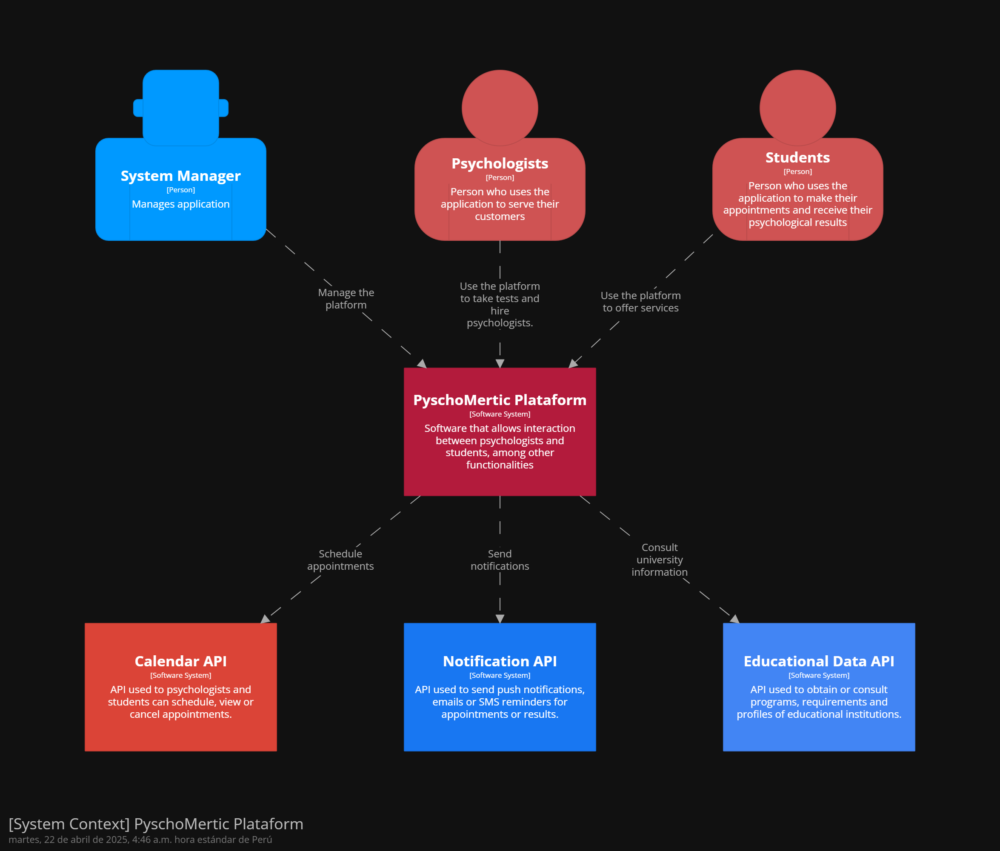
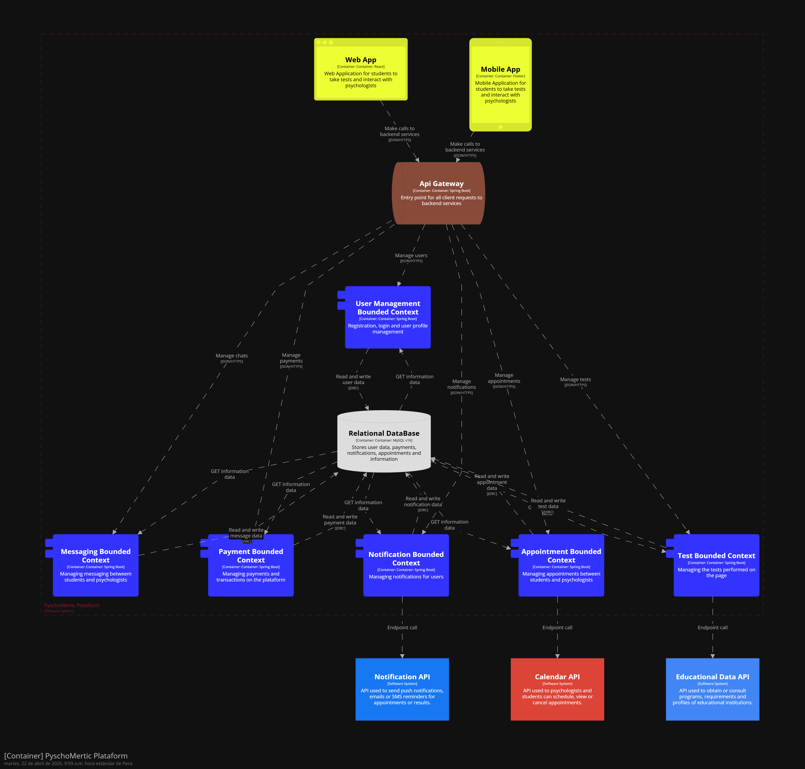

# PyschoMetric
<h3 align="center"> Universidad Peruana de Ciencias Aplicadas </h3>

<h3 align="center"> Ingeniería de Software </h3>
<h3 align="center"> Ciclo 2025 - 1 </h3>

 

 

    

 

<h3 align="center"> Desarrollo de Aplicaciones Open Source - 4341 </h3>
<h3 align="center"> Profesor del Curso: Juan Antonio Flores Moroco </h3>
<h3 align="center"> "INFORME DE TRABAJO FINAL"</h3>
<h3 align="center"> NOMBRE DE LA EMPRESA: PyschoHelp </h3>

<h3 align="center"> PRODUCTO: "PyschoMetric"</h3>

| 
Alumno
 | 
Código
 |
|:-------------------------------------:|:-------------------------------------:|
|     Joaquin Alberto Cuentas Peña      |              U20201f788               |
|      Walter Luis Fajardo Monrroy      |              U202221632               |
|      Eric Marlon Olivera Barzola      |              U202315032               |
|     Victor Manuel Rojas Reategui      |              U202123655               |                                
|     Geronimo Quispe Pablo Antonio     |              U202314304               |

 Abril 2025 

<h3 align="center"> 2024 </h3>

## Registro de Versiones del Informe

## Project Report Collaboration Insights  

## Tabla de Contenidos

## Student Outcome

| Criterio específico                                                                                      | Acciones realizadas                                                                                                                                                                                                                                                                                                                                                                                                                                                                                                                                                                                                                                                                                                                                                                                                                                                                                                                                                                                                                                                                                                                                                                                                              | Conclusiones                                                                                                                                                                                                                       |
|----------------------------------------------------------------------------------------------------------|----------------------------------------------------------------------------------------------------------------------------------------------------------------------------------------------------------------------------------------------------------------------------------------------------------------------------------------------------------------------------------------------------------------------------------------------------------------------------------------------------------------------------------------------------------------------------------------------------------------------------------------------------------------------------------------------------------------------------------------------------------------------------------------------------------------------------------------------------------------------------------------------------------------------------------------------------------------------------------------------------------------------------------------------------------------------------------------------------------------------------------------------------------------------------------------------------------------------------------|------------------------------------------------------------------------------------------------------------------------------------------------------------------------------------------------------------------------------------|
| 1.c1. Identifica problemas complejos de ingeniería de software.                                          | Cuentas Peña Joaquin Alberto TB1: Se encargó de desarrollar los antecedentes y problemáticas del trabajo para proporcionar una base sólida que facilite el análisis y la formulación de soluciones para la problemática.  Fajardo Monrroy, Walter Luis TB1: Se encargó de desarrollar los antecedentes y problemáticas del trabajo para proporcionar una base sólida que facilite el análisis y la formulación de soluciones para la problemática.  Olivera Barzola, Eric Marlon TB1: Se encargó de desarrollar los antecedentes y problemáticas del trabajo para proporcionar una base sólida que facilite el análisis y la formulación de soluciones para la problemática  Geronimo Quispe ,Pablo Antonio TB1: Se centró en identificar un problema concreto que afecta a los usuarios y ofrecer una solución innovadora. En este caso, la descripción del problema, los usuarios potenciales y los objetivos del proyecto.  Rojas Reategui, Victor Manuel TB1: Se encargó de desarrollar los antecedentes y problemáticas del trabajo para proporcionar una base sólida que facilite el análisis y la formulación de soluciones para la problemática. | TB1: El trabajo realizado en TB1 contribuyó significativamente a la comprensión de la problemática, la formulación de soluciones innovadoras y la estructura de propuestas para resolver problemas específicos en el proyecto. |
| 1.c2. Formula problemas complejos de ingeniería de software aplicando ciencias,matemáticas e ingeniería  | Cuentas Peña Joaquin Alberto TB1: Aplicando la técnica 5W2H, le permitió identificar de manera precisa y brindar un enfoque claro y bien fundamentado para el desarrollo antecedente y problemáticas del trabajo.  Fajardo Monrroy, Walter Luis TB1: Se encargó de desarrollar los antecedentes y problemáticas del trabajo para proporcionar una base sólida que facilite el análisis y la formulación de soluciones para la problemática.  Olivera Barzola, Eric Marlon TB1: Se encargó de desarrollar los antecedentes y problemáticas del trabajo para proporcionar una base sólida que facilite el análisis y la formulación de soluciones para la problemática.  Geronimo Quispe ,Pablo Antonio TB1: Se encargó de desarrollar los antecedentes y problemáticas del trabajo para proporcionar una base sólida que facilite el análisis y la formulación de soluciones para la problemática.  Rojas Reategui, Victor Manuel TB1: Se encargó de desarrollar los antecedentes y problemáticas del trabajo para proporcionar una base sólida que facilite el análisis y la formulación de soluciones para la problemática.                             | TB1: El trabajo realizado en TB1 contribuyó significativamente a la comprensión de la problemática, la formulación de soluciones innovadoras y la estructura de propuestas para resolver problemas específicos en el proyecto. |
| 1.c3. Resuelve problemas complejos de ingeniería de software aplicando ciencias,matemáticas e ingeniería | Cuentas Peña Joaquin Alberto TB1: Se encargó de desarrollar los antecedentes y problemáticas del trabajo para proporcionar una base sólida que facilite el análisis y la formulación de soluciones para la problemática.  Fajardo Monrroy, Walter Luis TB1: Se encargó de desarrollar los antecedentes y problemáticas del trabajo para proporcionar una base sólida que facilite el análisis y la formulación de soluciones para la problemática.  Olivera Barzola, Eric Marlon TB1: Se encargó de desarrollar los antecedentes y problemáticas del trabajo para proporcionar una base sólida que facilite el análisis y la formulación de soluciones para la problemática.  Geronimo Quispe ,Pablo Antonio TB1: El proceso de definir una propuesta de valor refuerza la importancia del aprendizaje continuo en el análisis de problemas reales y en la creación de soluciones centradas en el usuario.  Rojas Reategui, Victor Manuel TB1:Se encargó de desarrollar los antecedentes y problemáticas del trabajo para proporcionar una base sólida que facilite el análisis y la formulación de soluciones para la problemática.                         | TB1: El trabajo realizado en TB1 contribuyó significativamente a la comprensión de la problemática, la formulación de soluciones innovadoras y la estructura de propuestas para resolver problemas específicos en el proyecto. |

    
<h3>Capítulo I: Introducción </h3>
    
        <ul>
            <li><a href="#11-Startup-Profile">1.1. Startup Profile</a></li>
            <li><a href="#111-Descripción-de-la-Startup">1.1.1. Descripción de la Startup</a></li>
            <li><a href="#112-Perfiles-de-Integrantes-del-Equipo">1.1.2. Perfiles de Integrantes del Equipo</a></li>
            <li><a href="#12-Solution-Profile">1.2. Solution Profile</a></li>
            <li><a href="#121-Antecedentes-y-Problemática">1.2.1. Antecedentes y Problemática</a></li>
            <li><a href="#122-Lean-UX-Process">1.2.2. Lean UX Process</a></li>
            <li><a href="#1221-Lean-UX-Problem-Statements">1.2.2.1. Lean UX Problem Statements</a></li>
            <li><a href="#1222-Lean-UX-Assumptions">1.2.2.2. Lean UX Assumptions</a></li>
            <li><a href="#1223-Lean-UX-Hypothesis-Statements">1.2.2.3. Lean UX Hypothesis Statements</a></li>
            <li><a href="#1224-Lean-UX-Canvas">1.2.2.4. Lean UX Canvas</a></li>
            <li><a href="#13-Segmentos-Objetivos">1.3. Segmentos Objetivos</a></li>
        </ul>    

    
<h3>Capítulo II: Requirements Elicitation & Analysis</h3>

        <ul>
            <li><a href="#21-competidores">2.1. Competidores</a></li>
            <li><a href="#211-Análisis-competitivo">2.1.1. Análisis competitivo</a></li>
            <li><a href="#212-Estrategias-y-tácticas-frente-a-competidores">2.1.2. Estrategias y tácticas frente a competidores</a></li>
            <li><a href="#22-Entrevistas">2.2. Entrevistas</a></li>
            <li><a href="#221-Diseño-de-entrevistas">2.2.1. Diseño de entrevistas</a></li>
            <li><a href="#222-Registro-de-entrevistas">2.2.2. Registro de entrevistas</a></li>
            <li><a href="#223-Análisis-de-entrevistas">2.2.3. Análisis de entrevistas</a></li>
            <li><a href="#23-Needfinding">2.3. Needfinding</a></li>
            <li><a href="#231-User-Personas">2.3.1. User Personas</a></li>
            <li><a href="#232-User-Task-Matrix">2.3.2. User Task Matrix</a></li>
            <li><a href="#233-User-Journey-Mapping">2.3.3. User Journey Mapping</a></li>
            <li><a href="#234-Empathy-Mapping">2.3.4. Empathy Mapping</a></li>
            <li><a href="#235-As-is-Scenario-Mapping">2.3.5. As-is Scenario Mapping</a></li>
            <li><a href="#24-Ubiquitous-Language">2.4. Ubiquitous Language</a></li>
        </ul>   

    
<h3>Capítulo III: Requirements Specification </h3>

        <ul>
            <li><a href="#31-To-Be-Scenario-Mapping">3.1. To-Be Scenario Mapping</a></li>
            <li><a href="#32-User-Stories">3.2. User Stories</a></li>
            <li><a href="#33-Impact-Mapping">3.3. Impact Mapping</a></li>
            <li><a href="#34-Product-Backlog">3.4. Product Backlog</a></li>
        </ul>    

    
<h3>Capítulo IV: Product Design </h3>

        <ul>
            <li><a href="#41-Style-Guidelines">4.1. Style Guidelines</a></li>
            <li><a href="#411-General-Style-Guidelines">4.1.1. General Style Guidelines</a></li>
            <li><a href="#412-Web-Style-Guidelines">4.1.2. Web Style Guidelines</a></li>
            <li><a href="#42-Information-Architecture">4.2. Information Architecture</a></li>
            <li><a href="#421-Organization-Systems">4.2.1. Organization Systems</a></li>
            <li><a href="#422-Labeling-Systems">4.2.2. Labeling Systems</a></li>
            <li><a href="#423-SEO-Tags-and-Meta-Tags">4.2.3. SEO Tags and Meta Tags</a></li>
            <li><a href="#424-Searching-Systems">4.2.4. Searching Systems</a></li>
            <li><a href="#425-Navigation-Systems">4.2.5. Navigation Systems</a></li>
            <li><a href="#43-Landing-Page-UI-Design">4.3. Landing Page UI Design</a></li>
            <li><a href="#431-Landing-Page-Wireframe">4.3.1. Landing Page Wireframe</a></li>
            <li><a href="#432-Landing-Page-Mock-up">4.3.2. Landing Page Mock-up</a></li>
            <li><a href="#44-Web-Applications-UXUI-Design">4.4. Web Applications UX/UI Design</a></li>
            <li><a href="#441-Web-Applications-Wireframes">4.4.1. Web Applications Wireframes</a></li>
            <li><a href="#442-Web-Applications-Wireflow-Diagrams">4.4.2. Web Applications Wireflow Diagrams</a></li>
            <li><a href="#443-Web-Applications-Mock-ups">4.4.3. Web Applications Mock-ups</a></li>
            <li><a href="#444-Web-Applications-User-Flow-Diagrams">4.4.4. Web Applications User Flow Diagrams</a></li>
            <li><a href="#45-Web-Applications-Prototyping">4.5. Web Applications Prototyping</a></li>
            <li><a href="#46-Domain-Driven-Software-Architecture">4.6. Domain-Driven Software Architecture</a></li>
            <li><a href="#461-Software-Architecture-Context-Diagrams">4.6.1. Software Architecture Context Diagrams</a></li>
            <li><a href="#462-Software-Architecture-Container-Diagrams">4.6.2. Software Architecture Container Diagrams</a></li>
            <li><a href="#463-Software-Architecture-Components-Diagrams">4.6.3. Software Architecture Components Diagrams</a></li>
            <li><a href="#47-Software-Object-Oriented-Design">4.7. Software Object-Oriented Design</a></li>
            <li><a href="#471-Class-Diagrams">4.7.1. Class Diagrams</a></li>
            <li><a href="#472-Class-Dictionary">4.7.2. Class Dictionary</a></li>
            <li><a href="#48-Database-Design">4.8. Database Design</a></li>
            <li><a href="#481-Database-Diagram">4.8.1. Database Dagram</a></li>
        </ul>    

    
<h3>Capítulo V: Product Implementation, Validation & Deployment</h3> 

        <ul>
            <li><a href="#51-software-configuration-management">5.1. Software Configuration Management</a></li>
            <li><a href="#511-software-development-environment-configuration">5.1.1. Software Development Environment Configuration</a></li>
            <li><a href="#512-source-code-management">5.1.2. Source Code Management</a></li>
            <li><a href="#513-source-code-style-guide-conventions">5.1.3. Source Code Style Guide & Conventions</a></li>
            <li><a href="#514-software-deployment-configuration">5.1.4. Software Deployment Configuration</a></li>
            <li><a href="#52-landing-page-services-applications-implementation">5.2. Landing Page, Services & Applications Implementation</a></li>
            <li><a href="#521-sprint-1">5.2.1. Sprint 1</a></li>
            <li><a href="#5211-sprint-planning-1">5.2.1.1. Sprint Planning 1</a></li>
            <li><a href="#5212-aspect-leaders-and-collaborators">5.2.1.2. Aspect Leaders and Collaborators</a></li>
            <li><a href="#5213-sprint-backlog-1">5.2.1.3. Sprint Backlog 1</a></li>
            <li><a href="#5214-development-evidence-for-sprint-review">5.2.1.4. Development Evidence for Sprint Review</a></li>
            <li><a href="#5215-execution-evidence-for-sprint-review">5.2.1.5. Execution Evidence for Sprint Review</a></li>
            <li><a href="#5216-services-documentation-evidence-for-sprint-review">5.2.1.6. Services Documentation Evidence for Sprint Review</a></li>
            <li><a href="#5217-software-deployment-evidence-for-sprint-review">5.2.1.7. Software Deployment Evidence for Sprint Review</a></li>
            <li><a href="#5218-team-collaboration-insights-during-sprint">5.2.1.8. Team Collaboration Insights during Sprint</a></li>
        </ul>        

## Capítulo I: Introducción 

### 1.1. Startup Profile
#### 1.1.1. Descripción de la Startup

Elegir una carrera profesional puede ser una de las decisiones más difíciles en la vida de un joven. Muchos estudiantes se sienten inseguros, confundidos o insatisfechos con la elección que han tomado, lo que puede llevar a la deserción o frustración académica.
PsychoMetric nace para responder a esta problemática con una plataforma integral que conecta a jóvenes de entre 15 y 19 años con psicólogos vocacionales. Nuestra aplicación PsychoHelp brindará acceso a distintos planes de nivel, en los cuales el estudiante podrá encontrar test psicométricos especializados, recibir orientación personalizada, y obtener planes académicos alineados a sus intereses. Con todo ello, ayudamos a que los estudiantes tomen decisiones informadas y conscientes sobre su futuro profesional.
Además, brindamos a los psicólogos una herramienta para gestionar sus servicios, atender estudiantes desde cualquier lugar y participar activamente en el desarrollo vocacional de los jóvenes.
Como resultado final, la aplicación mostrará la compatibilidad del usuario con programas académicos y universidades que se ajustan a su perfil, facilitando así la toma de decisiones de los estudiantes de manera responsable e informada para su futuro académico y profesional.

**Objetivo**
Desarrollar una plataforma digital que facilite la orientación vocacional de jóvenes entre 15 y 19 años, combinando pruebas psicométricas, sesiones con psicólogos certificados y generación de planes académicos personalizados. Al mismo tiempo, brindar a los profesionales en psicología un espacio para ofrecer sus servicios, conectar con estudiantes y contribuir activamente en su desarrollo vocacional.
**Misión**
Brindar a los jóvenes una orientación vocacional precisa, accesible y personalizada mediante herramientas tecnológicas y el acompañamiento de psicólogos vocacionales. Al mismo tiempo, potenciar el trabajo de los profesionales, facilitando su conexión con estudiantes y apoyando su labor mediante una plataforma intuitiva, segura y eficiente.
**Visión**
Ser la plataforma líder en orientación vocacional en el país, revolucionando la forma en que los jóvenes descubren su vocación y eligen su camino académico y profesional. Aspiramos a reducir la deserción educativa, empoderar a los psicólogos en su rol como guías, y formar una nueva generación de profesionales motivados con su propósito.

#### 1.1.2. Perfiles de Integrantes del Equipo
| Miembros del equipo                                                                  | Codigo Estudiante | Descripcion                                                                                                                                                                                                                                                                                                                                                                                                                                                                                                                                                                                                                                                                                                     |
|--------------------------------------------------------------------------------------|-------------------|-----------------------------------------------------------------------------------------------------------------------------------------------------------------------------------------------------------------------------------------------------------------------------------------------------------------------------------------------------------------------------------------------------------------------------------------------------------------------------------------------------------------------------------------------------------------------------------------------------------------------------------------------------------------------------------------------------------------|
| Eric Marlon Olivera Barzola	 | U202315032        | Soy Eric Marlon Olivera Barzola, actualmente estoy cursando el quinto ciclo académico correspondiente. Mi experiencia me ha dotado de la capacidad para abordar tareas relacionadas con el diseño, programación y resolución de problemáticas en el ámbito del lenguaje de programación C++. Asimismo, estoy en proceso de adquirir conocimientos en C# y JavaScript.                                                                                                                                                                                                                                                                                                                                           | 
| Joaquin Alberto Cuentas Peña             | U20201f788        | Soy estudiante de la UPC de la carrera de Ingeniería de Software y me encuentro cursando el 5to ciclo. Cuento con habilidades de programación en C++ y Python, así como aptitudes para el desarrollo en UX y UI. Asimismo, en cuanto a habilidades extracurriculares, he contribuido en proyectos con edición de video y fomentando una actitud colaborativa en equipo                                                                                                                                                                                                                                                                                                                                          |
| Walter Luis Fajardo Monrroy                | U202221632        | Soy Walter Luis Fajardo Monrroy, cuento con 20 años y por motivos de estudio resido en Lima. Soy estudiante de la carrera de ingeniería de software, en mi formación como estudiante durante estos ciclos adquirí conocimientos en programación principalmente con lenguaje C + + y python, También cuanto con conocimientos en patrones de software al momento de realizar mis proyectos, además de experiencia realizando diagramas de clases y empleando el DDD (Diseño orientado a objetos). Las habilidades primarias para resaltar serían la responsabilidad y resiliencia frente a las adversidades. Cuento con experiencia en organización y trabajo grupal lo cual emplearé para beneficio del equipo. |
| Victor Manuel Rojas Reategui               | U202123655        | Mi nombre es Victor Rojas y voy en el 5to ciclo de la carrera de Ingeniería de Software. Me gusta lo rápido que cambia la tecnología en la actualidad, por lo que este curso me ayudará a expandir mis conocimientos y a explorar nuevas aplicaciones de mi carrera que no había experimentado antes.                                                                                                                                                                                                                                                                                                                                                                                                           |
| Geronimo Quispe Pablo Antonio          | u202314304        | Mi nombre es Pablo,tengo 19 años y soy estudiante de Ingeniería de Software en la UPC, sede San Miguel. Soy una persona decidida, confiable, responsable y honesta con mi grupo de trabajo ,siendo lo más útil posible. Tengo conocimientos en C++ y java,python. Cada día trato de dar una mejor versión de mi y aprender de mis errores.                                                                                                                                                                                                                                                                                                                                                                      |
                                                                                                                                                                                                                                                                                                                                                                                                                                                                                                                                                                                                                                                                                                          

### 1.2. Solution Profile

#### 1.2.1. Antecedentes y Problemática (usando The 5W'S y 2 'H's)
Uno de los problemas más comunes entre los estudiantes de secundaria y universitarios de primeros ciclos es la dificultad para elegir una carrera profesional adecuada. Esta situación se debe a diversos factores interrelacionados. Muchos jóvenes no cuentan con un adecuado nivel de autoconocimiento, lo que impide que puedan identificar claramente sus intereses, habilidades, valores y motivaciones personales. Esta falta de claridad sobre sí mismos afecta directamente su capacidad para tomar decisiones vocacionales informadas.
De acuerdo con un informe de la UNESCO (2021), la orientación vocacional es clave para mejorar la satisfacción estudiantil. Sin embargo, en América Latina, más del 60 % de los estudiantes no recibe ningún tipo de acompañamiento en este proceso.
Nuestro objetivo es comprender las necesidades de nuestros usuarios, por lo tanto, hemos analizamos sus historiales y la problemática bajo el enfoque de las 5 ‘W’s y 2 ‘H’s.

**What (Qué)**
- ¿Cuál es el problema?
Muchos jóvenes estudiantes se sienten confundidos o insatisfechos con la elección de su carrera profesional, lo que puede llevar a la desmotivación, cambio de carrera o abandono académico. La falta de orientación vocacional temprana y personalizada es la causa central de la problemática identificada.

**When (Cuando)**
- ¿Cuándo sucede el problema?
Este problema ocurre principalmente durante la etapa final de la secundaria y en algunos casos, en los primeros ciclos universitarios, cuando los estudiantes deben tomar decisiones importantes sobre su futuro académico o decidir si necesitan un cambio de carrera antes de avanzar con su malla curricular.

- ¿Cuándo utiliza el cliente el producto?
El cliente utiliza el producto en momentos clave de su vida académica:
 - Antes de postular a una universidad o carrera.

 - Durante los primeros ciclos universitarios, cuando sienten dudas o insatisfacción respecto a la carrera elegida.
En el caso de los psicólogos:
 Cuando están en búsqueda de clientes, como lo son los estudiantes.

**Where (Dónde)**
- ¿Dónde está el usuario cuando usa el producto?
El usuario accede a la aplicación desde cualquier lugar con conexión a internet, generalmente desde su casa, colegio, biblioteca, oficina o en espacios donde busca privacidad para reflexionar sobre su futuro. La plataforma está diseñada para ser accesible desde dispositivos móviles y computadoras.

**Who (Quién)**
- ¿Quiénes están involucrados?
Usuarios principales: Jóvenes estudiantes, de secundaria (últimos años) y universitarios de primeros ciclos.

Profesionales involucrados: Psicólogos vocacionales y consejeros certificados que brindan asesoramiento personalizado.

- ¿Quién lo utilizará?
Principalmente lo utilizarán los jóvenes estudiantes que buscan claridad y guía para tomar decisiones académicas alineadas con su perfil e intereses. Asimismo los profesionales en orientación vocacional lo usarán para ofrecer sus servicios.

**Why (Por qué)**
- ¿Cuál es la causa del problema?
Algunas de las causas identificadas son las siguientes: 
 - Falta de autoconocimiento vocacional desde etapas tempranas.
 - Ausencia de orientación profesional efectiva en colegios y universidades.
 - Escasa información clara y personalizada sobre las opciones académicas disponibles.

**How (Cómo)**
- ¿Cómo prefieren los usuarios que sea el producto?
Los usuarios esperan una aplicación intuitiva y fácil de usar desde el celular o    computadora. Además su confianza estará puesta en la confiabilidad de los resultados, por lo cual estos deben estar respaldados por profesionales. Y finalmente, esperan recibir resultados personalizados, adaptados a su perfil e intereses.

 **How much (Cuánto)**
- ¿Cuánto usaron los usuarios la app?
Nuestra aplicación resuelve una problemática crítica y ampliamente extendida: la falta de claridad vocacional entre estudiantes de secundaria y primeros ciclos universitarios. Más del 60 % de los jóvenes en América Latina no recibe orientación vocacional, lo que evidencia una gran brecha que nuestra plataforma puede cubrir. Esta necesidad es especialmente urgente en etapas clave como la preparación para postular a una carrera o durante los primeros ciclos universitarios, donde se consolidan decisiones fundamentales sobre el futuro profesional del estudiante. Es por estos motivos que el uso de nuestra app por parte de los usuarios será grande.
En cuanto al nivel de uso, se espera que los estudiantes interactúen activamente con la aplicación en varios momentos de su camino vocacional. Inicialmente, para realizar tests psicométricos y definir su perfil vocacional. Posteriormente, para revisar resultados, explorar carreras afines, agendar citas con psicólogos vocacionales y recibir retroalimentación personalizada.

#### 1.2.2. Lean UX Process

##### 1.2.2.1. Lean UX Problem Statements

Muchos estudiantes de secundaria enfrentan incertidumbre, confusión o insatisfacción al elegir una carrera profesional, debido a la falta de autoconocimiento, orientación vocacional personalizada y acceso a información clara sobre programas académicos. Esta situación puede llevar a decisiones mal fundamentadas, abandono de estudios o frustración profesional a largo plazo.
Actualmente, no existen soluciones digitales completas, confiables y accesibles que integren evaluaciones psicométricas especializadas, sesiones con psicólogos certificados, informes vocacionales interactivos en PDF y recomendaciones académicas personalizadas dentro de un solo ecosistema.
Además, los psicólogos vocacionales certificados enfrentan dificultades para encontrar espacios digitales que les permitan visibilizar su trabajo, acceder a herramientas especializadas, atraer nuevos clientes potenciales y desarrollarse profesionalmente. No existen plataformas que les ofrezcan beneficios escalables a través de una membresía profesional que valore su expertise y potencie su alcance.

##### 1.2.2.2. Lean UX Assumptions

Los estudiantes de secundaria y universitarios de primeros ciclos experimentan inseguridad y confusión al momento de elegir una carrera profesional.

Su falta de autoconocimiento, la presión social y el desconocimiento de la oferta académica son factores que dificultan una elección adecuada.

Los jóvenes están dispuestos a utilizar herramientas digitales como apoyo para su orientación vocacional.

Dado su nivel de familiaridad con la tecnología, una app móvil o web es un canal accesible y cómodo para este público.

Los usuarios confiarán en los resultados de pruebas psicométricas si estas se presentan de manera clara, profesional y con respaldo especializado.

Una metodología basada en psicología vocacional validada tendrá mayor aceptación que simples tests genéricos disponibles en línea.

El acompañamiento de psicólogos o consejeros certificados será valorado positivamente por los estudiantes.

Las sesiones con especialistas aportan valor agregado a la orientación y aumentan la confianza en la toma de decisiones.

Los estudiantes están dispuestos a pagar por beneficios adicionales como acceso a psicólogos, reportes vocacionales interactivos y detallados, y tests avanzados mediante una suscripción premium.

Los psicólogos certificados están interesados en un modelo de suscripción premium que les permita acceder a herramientas digitales, obtener mayor visibilidad frente a potenciales pacientes y expandir su red de trabajo dentro de una comunidad profesional.

Los estudiantes y psicólogos cuentan con dispositivos y acceso a internet que les permiten interactuar con la plataforma.

Padres de familia, colegios e instituciones educativas valorarán soluciones que apoyen a los jóvenes en sus decisiones vocacionales.

Existe una oportunidad de mercado debido a la falta de soluciones digitales completas, integradas y personalizadas de orientación vocacional.

##### 1.2.2.3. Lean UX Hypothesis Statements

Creemos que los estudiantes de secundaria necesitan una herramienta digital de orientación vocacional que les permita descubrir sus intereses, habilidades y compatibilidad con carreras profesionales mediante pruebas psicométricas avanzadas, sesiones con especialistas y reportes vocacionales personalizados.
Si desarrollamos una aplicación que combine:
 - Un modelo freemium con beneficios exclusivos en su versión premium (tests avanzados, acceso a especialistas y reportes detallados),

 - La posibilidad de agendar citas con psicólogos certificados dentro de la plataforma,

 - Y una suscripción premium para psicólogos que les ofrezca visibilidad, posicionamiento profesional y herramientas para su práctica vocacional,

Entonces lograremos que los estudiantes tomen decisiones académicas más informadas, reduzcan la tasa de deserción por elección incorrecta de carrera y que los psicólogos encuentren una red profesional sólida, sostenible y con oportunidades reales de crecimiento dentro de la plataforma.

### 1.3. Segmentos Objetivos

**Jóvenes estudiantes de 15 - 19 años**

**Descripción:**
Adolescentes que se encuentran en la etapa final de la educación secundaria o que recientemente la han terminado. Están próximos a tomar decisiones clave sobre su futuro académico y profesional, pero en muchos casos enfrentan incertidumbre, presión externa e indecisión sobre qué carrera seguir o dónde estudiar.
**Objetivo principal:**
Definir su carrera profesional ideal y elegir la institución educativa alineada a su perfil vocacional.
**Características clave:**
 - En etapa activa de exploración de intereses y habilidades.

 - Sienten presión para tomar decisiones importantes a corto plazo.

 - Influenciados por padres, docentes, amigos y su entorno.

 - Buscan orientación clara, confiable y personalizada.

**Necesidades específicas:**
Identificar sus fortalezas, talentos e intereses mediante herramientas confiables.

 - Recibir sugerencias de carreras compatibles con su perfil.

 - Explorar universidades, carreras y rutas educativas adaptadas a su vocación.

 - Recibir orientación profesional de calidad.

**Psicólogos enfocados en orientación vocacional**

**Descripción:**
Profesionales titulados en psicología con experiencia en orientación vocacional. Buscan digitalizar sus servicios, llegar a más jóvenes, y aprovechar plataformas tecnológicas para ofrecer asesorías personalizadas de manera remota.
**Objetivo principal:**
Ofrecer orientación vocacional personalizada en línea, generar ingresos y ampliar su impacto profesional.
**Características clave:**
 - Formación especializada en psicometría, vocación y asesoramiento juvenil.

 - Interés en plataformas digitales que les permitan crecer profesionalmente.

 - Buscan mayor visibilidad, acceso a nuevos clientes y autonomía en su gestión.

 - Valoran herramientas que faciliten y eleven la calidad de su servicio.

**Necesidades específicas:**
 - Acceder a una red de estudiantes que requieren apoyo vocacional.

 - Contar con una plataforma que centralice la gestión de citas, evaluaciones y reportes.

 - Aplicar pruebas psicométricas y generar informes personalizados de forma digital.

 - Obtener ingresos justos y sostenibles por cada sesión brindada a través de la app.

**Segmentación Geográfica:**
Región: Áreas urbanas de Lima con acceso a internet y una alta concentración de instituciones educativas de nivel secundario y superior.

Distribución: Ciudades grandes y medianas con presencia de colegios, academias preuniversitarias y universidades, donde existe una mayor competitividad académica y presión por tomar decisiones vocacionales acertadas.

**Segmentación Demográfica:**
Edad: Estudiantes entre 15 y 19 años (secundaria y primeros ciclos universitarios).

Nivel Socioeconómico: Clase media y media - alta, con acceso a dispositivos móviles, conectividad y recursos para invertir en orientación personalizada.

Ocupación: Estudiantes activos de secundaria, egresados de colegio en búsqueda de carrera, y universitarios en etapa inicial de estudios.

**Segmentación Psicográfica:**
Estilo de Vida: Jóvenes que utilizan tecnología diariamente, familiarizados con apps educativas, redes sociales y plataformas digitales de aprendizaje.

Valores y creencias: Buscan autoconocimiento, claridad sobre su futuro y una toma de decisiones responsable. Valoran la personalización, la orientación profesional y el acompañamiento humano en procesos importantes de su vida.

## Capítulo II: Requirements Elicitation & Analysis

# 2.1.1. Análisis Competitivo

En esta sección identificamos los principales competidores directos con productos digitales similares.
### Competitive Analysis Landscape 

| Por qué llevar a cabo este análisis? | Este análisis es clave para entender el mercado, las necesidades de los usuarios y cómo Psychometric puede ofrecer soluciones innovadoras y efectivas para poder contrarrestar y mejorar el producto. |
|--------------------------------------|-----------------------------------------------------------------------------------------------------------------------------------------------------------------------------------|

| Características | PsychoHelp | Orientum | Edutest | Universia |
|-----------------|------------|----------|---------|-----------|
| **Perfil**      | **Overview:** PsychoHelp es una aplicación digital que ayuda a estudiantes de secundaria y primeros ciclos universitarios a descubrir su vocación profesional. | Plataforma especializada en orientación vocacional, dirigida a jóvenes que están por elegir carrera. | Ofrece test vocacionales interactivos y herramientas para explorar distintas opciones académicas. Está dirigido a estudiantes de último año de secundaria. | Portal web con test vocacionales gratuitos y contenidos informativos sobre carreras y universidades. Su enfoque está en estudiantes de secundaria. |
| **Ventaja competitiva** ¿Qué valor ofrece a los clientes? | PsychoHelp ofrece una experiencia completa y personalizada, combinando test vocacionales avanzados con asesoría profesional en vivo, lo que permite a los estudiantes tomar decisiones informadas con base en su perfil real y emocional. | Ofrece test vocacionales y asesoría personalizada para ayudar a los jóvenes a identificar la carrera que mejor se adapta a sus intereses. | Brinda test vocacionales interactivos y fáciles de usar para orientar a estudiantes en la elección de una carrera, de forma rápida y gratuita. | Proporciona herramientas vocacionales básicas y contenido informativo sobre universidades y programas académicos en distintos países. |
| **Overview**                 | Aplicación digital que ayuda a estudiantes de secundaria y primeros ciclos universitarios a descubrir su vocación profesional.             | Plataforma especializada en orientación vocacional, dirigida a jóvenes que están por elegir carrera. | Ofrece test vocacionales interactivos y herramientas para explorar distintas opciones académicas. | Portal web con test vocacionales gratuitos y contenidos informativos sobre carreras y universidades. |
| **Ventaja competitiva**      | Experiencia completa y personalizada, combinando test vocacionales avanzados con asesoría profesional en vivo.                            | Ofrece test vocacionales y asesoría personalizada.                                              | Brinda test vocacionales interactivos de forma rápida y gratuita.       | Herramientas vocacionales básicas y contenido informativo sobre universidades y programas académicos. |
| **Mercado objetivo**         | Estudiantes de secundaria y jóvenes universitarios en primeros ciclos con dudas sobre su carrera.                                          | Estudiantes de secundaria, bachillerato, padres y colegios.                                    | Jóvenes de secundaria y preuniversitarios que buscan conocer sus intereses. | Estudiantes de secundaria y universitarios, principalmente en países de habla hispana.                |
| **Estrategias de marketing** | Marketing de contenido, alianzas con colegios y universidades.                                                                             | Charlas y talleres en instituciones educativas, presencia en buscadores.                       | Estrategia freemium, correos y boletines informativos.                  | Alianzas con universidades, contenido web gratuito.                                      |
| **Precios & Costos**         | Freemium: test básico gratuito. Informe detallado: S/ 30 – S/ 50. Sesión con psicólogo: S/ 70 – S/ 100.                                     | Test y asesoría personalizada: S/ 50 – S/ 150.                                                  | Acceso pago: S/ 30 – S/ 50.                                            | Totalmente gratis; financiado por alianzas con universidades y patrocinadores.          |
| **Productos & Servicios**    | Test psicométricos, informes personalizados, recomendaciones de carreras, sesiones con psicólogos.                                         | Test vocacionales psicométricos y asesoría personalizada.                                      | Test vocacionales interactivos con informes detallados de pago.        | Test vocacional gratuito, buscador de carreras, artículos y blogs sobre orientación.     |
| **Canales de distribución**  | Integración en plataformas educativas, plataforma web y aplicación móvil.                                                                  | Plataforma web con agendamiento de sesiones.                                                   | Plataforma web para acceso a tests.                                    | Web y app móvil para facilitar acceso.                                                   |
  | **Fortalezas** | Combina tecnología con atención humana personalizada y una plataforma flexible, desde cualquier lugar. | Ofrece orientación personalizada con psicólogos profesionales, brindando un enfoque más humano y confiable a los usuarios. | Su modelo permite atraer a muchos estudiantes, ofreciendo acceso gratuito a tests básicos. | Cuenta con una sólida red de universidades y amplia presencia en países hispanohablantes. |
| **Debilidades**| Necesita inversión constante en marketing y captación de usuarios. | El modelo de pago limita el acceso a estudiantes con pocos recursos. | No ofrece asesoría profesional, lo que limita su valor agregado. | El test vocacional es básico y carece de personalización. |
| **Oportunidades**| Alta demanda de orientación vocacional entre jóvenes. | Puede expandir su presencia digital y llegar a más estudiantes mediante plataformas en línea. | Integrar servicios de orientación personalizada para diferenciarse de otras plataformas. | Refuerza su servicio vocacional con más tecnología para atraer a una audiencia más joven. |
| **Amenazas**   | Competencia con plataformas consolidadas y gratuitas como Universia y Edutest. | La competencia de plataformas gratuitas puede reducir su cuota de mercado. | La falta de seguimiento humano puede llevar a que los usuarios busquen alternativas más completas. | Startups más especializadas pueden ofrecer servicios más personalizados y dinámicos. |

# 2.1.2. Estrategias y Tácticas frente a Competidores

Estas son las principales estrategias que aplicará **PsychoHelp**:

- Ofrecer orientación personalizada y humana combinada con test psicométricos avanzados.
- Ofrecer una versión básica gratuita con opciones de pago para resultados más detallados y servicios adicionales.
- Establecer alianzas con colegios, universidades y centros educativos para integrar **PsychoHelp** como herramienta oficial de orientación vocacional.
- Desarrollar una app móvil atractiva y fácil de usar, optimizada para el público joven.
- Proponer test vocacionales basados en psicometría confiable, más allá de simples cuestionarios de personalidad.

# 2.2. Entrevistas

## 2.2.1. Diseño de Entrevistas

### Preguntas para estudiantes de últimos años de colegio (4to y 5to de secundaria)

1. ¿Has pensado qué carrera te gustaría seguir después del colegio? ¿Por qué?
2. ¿Cuál es tu mayor motivación al pensar en tu futuro? ¿Y tu mayor miedo?
3. ¿Qué tan seguro/a te sientes sobre tu elección profesional?
4. ¿Has hecho alguna vez un test vocacional? ¿Cómo fue tu experiencia?
5. ¿A quién acudes cuando necesitas orientación sobre tu futuro académico?
6. ¿Qué tipo de herramientas digitales usas con frecuencia (apps, redes, plataformas educativas)?
7. ¿Qué características valoras en una plataforma que te ayude a elegir tu carrera?
8. ¿Qué te frustra o preocupa al pensar en tu futuro profesional?
9. ¿Cómo te gustaría que te ayuden a descubrir tu vocación? ¿Qué formato prefieres?

### Preguntas para Psicólogos y Consejeros Vocacionales Certificados

1. ¿Cuánto tiempo llevas trabajando en orientación vocacional?
2. ¿Qué tipo de estudiantes atiendes con más frecuencia? ¿Edad, nivel educativo?
3. ¿Cómo es el proceso que sigues para orientar a un estudiante?
4. ¿Qué herramientas digitales usas actualmente en tus sesiones?
5. ¿Qué tipo de dificultades encuentras al orientar a jóvenes?
6. ¿Qué aspectos consideras esenciales en un test vocacional?
7. ¿Qué tan abierto estás a colaborar con plataformas digitales de orientación?
8. ¿Qué te parecería tener una app que te conecte directamente con estudiantes?
9. ¿Qué necesitarías para confiar en una plataforma como **PsychoHelp**?

### 2.2.2. Registro de entrevistas
#### Segmento 1:Jóvenes estudiantes de 15 - 19 años ####

- Entrevista N°1: Adrian Valera
- Sexo: Masculino
- Edad: 17 años

- Ubicación en la que vive olivos, Lima, Perú

#### Entrevista: ####
link: [URL entrevista](https://upcedupe-my.sharepoint.com/:v:/g/personal/u202314304_upc_edu_pe/EbkmdeLghNhGjq4V5uYy5esBiOXestT9hokV-ZV7bz5WRg?e=UARbDo&nav=eyJyZWZlcnJhbEluZm8iOnsicmVmZXJyYWxBcHAiOiJTdHJlYW1XZWJBcHAiLCJyZWZlcnJhbFZpZXciOiJTaGFyZURpYWxvZy1MaW5rIiwicmVmZXJyYWxBcHBQbGF0Zm9ybSI6IldlYiIsInJlZmVycmFsTW9kZSI6InZpZXcifX0%3D)

- Momento en el que inicia: 0:02

- Duración: 7:07

**Resumen:**
Adrián es un joven que actualmente cursa el quinto año de secundaria en el colegio Trilce, sede Los Olivos. Nos comparte que, aunque todavía no ha decidido con claridad qué carrera le gustaría seguir, una de las opciones que más le atrae es Psicología, ya que considera que es una profesión interesante y, en sus palabras, "bastante tranquila".
Además, Adrián nos comentó que en alguna ocasión realizó un test vocacional con el acompañamiento de un psicólogo, sin embargo, la experiencia no resultó tan útil o reveladora como él esperaba. A pesar de ello, mantiene la curiosidad y apertura por seguir explorando su vocación.
En ese sentido, está dispuesto a probar nuevas alternativas y le parece una idea interesante la posibilidad de realizar un test vocacional en línea, siempre y cuando exista la guía de un profesional que pueda orientarlo adecuadamente durante el proceso. Considera que contar con una plataforma digital o aplicación que combine tecnología con asesoramiento humano sería una buena forma de ayudar a estudiantes como él a descubrir una carrera que realmente se ajuste a sus intereses y personalidad.

- Entrevista N°2: Elvis Larico
- Sexo: Masculino
- Edad: 17 años
- Ubicación en la que vive magdalena, Lima, Perú

#### Entrevista: ####
link:[URL entrevista](https://drive.google.com/file/d/12zpl-imeFKodLIK2MSkcLZRE6kfCeG6q/view?usp=sharing)
- Momento en el que inicia: 0:00
- Duración: 6:08
  
**Resumen:**
Nuestro entrevistado, quien actualmente cursa el 5to grado de secundaria, nos comentó que siente un marcado interés por la carrera de Matemáticas Puras, aunque aún presenta cierta ambivalencia respecto a otras opciones profesionales, ya que no ha tomado una decisión definitiva.
Durante la conversación, mencionó que los test vocacionales que ha realizado hasta el momento han sido ofrecidos únicamente por su colegio y que, lamentablemente, no han contado con un seguimiento personalizado por parte de un psicólogo, lo que ha dificultado obtener resultados más claros y confiables.
Por otro lado, resaltó que sus padres le brindan flexibilidad al momento de elegir su futura carrera, ya que su principal consejo es que tome una decisión libre y sin presiones, buscando siempre lo que lo haga sentir realizado.
Además, expresó su interés en probar una plataforma digital que no solo ofrezca test vocacionales, sino que también proporcione un acompañamiento continuo, algo que hasta ahora siente que ha faltado en su proceso de orientación. Señaló que, al contar con este tipo de ayuda, sentiría mayor seguridad en su elección de carrera.
Finalmente, manifestó que estaría totalmente dispuesto a contactar con un psicólogo a través de la plataforma, ya que considera que el seguimiento profesional es clave para asegurarse de elegir una carrera que realmente se ajuste a sus intereses y habilidades.

**Entrevista N°3: Alejandro Bravo**
- Sexo: Masculino
- Edad: 17 años
- Ubicación en la que vive   San miguel, Lima, Perú
  

#### Entrevista: #####
link:[URL entrevista]( https://upcedupe-my.sharepoint.com/:v:/g/personal/u202314304_upc_edu_pe/EdFC8tauorhEuMi__ESOCRgBaBfZJhHZCFduqWM33oQudg?e=6k7wes)

- Momento en el que inicia: 0:00
- Duración: 4:56
  
**Resumen:**
En esta oportunidad, se entrevistó a Alejandro Bravo Castillo, un estudiante que está próximo a culminar su grado de secundaria. Durante la conversación, Alandro compartió que ya ha pensado en su futura carrera profesional y se siente bastante atraído por el mundo del Derecho, ya que le interesa mucho todo lo relacionado con las leyes y sueña con convertirse en abogado.
Al preguntarle sobre sus motivaciones y temores, Alandro comentó que su mayor motivación es poder construir un futuro aprendiendo sobre una carrera que le apasione. Sin embargo, también reconoció que su mayor miedo es cometer errores en el camino, aunque entiende que es algo natural en cualquier proceso de aprendizaje.
Respecto a la seguridad sobre su elección, mencionó que se siente seguro por ahora, aunque es consciente de que solo al iniciar la carrera podrá confirmar si realmente es lo que le gusta. Cuando necesita orientación o apoyo sobre su futuro académico, suele acudir principalmente a sus padres, su abuela y en ocasiones también a sus amigos para conocer sus opiniones.
Finalmente, mencionó que acceder a una videollamada con un psicólogo sería algo sencillo para él, ya que considera que es una opción práctica, cómoda y accesible desde cualquier lugar, sin necesidad de salir de casa.

#### Segmento 2:Psicólogos enfocados en orientación vocacional ####

**Entrevista N°1: MarCielo Rugel**
- Sexo: Femenino
- Edad: 23 años
- Ubicación en la que vive olivos, Lima, Perú
  

#### Entrevista: ####

link:[URL entrevista](https://upcedupe-my.sharepoint.com/:v:/g/personal/u202314304_upc_edu_pe/EcVMA4GvuX5PiYD6y-ZQDQoBMpOEFHInTl34d-NKVHWzAA?e=Xkc9TW)
- Momento en el que inicia: 0:00
- Duración: 7:49
  
**Resumen:**
Maricielo es licenciada en Psicología y cuenta con experiencia trabajando en el área de orientación vocacional para estudiantes. Actualmente, se desempeña en el sector de Recursos Humanos, pero conserva un fuerte interés por los procesos de acompañamiento a jóvenes que están en búsqueda de su vocación.
Durante nuestra conversación, Maricielo nos compartió información valiosa sobre cómo se orienta a los estudiantes que aún no han iniciado un proceso vocacional o que no están familiarizados con los test vocacionales. Nos explicó detalladamente el paso a paso que debería seguir un estudiante para realizar un test vocacional de manera adecuada, desde la preparación previa hasta la interpretación de resultados con apoyo profesional.
Además, resaltó que una plataforma vocacional debería contar con un sistema de comunicación rápido y eficaz entre el estudiante y el orientador, para garantizar una mejor conexión y acompañamiento personalizado. También hizo énfasis en que, para generar confianza en el producto, sería fundamental implementar un sistema de filtrado o validación de profesionales, que asegure que quienes orientan a los estudiantes cuenten con la preparación y experiencia necesarias.
Su perspectiva refuerza la importancia de unir la tecnología con un enfoque humano y profesional para ofrecer una experiencia vocacional confiable, útil y accesible.

**Entrevista N°2:  Antonella Rugel**
- Sexo: Femenino
- Edad: 28 años
- Ubicación en la que vive olivos, Lima, Perú

#### Entrevista: ####

link:[URL entrevista](https://upcedupe-my.sharepoint.com/:v:/g/personal/u202314304_upc_edu_pe/EfgU6lkVBSdAu4djjhTMSGABFNyjN-QAbxvux7EK8lC03w?e=HzHUxX&nav=eyJyZWZlcnJhbEluZm8iOnsicmVmZXJyYWxBcHAiOiJTdHJlYW1XZWJBcHAiLCJyZWZlcnJhbFZpZXciOiJTaGFyZURpYWxvZy1MaW5rIiwicmVmZXJyYWxBcHBQbGF0Zm9ybSI6IldlYiIsInJlZmVycmFsTW9kZSI6InZpZXcifX0%3D)
- Momento en el que inicia: 0:00
-Duración: 7:49

**Resumen:**
Antonella Rugel es licenciada en Psicología y actualmente se desempeña en el área de salud psicológica. Cuenta con más de tres años de experiencia brindando orientación a jóvenes en la búsqueda de su vocación, utilizando herramientas como los test de Holland y Kuder.
Sin embargo, Antonella nos comentó que, a pesar de ser herramientas útiles, estos test presentan una limitación importante: no incluyen todas las carreras que existen actualmente, lo que puede restringir las opciones para los estudiantes y limitar su visión sobre el amplio abanico de posibilidades profesionales.
Durante su experiencia, ha observado que las carreras que los jóvenes suelen descartar con mayor frecuencia son las relacionadas con humanidades, así como algunas otras que, en muchos casos, no cuentan con la aprobación o respaldo de sus padres. En contraste, las carreras que suelen tener más interés y demanda son aquellas vinculadas a las ingenierías, la medicina y la arquitectura, debido a su prestigio social y las expectativas familiares.
Antonella también resaltó la importancia del rol que cumplen los padres en este proceso, ya que, en varias situaciones, no solo se orienta al estudiante, sino que también se trabaja con la familia para que exista un entendimiento y acompañamiento adecuado.En algunos casos la desinformación de los jóvenes puede ser muy preocupante para los psicólogos al evaluarlos.

**Entrevista N°3  Juan Requejo**
- Sexo: Másculino
- Edad: 24 años
- Ubicación en la que vive: Pueblo Libre, Lima, Perú

#### Entrevista: ####
- link:[URL entrevista]( https://youtu.be/IuQXwxSmHgA )
- Momento en el que inicia: 0:00
- Duración: 3:39

**Resumen:**
El psicólogo Juan Requejo  entrevistado tiene 2 años de experiencia en orientación vocacional, trabajando con jóvenes de 15 a 20 años que suelen estar en sus últimos años de secundaria o en los primeros ciclos universitarios.El proceso que sigue empieza con una entrevista inicial, luego aplica pruebas psicométricas, conversa los resultados y termina elaborando un plan de acción personalizado.
Actualmente usa Google Meet, Zoom y formularios online, aunque considera que estas herramientas están muy dispersas y sería mejor tener todo en una plataforma integrada.
Considera que un buen test vocacional debe ser científicamente valido,visualmente claro y atractivo, relacion de  los resultados con carreras y opciones reales y adaptable a diferentes edades y con análisis cualitativo.
Está muy a favor de usar plataformas digitales y considera que una app que conecte psicólogos con estudiantes sería ideal para facilitar todo el proceso. Para confiar en una plataforma como Psycho Hell pide que tenga respaldo ético y profesional,tests integrados y confiables,confidencialidad garantizada,un servicio premium que ofrezca valor real.

 ### 2.2.3. Análisis de entrevista
 **Segmento 1:Jóvenes estudiantes de 15 - 19 años**
 **Entrevista 1:** Adrian Valera
**Análisis de la entrevista:** Adrián nos comentó que le gustaría contar con una plataforma de orientación vocacional, siempre y cuando esta cuente con certificaciones oficiales y ofrezca una guía personalizada durante todo el proceso. Además, señaló que los test vocacionales en formato físico que ha realizado anteriormente no le han resultado útiles ni satisfactorios, por lo que considera que una plataforma bien estructurada y acompañada por profesionales podría brindarle mayor confianza y mejores resultados.

 **Entrevista 2: Elvis Liraco**
 **Análisis de la entrevista:**  Elvis nos comento que estaria dispuesto a intentar usar la plataforma en un futuro ya que los test que le realizaban eran muy generales siempre y cuando tenga la seguridad que sean confiables 

 **Entrevista 3: Alejandro bravo**
**Análisis de la entrevista:** Alejandro bravo nos comento que uno de sus mayores temores seria al equivocarse de carrera aunque le guste mucho la carrera de derecho tiene miedo de dejarlo tambien nos comentó que estaria dispuesto a entablar un seguimiento de test vocacional con un psicólogo de guia a traves de la plataforma.
Gráficos Complementarios al análisis

**Segmento 2:Psicólogos enfocados en orientación vocacional**

**Entrevista 1:  Maricielo Rugel**
**Análisis de la entrevista:** Maricielo destaca la importancia de combinar herramientas digitales con acompañamiento profesional en los procesos de orientación vocacional. Subraya que la confianza del estudiante depende tanto de la calidad del seguimiento humano como de un sistema seguro y validado, lo que confirma la necesidad de plataformas que integren tecnología con respaldo ético y profesional.
 **Entrevista 2: Antonella Rugel**
 **Análisis de la entrevista:** El testimonio de Antonella Rugel resalta la importancia de contar con acompañamiento constante y profesional durante la orientación vocacional. Subraya que la falta de seguimiento y la poca personalización en los test tradicionales afectan la confianza del estudiante, lo que refuerza la necesidad de crear plataformas que integren soporte humano y tecnología confiable para guiar de forma efectiva a los jóvenes en su elección de carrera.
 **Entrevista 3: Juan Requejo**
 **Análisis de la entrevista:** El testimonio de Juan Requejo evidencia que muchos jóvenes enfrentan inseguridad y desinformación al momento de elegir una carrera, especialmente cuando no reciben un acompañamiento adecuado. Su experiencia resalta la importancia de que las plataformas vocacionales combinen herramientas digitales confiables con orientación profesional personalizada, facilitando así decisiones más claras y seguras para los estudiantes.
Gráficos Complementarios al análisis

## 2.3. Needfinding

#### 2.3.1. User Personas
Los User personas se realizaron en base a las distintas personas que entrevistamos según nuestros segmentos objetivos.
**Estudiante de 4to año de secundaria:**

**Psicólogo certificado:**

#### 2.3.2. User Task Matrix
En esta sección vamos a detallar las tareas que realizan los diferentes segmentos de usuarios representados por los User Personas de PsychoHealth.
**Estudiante de 4to año de secundaria: Enrique Gonzalo**

| Actividades                                         | Frecuencia     | Importancia |
|-----------------------------------------------------|----------------|-------------|
| Realizar un test vocacional interactivo             | Frecuentemente | Alta        |
| Obtener recomendaciones de carreras y programas     | Ocasionalmente | Alta        |
| Ver universidades compatibles con su perfil         | Frecuentemente | Media       |
| Ver experiencias o testimonios de otros estudiantes | Ocasionalmente | Media       |
| Pedir recomendaciones a vecinos o conocidos         | Rara vez       | Baja        |

**Psicólogo certificado: Luiz Ramirez**

| Actividades                                                | Frecuencia     | Importancia |
|------------------------------------------------------------|----------------|-------------|
| Buscar electricistas certificados                          | Frecuentemente | Alta        |
| Agendar mantenimientos preventivos para el hogar           | Ocasionalmente | Alta        |
| Comparar calificaciones de proveedores                     | Frecuentemente | Media       |
| Buscar soluciones que ahorren energía en el hogar          | Ocasionalmente | Media       |
| Pedir recomendaciones a vecinos o conocidos                | Rara vez       | Media       |

#### 2.3.3. User Journey Mapping

**USER PERSONA: Enrique Gonzalo**

Enrique Gonzales atraviesa un camino marcado por la incertidumbre y la presión, con decisiones que percibe como determinantes para su futuro pero con muy poca orientación personalizada. Aunque intenta buscar ayuda en internet, en su entorno o en charlas del colegio, su experiencia es confusa, genérica y poco útil.
Sus mayores frustraciones están en:

    * La sobrecarga de información sin una guía clara para filtrar opciones.

    * La falta de autoconocimiento sobre sus fortalezas, intereses y talentos.

    * La presión externa de padres y entorno que opacan su propio criterio.

    * La ausencia de herramientas accesibles que le ayuden a tomar decisiones de forma objetiva y emocionalmente segura.

A pesar de esto, Valeria tiene una actitud abierta al aprendizaje, interés en construir su camino y una necesidad genuina de orientación. Esto la convierte en una usuaria ideal para una solución como PsychoHelp

**USER PERSONA: Luis Ramirez**

Luis transita un recorrido profesional donde su vocación de ayudar está limitada por los medios tradicionales con los que trabaja. Aunque tiene formación, experiencia y motivación, su impacto es reducido por tareas administrativas y tecnológicas que lo sobrecargan.
Sus mayores frustraciones están en:
La dificultad para llegar a nuevos pacientes, especialmente jóvenes.

    * Los procesos manuales y poco escalables para agendar, evaluar y cobrar.

    * La falta de una plataforma profesional que centralice sus funciones.

    * La sensación de estar desperdiciando tiempo valioso en lo no clínico.

Aun así, Luis tiene disposición, habilidades y un alto compromiso con su labor como orientador vocacional. Esto lo convierte en un aliado ideal para PsychoHelp.

#### 2.3.4. Empathy Mapping

**USER PERSONA: Enrique Gonzalo**

**USER PERSONA: Luis Ramirez**

### 2.3.5. As-is Scenario Mapping

**USER PERSONA: Enrique Gonzalo**

Enrique atraviesa un proceso emocionalmente abrumador y poco estructurado. La sobrecarga de información, la presión externa y la falta de autoconocimiento lo llevan a decisiones inseguras y apresuradas. Su necesidad de orientación personalizada y confiable es urgente, convirtiéndo en un usuario ideal para una solución como PsychoHelp que lo guíe con claridad y empatía.

**USER PERSONA: Luis Ramirez**

Luis trabaja con compromiso, pero se enfrenta a procesos manuales, herramientas poco eficientes y limitaciones para escalar su impacto. Esto afecta su motivación y profesionalismo. Una plataforma como PsychoHelp representaría una oportunidad clave para optimizar su práctica, ampliar su alcance y ofrecer un servicio vocacional de mayor calidad y eficiencia.

## 2.4. Ubiquitous Language

| Término en inglés           | Término en español          | Definición                                                                                                           |
|----------------------------|-----------------------------|----------------------------------------------------------------------------------------------------------------------|
| Career Doubt               | Orientación vocacional      | Estado de confusión o inseguridad que siente un estudiante al no tener claridad sobre qué profesión desea seguir.   |
| Premium Subscription       | Suscripción premium         | Plan de pago que permite al usuario acceder a tests avanzados, reportes personalizados y sesiones privadas.         |
| Psychometric Profile       | Perfil psicométrico         | Informe que resume los rasgos psicológicos, habilidades cognitivas y tendencias conductuales de un estudiante.      |
| Vocational Test            | Test vocacional             | Evaluación psicométrica diseñada para identificar intereses, aptitudes y rasgos de personalidad del estudiante.     |
| Career Compatibility       | Compatibilidad vocacional   | Nivel de alineación entre los intereses, habilidades y personalidad del estudiante con determinadas carreras.       |
| Vocational Report          | Informe vocacional          | Documento detallado en PDF con sugerencias de carrera tras una evaluación o sesión de orientación.                  |
| Career Guidance            | Orientación vocacional      | Apoyo personalizado para ayudar a los estudiantes a explorar y decidir su camino académico o profesional.           |

## Capítulo III: Requirements Specification
### 3.1. To-Be Scenario Mapping

El mapeo de escenarios "To-Be" nos permite visualizar cómo será el proceso o flujo de trabajo deseado en el futuro después de implementar las mejoras propuestas. 

**USER PERSONA: Enrique Gonzalo**

Enrique atraviesa un proceso más claro, guiado y confiable para decidir su futuro académico. Gracias a la suscripción premium, accede a tests avanzados, reportes detallados y sesiones con especialistas. Además, adquiere un informe vocacional personalizado que le ofrece una visión integral de su perfil y recomendaciones de universidades. El proceso le genera alivio, seguridad y motivación, ayudándole a tomar decisiones informadas y alineadas a sus intereses.

**USER PERSONA: Luis Ramirez**

Luis se incorpora a PsychoHelp como profesional verificado, gestionando su disponibilidad y tarifas. Brinda orientación vocacional apoyado por reportes psicométricos y recibe pagos directos por sus sesiones, lo que le permite obtener ingresos adicionales y ganar visibilidad profesional. Se siente satisfecho, valorado y reconocido, convirtiendo a la plataforma en una herramienta de crecimiento personal y económico.

### 3.2. User Stories
### 3.3. Impact Mapping
Impact Mapping nos ayudará a visualizar y planificar cómo nuestro proyecto puede generar un impacto significativo en nuestros usuarios y en nuestro objetivo final. 
### 3.4. Product Backlog

## Capítulo IV: Product Design
### 4.1. Style Guidelines
#### 4.1.1. General Style Guidelines
Es necesario estas guías de estilo para la plataforma de orientación vocacional, diseñadas para mantener una presentación consistente y profesional en todos los elementos de la interfaz.

**Branding**

Un cerebro estilizado, pero con un diseño amigable (líneas curvas suaves), integrado con un corazón o una mano que simboliza apoyo y guía.. Este logo representa lo cálida, confiable, profesional y moderna y además transmite la confianza, orientación, descubrimiento y progreso personal.

**Typography**

- Fuente principal: Inter (sans-serif)
- Jerarquía de títulos: H1-H5 con tamaños y pesos específicos
- Texto de cuerpo: Tres tamaños (base, small, caption)
- Estilos especiales: Énfasis, itálica y enlaces

**Colors**

Brand Colors:
- Primary: `#4361EE` (azul vibrante)
- Primary Dark: `#3A0CA3` (azul oscuro)
- Secondary: `#4CC9F0` (azul claro)
- Accent: `#F72585` (rosa vibrante)

**State Colors**

- Success: `#10B981` (verde)
- Warning: `#F59E0B` (ámbar)
- Error: `#EF4444` (rojo)
- Info: `#3B82F6` (azul)

**Black/grey Colors**

- Gray 900: `#111827` (texto principal)
- Gray 700: `#374151` (texto secundario)
- Gray 500: `#6B7280` (texto terciario, iconos)
- Gray 300: `#D1D5DB` (bordes, divisores)
- Gray 100: `#F3F4F6` (fondos, estados hover)

**Spacing**
- Sistema basado en incrementos de 4px
- Escala: 4px (xs), 8px (sm), 16px (md), 24px (lg), 32px (xl), 48px (2xl), 64px (3xl)
- Espaciado adaptativo para diferentes tamaños de pantalla:
- Móvil: Espaciado reducido, elementos apilados verticalmente
- Tablet: Espaciado estándar
- Desktop: Espaciado amplio para mejor legibilidad

El tono de comunicación y lenguaje aplicado se está usando es para tener un tono Formal/Casual

#### 4.1.2. Web Style Guidelines
Para PsychoHelp, estamos desarrollando una plataforma web orientada a la orientación vocacional personalizada, para que los estudiantes y psicólogos puedan navegar de forma cómoda, clara y eficiente, mejorando significativamente su experiencia de usuario.

Decidimos incorporar el patrón de diseño en forma de Z en nuestro sitio web. Esta técnica de diseño web es altamente efectiva para guiar visualmente la atención del usuario hacia los elementos clave, lo que potencia la comprensión del contenido y facilita la interacción. Normalmente, colocaremos el logotipo de PsychoHelp en la esquina superior izquierda, asegurando que sea el primer elemento que capte la atención del visitante.

### 4.2. Information Architecture
#### 4.2.1. Organization Systems
En PsychoHelp, aplicaremos distintos sistemas de organización de la información dependiendo del tipo de contenido y la experiencia deseada para el usuario. Nuestro objetivo es asegurar que tanto estudiantes como psicólogos accedan fácilmente a la información relevante, en el momento adecuado.

**Menú principal:**

| Sección        | Etiqueta             | Descripción                                                                                    |
|----------------|----------------------|------------------------------------------------------------------------------------------------|
| Menú de inicio | Inicio               | Página principal con visión general de la plataforma y CTA para comenzar.                      |
| Menú de inicio | Sobre Nosotros       | Información sobre la misión, visión y equipo de PsychoHelp.                                    |
| Menú de inicio | Test Vocacional      | Botón para acceso a los distintos tipos de test vocacionales (gratuito y premium).             |
| Menú de inicio | Psicólogos           | Botón para ver el listado y perfiles de psicólogos certificados, con opción de agendar sesión. |
| Menú de inicio | Planes y Suscripción | Comparación entre versión gratuita y premium para estudiantes y psicólogos.                    |
| Menú de inicio | Iniciar sesión       | Botón para que usuarios registrados accedan a su cuenta.                                       |
| Menú de inicio | Registrarse          | Opción para crear una nueva cuenta (estudiante o psicólogo).                                   |

**Inicio de sesión y registro:**

| Sección       | Etiqueta                    | Descripción                                          |
|---------------|-----------------------------|------------------------------------------------------|
| Autenticación | Iniciar sesión              | Botón donde los usuarios acceden a su cuenta.        |
| Autenticación | Iniciar sesión con Google   | Inicio de sesión a través de una cuenta de Google.   |
| Autenticación | Iniciar sesión con Facebook | Inicio de sesión a través de una cuenta de Facebook. |
| Autenticación | Registrarse                 | Formulario de registro como estudiante o psicólogo.  |

**Panel del Estudiante (Dashboard)**

| Sección              | Etiqueta                   | Descripción                                                         |
|----------------------|----------------------------|---------------------------------------------------------------------|
| Dashboard Estudiante | Resultados de test         | Visualización de resultados y análisis básicos.                     |
| Dashboard Estudiante | Reporte vocacional (PDF)   | Acceso y descarga del reporte detallado si es usuario premium.      |
| Dashboard Estudiante | Historial de sesiones      | Registro de sesiones pasadas con psicólogos.                        |
| Dashboard Estudiante | Recomendaciones académicas | Universidades sugeridas según perfil psicométrico( usuario premium) |
| Dashboard Estudiante | Editar perfil              | Permite modificar sus datos personales                              |

**Panel del Psicólogo (Dashboard)**

| Sección             | Etiqueta               | Descripción                                                      |
|---------------------|------------------------|------------------------------------------------------------------|
| Dashboard Psicólogo | Perfil profesional     | Visualización y edición del perfil público.                      |
| Dashboard Psicólogo | Disponibilidad         | Configuración de horarios y fechas para agendar citas.           |
| Dashboard Psicólogo | Citas agendadas        | Vista y gestión de sesiones con estudiantes.                     |
| Dashboard Psicólogo | Estadísticas de perfil | Métricas de visualización, citas programadas, reseñas recibidas. |
| Dashboard Psicólogo | Acceso Premium         | Gestión de la suscripción premium y sus beneficios.              |

**Página de Planes y Suscripción**

| Sección          | Etiqueta            | Descripción                                                                  |
|------------------|---------------------|------------------------------------------------------------------------------|
| Planes y precios | Estudiante Gratuito | Plan básico con test inicial gratuito y visualización parcial de resultados. |
| Planes y precios | Estudiante Premium  | Acceso a tests avanzados, reporte PDF y sesiones con psicólogos.             |
| Planes y precios | Psicólogo Gratuito  | Registro en la plataforma y perfil básico visible.                           |
| Planes y precios | Psicólogo Premium   | Mayor visibilidad, herramientas, estadísticas y agenda destacada.            |

**Página de Test Vocacional**

| Sección         | Etiqueta              | Descripción                                                                              |
|-----------------|-----------------------|------------------------------------------------------------------------------------------|
| Test Vocacional | Tipos de Test         | Sección que compara el test básico gratuito con el test premium más profundo.            |
| Test Vocacional | Realizar Test         | Botón que llama a la acción para iniciar el test. Pide login/registro si aún no accedió. |
| Test Vocacional | Resultados inmediatos | Muestra resumen básico de perfil vocacional.                                             |
| Test Vocacional | CTA Premium           | Botón o mensaje para animar a suscribirse y desbloquear el test avanzado y el PDF.       |

**Página de Psicólogos**

| Sección             | Etiqueta            | Descripción                                                                             |
|---------------------|---------------------|-----------------------------------------------------------------------------------------|
| Busqueda Psicólogos | Lista de Psicólogos | Muestra todos los psicólogos registrados con filtros por especialidad, enfoque, etc.    |
| Busqueda Psicólogos | Ficha de Psicólogo  | Botón que muestra la información profesional, educación, certificaciones y testimonios. |
| Busqueda Psicólogos | Agendar sesión      | Botón o formulario para reservar una cita (requiere estar registrado y ser premiun).    |

#### 4.2.2. Labeling Systems

Para garantizar una experiencia clara y sin confusión, utilizaremos etiquetas simples, consistentes y directas en todas las interfaces de usuario.

| Sección                  | Etiqueta                     | Asociación / Función                                    |
|--------------------------|------------------------------|---------------------------------------------------------|
| Página de inicio         | Inicio                       | Entrada principal al sitio, visión general              |
| Cómo funciona            | ¿Cómo funciona?              | Explicación paso a paso del servicio                    |
| Test vocacional          | Realizar test                | Acceso directo al test básico o premium                 |
| Resultados del test      | Mis resultados               | Acceso a resultados anteriores y descarga del PDF       |
| Página de psicólogos     | Psicólogos disponibles       | Lista filtrable de especialistas certificados           |
| Perfil del psicólogo     | Ver perfil                   | Información de experiencia, estudios, valoraciones      |
| Citas / sesiones         | Agendar sesión               | Acción para programar una sesión                        |
| Panel del estudiante     | Mi panel                     | Dashboard personalizado del estudiante                  |
| Panel del psicólogo      | Panel profesional            | Dashboard de gestión del psicólogo                      |
| Planes y precios         | Planes y suscripción         | Comparación y elección entre planes gratuitos y premium |
| Registro e inicio sesión | Iniciar sesión / Registrarse | Acceso o creación de cuenta                             |
| Cerrar sesión            | Salir                        | Finalizar la sesión actual                              |
| Testimonios              | Opiniones de usuarios        | Comentarios y experiencias de estudiantes               |
| Contacto                 | Contáctanos                  | Formulario de consulta o soporte                        |

#### 4.2.3. SEO Tags and Meta Tags

1.Menú Principal
- Title: "PsychoHelp - Plataforma de Orientación Vocacional para Estudiantes"

- Meta Description: "Accede a la plataforma PsychoHelp para explorar tests psicométricos, sesiones con psicólogos certificados y reportes detallados. Descubre la mejor orientación vocacional."

- Meta Keywords: "orientación vocacional, tests psicométricos, psicólogos certificados, plataforma vocacional, PsychoHelp"

- Meta Author: "PsychoHelp Team"

2.Inicio de Sesión y Registro
- Title: "Iniciar Sesión / Registrarse - PsychoHelp"

- Meta Description: "Inicia sesión en PsychoHelp o regístrate para obtener acceso a tests vocacionales, sesiones con psicólogos certificados y reportes detallados."

- Meta Keywords: "iniciar sesión, registrarse, acceso PsychoHelp, cuenta estudiante, cuenta psicólogo"

- Meta Author: "PsychoHelp Team"

3.Panel del Estudiante (Dashboard)
- Title: "Panel del Estudiante - PsychoHelp"

- Meta Description: "Accede a tu panel personal en PsychoHelp, donde podrás ver tus resultados de test vocacionales, agendar sesiones con psicólogos certificados y consultar tus reportes vocacionales."

- Meta Keywords: "panel estudiante, resultados de test, psicólogos certificados, agendar sesión, reporte vocacional"

- Meta Author: "PsychoHelp Team"

4.Panel del Psicólogo (Dashboard)
- Title: "Panel del Psicólogo - PsychoHelp"

- Meta Description: "Accede al panel de psicólogo en PsychoHelp para gestionar tu disponibilidad, interactuar con estudiantes, ver estadísticas de tus sesiones y obtener más visibilidad."

- Meta Keywords: "panel psicólogo, gestionar disponibilidad, estadísticas de sesiones, psicólogos certificados, orientación vocacional"

- Meta Author: "PsychoHelp Team"

5.Página de Planes y Suscripción
- Title: "Planes y Suscripción Premium - PsychoHelp"

- Meta Description: "Descubre los planes y suscripción premium de PsychoHelp. Obtén acceso a tests avanzados, sesiones con psicólogos y reportes vocacionales interactivos."

- Meta Keywords: "plan premium, suscripción premium, tests avanzados, orientación vocacional, reporte vocacional, psicólogos certificados"

- Meta Author: "PsychoHelp Team"

6.Página de Test Vocacional
- Title: "Test Vocacional Gratuito y Avanzado - PsychoHelp"

- Meta Description: "Realiza tu test vocacional gratuito o premium en PsychoHelp. Obtén recomendaciones de carrera, perfil psicométrico y acceso a reportes detallados."

- Meta Keywords: "test vocacional, test gratuito, test avanzado, orientación vocacional, perfil psicométrico, carrera profesional"

- Meta Author: "PsychoHelp Team"

7.Página de Psicólogos
- Title: "Psicólogos Certificados - PsychoHelp"

- Meta Description: "Conecta con psicólogos vocacionales certificados. Encuentra el profesional adecuado para recibir orientación vocacional y tomar decisiones académicas informadas."

- Meta Keywords: "psicólogos certificados, orientación vocacional, psicólogos en línea, sesión con psicólogos, psicología vocacional"

#### 4.2.4. Searching Systems

| Filtro                            | Opciones de búsqueda                                                                                                                                                                                                                                                                                                                                                                                                                                                                                                                                                                          |
|-----------------------------------|-----------------------------------------------------------------------------------------------------------------------------------------------------------------------------------------------------------------------------------------------------------------------------------------------------------------------------------------------------------------------------------------------------------------------------------------------------------------------------------------------------------------------------------------------------------------------------------------------|
| Búsqueda de Psicólogos            | Búsqueda por nombre: Los usuarios podrán buscar a un psicólogo por su nombre o apellido.    Búsqueda por especialidad: Los usuarios podrán filtrar psicólogos según áreas de especialización, como orientación vocacional, terapia psicológica, etc.   Búsqueda por disponibilidad: Los usuarios podrán filtrar psicólogos según su disponibilidad para agendar citas.  Búsqueda por ubicación (opcional): Si se planea incluir una opción de ubicación, los usuarios podrían buscar psicólogos en su área geográfica (opcional si se implementan consultas físicas). |
| Búsqueda de Tests Vocacionales    | Búsqueda por tipo de test: Los usuarios podrán elegir entre el test gratuito básico y los test avanzados (premium).   Búsqueda por objetivo: El usuario podrá filtrar por el objetivo del test, como "Descubrir intereses profesionales" o "Identificar habilidades y fortalezas".                                                                                                                                                                                                                                                                                                    |
| Búsqueda de Reportes Vocacionales | Búsqueda por carrera: Los usuarios podrán buscar reportes que correspondan a áreas o carreras específicas.   Búsqueda por tipo de reporte: Por ejemplo, reporte de perfil psicométrico, recomendación de carreras, análisis de fortalezas y debilidades  Nivel de detalle: Los usuarios podrán seleccionar entre reportes básicos o detallados.  Áreas de recomendación: Filtro por áreas de interés (arte, ciencias, tecnología, salud, etc.).                                                                                                                       |
| Sistema de Búsqueda Global        | Opciones de Búsqueda:     Búsqueda global: Un campo de búsqueda ubicado en la parte superior de la plataforma que permita a los usuarios realizar una búsqueda rápida de cualquier contenido (psicólogos, tests, reportes, artículos, etc.).    Filtros Disponibles:     Los resultados de búsqueda global estarán divididos en categorías como "Psicólogos", "Tests", "Reportes", "Planes", etc.                                                                                                                                                                     |

#### 4.2.5. Navigation Systems
1.Navegación en la Landing Page
- Objetivo: Guiar a los usuarios para que exploren las características clave de la plataforma.

- Acciones: Menú claro con acceso a secciones importantes (test vocacional, psicólogos, planes), llamadas a la acción destacadas (suscripción, prueba gratis).

2.Navegación en el Panel del Estudiante
- Objetivo: Facilitar el acceso a tests, psicólogos y reportes.

- Acciones: Menú lateral con accesos directos, notificaciones de citas y reportes, filtros para tests y psicólogos.

3.Navegación en el Panel del Psicólogo
- Objetivo: Gestionar perfil, citas y estadísticas.

- Acciones: Menú lateral con opciones clave (agenda, reportes, pagos), calendario interactivo, herramientas de visibilidad.

4.Navegación en la Página de Test Vocacional
- Objetivo: Facilitar el acceso y realización de tests.

- Acciones: Botones de inicio claro para tests, instrucciones paso a paso, acceso a resultados y opción de suscripción para reportes premium.

5.Navegación en la Página de Psicólogos
- Objetivo: Ayudar a los estudiantes a encontrar psicólogos adecuados.

- Acciones: Filtros de búsqueda, perfiles detallados de psicólogos, botón para agendar citas.

6.Navegación en la Página de Planes y Suscripción

- Objetivo: Guiar a los usuarios en la selección de su plan.

- Acciones: Comparativa de planes, botones claros para suscribirse, explicaciones de beneficios.

### 4.3. Landing Page UI Design
La Landing Page de PsychoHelp se diseñará con el objetivo de ser clara, accesible y fácil de navegar, tanto para estudiantes como para psicólogos.

Elementos Clave:
- Header: Logotipo, menú de navegación (Inicio, Test Vocacional, Psicólogos, Planes, Contacto), botones de login/registro.

- Sección Principal: Imagen atractiva, mensaje inspirador y CTA de "Empieza ahora".

- Beneficios: Tres bloques visuales con los beneficios de la plataforma (test vocacional, psicólogos certificados, reportes interactivos).

- Testimonios: Opiniones de usuarios y psicólogos.

- Planes y Suscripción: Comparativa de planes gratuitos y premium, con CTA para suscribirse.

- Footer: Información de contacto, enlaces adicionales y opción de suscripción al boletín.

Estrategias de Diseño:
- Responsive Design para una experiencia óptima en todos los dispositivos.

- Jerarquía Visual clara para una navegación intuitiva.

- Colores y tipografía profesionales y fáciles de leer.

#### 4.3.1. Landing Page Wireframe

#### 4.3.2. Landing Page Mock-up
### 4.4. Web Applications UX/UI Design
#### 4.4.1. Web Applications Wireframes
**LOGIN**

**REGISTRO**

**PERFIL DE ESTUDIANTE**

**PERFIL DE PSICÓLOGO**

**INTERFAZ DE TESTS**

**PÁGINA DE PLANES Y SUSCRIPCIÓN**

**BUSQUEDA DE PSICÓLOGOS**

**PÁGINA DE SELECCIÓN DE TESTS**

**PANEL DE ESTUDIANTE**

**PANELL DE PSICÓLOGO**

#### 4.4.2. Web Applications Wireflow Diagrams
#### 4.4.3. Web Applications Mock-ups
#### 4.4.4. Web Applications User Flow Diagrams
### 4.5. Web Applications Prototyping
### 4.6. Domain-Driven Software Architecture
#### 4.6.1. Software Architecture Context Diagrams

#### 4.6.2. Software Architecture Container Diagrams

#### 4.6.3. Software Architecture Components Diagrams

**Diagrama de Componentes - User Management Bounded Context**

**Diagrama de Componentes - Messaging Management Bounded Context**

 

**Diagrama de Componentes - Payment Bounded Context**

**Diagrama de Componentes - Notification Bounded Context**

**Diagrama de Componentes - Appointment Bounded Context**

**Diagrama de Componentes - Test Bounded Context**

### 4.7. Software Object-Oriented Design
#### 4.7.1. Class Diagrams
#### 4.7.2. Class Dictionary
### 4.8. Database Design
#### 4.8.1. Database Diagram

