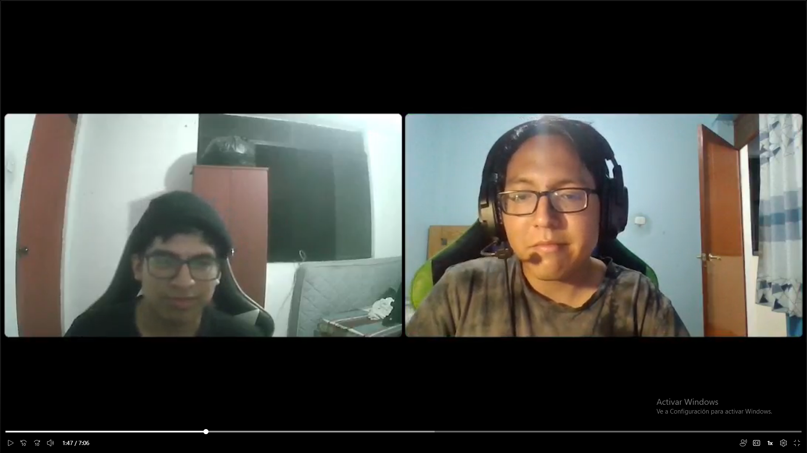
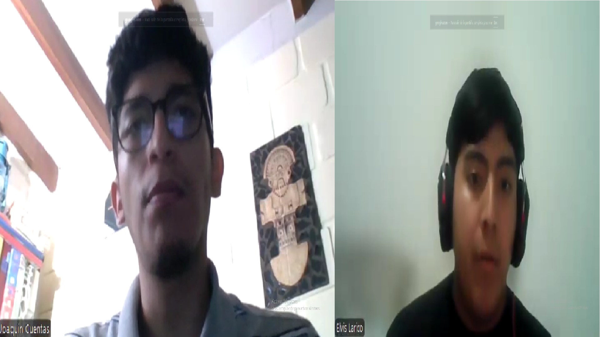

# PyschoMetric
<h3 align="center"> Universidad Peruana de Ciencias Aplicadas </h3>

<h3 align="center"> Ingeniería de Software </h3>
<h3 align="center"> Ciclo 2025 - 1 </h3>

 

 

    

 

<h3 align="center"> Desarrollo de Aplicaciones Open Source - 4341 </h3>
<h3 align="center"> Profesor del Curso: Juan Antonio Flores Moroco </h3>
<h3 align="center"> "INFORME DE TRABAJO FINAL"</h3>
<h3 align="center"> NOMBRE DE LA EMPRESA: PyschoHelp </h3>

<h3 align="center"> PRODUCTO: "PyschoMetric"</h3>

| 
Alumno
 | 
Código
 |
|:-------------------------------------------:|:-------------------------------------------:|
|                            |    
|              |                             |
|       Eric Marlon Olivera Barzola           |              U202315032                     |
|             |                 |                                 |
|                 |                         |

 Abril 2025 

<h3 align="center"> 2024 </h3>

## Registro de Versiones del Informe

## Project Report Collaboration Insights  

## Tabla de Contenidos

## Student Outcome

    
<h3>Capítulo I: Introducción </h3>
    
        <ul>
            <li><a href="#11-Startup-Profile">1.1. Startup Profile</a></li>
            <li><a href="#111-Descripción-de-la-Startup">1.1.1. Descripción de la Startup</a></li>
            <li><a href="#112-Perfiles-de-Integrantes-del-Equipo">1.1.2. Perfiles de Integrantes del Equipo</a></li>
            <li><a href="#12-Solution-Profile">1.2. Solution Profile</a></li>
            <li><a href="#121-Antecedentes-y-Problemática">1.2.1. Antecedentes y Problemática</a></li>
            <li><a href="#122-Lean-UX-Process">1.2.2. Lean UX Process</a></li>
            <li><a href="#1221-Lean-UX-Problem-Statements">1.2.2.1. Lean UX Problem Statements</a></li>
            <li><a href="#1222-Lean-UX-Assumptions">1.2.2.2. Lean UX Assumptions</a></li>
            <li><a href="#1223-Lean-UX-Hypothesis-Statements">1.2.2.3. Lean UX Hypothesis Statements</a></li>
            <li><a href="#1224-Lean-UX-Canvas">1.2.2.4. Lean UX Canvas</a></li>
            <li><a href="#13-Segmentos-Objetivos">1.3. Segmentos Objetivos</a></li>
        </ul>    

    
<h3>Capítulo II: Requirements Elicitation & Analysis</h3>

        <ul>
            <li><a href="#21-competidores">2.1. Competidores</a></li>
            <li><a href="#211-Análisis-competitivo">2.1.1. Análisis competitivo</a></li>
            <li><a href="#212-Estrategias-y-tácticas-frente-a-competidores">2.1.2. Estrategias y tácticas frente a competidores</a></li>
            <li><a href="#22-Entrevistas">2.2. Entrevistas</a></li>
            <li><a href="#221-Diseño-de-entrevistas">2.2.1. Diseño de entrevistas</a></li>
            <li><a href="#222-Registro-de-entrevistas">2.2.2. Registro de entrevistas</a></li>
            <li><a href="#223-Análisis-de-entrevistas">2.2.3. Análisis de entrevistas</a></li>
            <li><a href="#23-Needfinding">2.3. Needfinding</a></li>
            <li><a href="#231-User-Personas">2.3.1. User Personas</a></li>
            <li><a href="#232-User-Task-Matrix">2.3.2. User Task Matrix</a></li>
            <li><a href="#233-User-Journey-Mapping">2.3.3. User Journey Mapping</a></li>
            <li><a href="#234-Empathy-Mapping">2.3.4. Empathy Mapping</a></li>
            <li><a href="#235-As-is-Scenario-Mapping">2.3.5. As-is Scenario Mapping</a></li>
            <li><a href="#24-Ubiquitous-Language">2.4. Ubiquitous Language</a></li>
        </ul>   

    
<h3>Capítulo III: Requirements Specification </h3>

        <ul>
            <li><a href="#31-To-Be-Scenario-Mapping">3.1. To-Be Scenario Mapping</a></li>
            <li><a href="#32-User-Stories">3.2. User Stories</a></li>
            <li><a href="#33-Impact-Mapping">3.3. Impact Mapping</a></li>
            <li><a href="#34-Product-Backlog">3.4. Product Backlog</a></li>
        </ul>    

    
<h3>Capítulo IV: Product Design </h3>

        <ul>
            <li><a href="#41-Style-Guidelines">4.1. Style Guidelines</a></li>
            <li><a href="#411-General-Style-Guidelines">4.1.1. General Style Guidelines</a></li>
            <li><a href="#412-Web-Style-Guidelines">4.1.2. Web Style Guidelines</a></li>
            <li><a href="#42-Information-Architecture">4.2. Information Architecture</a></li>
            <li><a href="#421-Organization-Systems">4.2.1. Organization Systems</a></li>
            <li><a href="#422-Labeling-Systems">4.2.2. Labeling Systems</a></li>
            <li><a href="#423-SEO-Tags-and-Meta-Tags">4.2.3. SEO Tags and Meta Tags</a></li>
            <li><a href="#424-Searching-Systems">4.2.4. Searching Systems</a></li>
            <li><a href="#425-Navigation-Systems">4.2.5. Navigation Systems</a></li>
            <li><a href="#43-Landing-Page-UI-Design">4.3. Landing Page UI Design</a></li>
            <li><a href="#431-Landing-Page-Wireframe">4.3.1. Landing Page Wireframe</a></li>
            <li><a href="#432-Landing-Page-Mock-up">4.3.2. Landing Page Mock-up</a></li>
            <li><a href="#44-Web-Applications-UXUI-Design">4.4. Web Applications UX/UI Design</a></li>
            <li><a href="#441-Web-Applications-Wireframes">4.4.1. Web Applications Wireframes</a></li>
            <li><a href="#442-Web-Applications-Wireflow-Diagrams">4.4.2. Web Applications Wireflow Diagrams</a></li>
            <li><a href="#443-Web-Applications-Mock-ups">4.4.3. Web Applications Mock-ups</a></li>
            <li><a href="#444-Web-Applications-User-Flow-Diagrams">4.4.4. Web Applications User Flow Diagrams</a></li>
            <li><a href="#45-Web-Applications-Prototyping">4.5. Web Applications Prototyping</a></li>
            <li><a href="#46-Domain-Driven-Software-Architecture">4.6. Domain-Driven Software Architecture</a></li>
            <li><a href="#461-Software-Architecture-Context-Diagrams">4.6.1. Software Architecture Context Diagrams</a></li>
            <li><a href="#462-Software-Architecture-Container-Diagrams">4.6.2. Software Architecture Container Diagrams</a></li>
            <li><a href="#463-Software-Architecture-Components-Diagrams">4.6.3. Software Architecture Components Diagrams</a></li>
            <li><a href="#47-Software-Object-Oriented-Design">4.7. Software Object-Oriented Design</a></li>
            <li><a href="#471-Class-Diagrams">4.7.1. Class Diagrams</a></li>
            <li><a href="#472-Class-Dictionary">4.7.2. Class Dictionary</a></li>
            <li><a href="#48-Database-Design">4.8. Database Design</a></li>
            <li><a href="#481-Database-Diagram">4.8.1. Database Dagram</a></li>
        </ul>    

    
<h3>Capítulo V: Product Implementation, Validation & Deployment</h3> 

        <ul>
            <li><a href="#51-software-configuration-management">5.1. Software Configuration Management</a></li>
            <li><a href="#511-software-development-environment-configuration">5.1.1. Software Development Environment Configuration</a></li>
            <li><a href="#512-source-code-management">5.1.2. Source Code Management</a></li>
            <li><a href="#513-source-code-style-guide-conventions">5.1.3. Source Code Style Guide & Conventions</a></li>
            <li><a href="#514-software-deployment-configuration">5.1.4. Software Deployment Configuration</a></li>
            <li><a href="#52-landing-page-services-applications-implementation">5.2. Landing Page, Services & Applications Implementation</a></li>
            <li><a href="#521-sprint-1">5.2.1. Sprint 1</a></li>
            <li><a href="#5211-sprint-planning-1">5.2.1.1. Sprint Planning 1</a></li>
            <li><a href="#5212-aspect-leaders-and-collaborators">5.2.1.2. Aspect Leaders and Collaborators</a></li>
            <li><a href="#5213-sprint-backlog-1">5.2.1.3. Sprint Backlog 1</a></li>
            <li><a href="#5214-development-evidence-for-sprint-review">5.2.1.4. Development Evidence for Sprint Review</a></li>
            <li><a href="#5215-execution-evidence-for-sprint-review">5.2.1.5. Execution Evidence for Sprint Review</a></li>
            <li><a href="#5216-services-documentation-evidence-for-sprint-review">5.2.1.6. Services Documentation Evidence for Sprint Review</a></li>
            <li><a href="#5217-software-deployment-evidence-for-sprint-review">5.2.1.7. Software Deployment Evidence for Sprint Review</a></li>
            <li><a href="#5218-team-collaboration-insights-during-sprint">5.2.1.8. Team Collaboration Insights during Sprint</a></li>
        </ul>        

## Capítulo I: Introducción 

### 1.1. Startup Profile
#### 1.1.1. Descripción de la Startup
#### 1.1.2. Perfiles de Integrantes del Equipo
| Miembros del equipo                             | Codigo Estudiante | Descripcion            |
| ----------------------------------------------- | ----------------- | ---------------------- |
| Eric Marlon Olivera Barzola	   | U202315032            | Soy Eric Marlon Olivera Barzola, actualmente estoy cursando el quinto ciclo académico correspondiente. Mi experiencia me ha dotado de la capacidad para abordar tareas relacionadas con el diseño, programación y resolución de problemáticas en el ámbito del lenguaje de programación C++. Asimismo, estoy en proceso de adquirir conocimientos en C# y JavaScript. | 

#### 1.2.1. Antecedentes y Problemática (usando The 5W'S y 2 'H's)
**What (Qué)**
- ¿Cuál es el problema?
- ¿Cuál es la relación con la persona en cuestión?

**When (Cuando)**
- ¿Cuándo sucede el problema?
- ¿Cuándo utiliza el cliente el producto?

**Where (Dónde)**
- ¿Dónde está el cliente cuando usa el producto?
- ¿A dónde se dirige?
- ¿Dónde surge el problema?

## Capítulo II: Requirements Elicitation & Analysis

# 2.1.1. Análisis Competitivo

En esta sección identificamos los principales competidores directos con productos digitales similares.
### Competitive Analysis Landscape 

| Por qué llevar a cabo este análisis? | Este análisis es clave para entender el mercado, las necesidades de los usuarios y cómo Psychometric puede ofrecer soluciones innovadoras y efectivas para poder contrarrestar y mejorar el producto. |
|--------------------------------------|-----------------------------------------------------------------------------------------------------------------------------------------------------------------------------------|

| Características | PsychoHelp | Orientum | Edutest | Universia |
|-----------------|------------|----------|---------|-----------|
| **Perfil**      | **Overview:** PsychoHelp es una aplicación digital que ayuda a estudiantes de secundaria y primeros ciclos universitarios a descubrir su vocación profesional. | Plataforma especializada en orientación vocacional, dirigida a jóvenes que están por elegir carrera. | Ofrece test vocacionales interactivos y herramientas para explorar distintas opciones académicas. Está dirigido a estudiantes de último año de secundaria. | Portal web con test vocacionales gratuitos y contenidos informativos sobre carreras y universidades. Su enfoque está en estudiantes de secundaria. |
| **Ventaja competitiva** ¿Qué valor ofrece a los clientes? | PsychoHelp ofrece una experiencia completa y personalizada, combinando test vocacionales avanzados con asesoría profesional en vivo, lo que permite a los estudiantes tomar decisiones informadas con base en su perfil real y emocional. | Ofrece test vocacionales y asesoría personalizada para ayudar a los jóvenes a identificar la carrera que mejor se adapta a sus intereses. | Brinda test vocacionales interactivos y fáciles de usar para orientar a estudiantes en la elección de una carrera, de forma rápida y gratuita. | Proporciona herramientas vocacionales básicas y contenido informativo sobre universidades y programas académicos en distintos países. |
| **Overview**                 | Aplicación digital que ayuda a estudiantes de secundaria y primeros ciclos universitarios a descubrir su vocación profesional.             | Plataforma especializada en orientación vocacional, dirigida a jóvenes que están por elegir carrera. | Ofrece test vocacionales interactivos y herramientas para explorar distintas opciones académicas. | Portal web con test vocacionales gratuitos y contenidos informativos sobre carreras y universidades. |
| **Ventaja competitiva**      | Experiencia completa y personalizada, combinando test vocacionales avanzados con asesoría profesional en vivo.                            | Ofrece test vocacionales y asesoría personalizada.                                              | Brinda test vocacionales interactivos de forma rápida y gratuita.       | Herramientas vocacionales básicas y contenido informativo sobre universidades y programas académicos. |
| **Mercado objetivo**         | Estudiantes de secundaria y jóvenes universitarios en primeros ciclos con dudas sobre su carrera.                                          | Estudiantes de secundaria, bachillerato, padres y colegios.                                    | Jóvenes de secundaria y preuniversitarios que buscan conocer sus intereses. | Estudiantes de secundaria y universitarios, principalmente en países de habla hispana.                |
| **Estrategias de marketing** | Marketing de contenido, alianzas con colegios y universidades.                                                                             | Charlas y talleres en instituciones educativas, presencia en buscadores.                       | Estrategia freemium, correos y boletines informativos.                  | Alianzas con universidades, contenido web gratuito.                                      |
| **Precios & Costos**         | Freemium: test básico gratuito. Informe detallado: S/ 30 – S/ 50. Sesión con psicólogo: S/ 70 – S/ 100.                                     | Test y asesoría personalizada: S/ 50 – S/ 150.                                                  | Acceso pago: S/ 30 – S/ 50.                                            | Totalmente gratis; financiado por alianzas con universidades y patrocinadores.          |
| **Productos & Servicios**    | Test psicométricos, informes personalizados, recomendaciones de carreras, sesiones con psicólogos.                                         | Test vocacionales psicométricos y asesoría personalizada.                                      | Test vocacionales interactivos con informes detallados de pago.        | Test vocacional gratuito, buscador de carreras, artículos y blogs sobre orientación.     |
| **Canales de distribución**  | Integración en plataformas educativas, plataforma web y aplicación móvil.                                                                  | Plataforma web con agendamiento de sesiones.                                                   | Plataforma web para acceso a tests.                                    | Web y app móvil para facilitar acceso.                                                   |
  | **Fortalezas** | Combina tecnología con atención humana personalizada y una plataforma flexible, desde cualquier lugar. | Ofrece orientación personalizada con psicólogos profesionales, brindando un enfoque más humano y confiable a los usuarios. | Su modelo permite atraer a muchos estudiantes, ofreciendo acceso gratuito a tests básicos. | Cuenta con una sólida red de universidades y amplia presencia en países hispanohablantes. |
| **Debilidades**| Necesita inversión constante en marketing y captación de usuarios. | El modelo de pago limita el acceso a estudiantes con pocos recursos. | No ofrece asesoría profesional, lo que limita su valor agregado. | El test vocacional es básico y carece de personalización. |
| **Oportunidades**| Alta demanda de orientación vocacional entre jóvenes. | Puede expandir su presencia digital y llegar a más estudiantes mediante plataformas en línea. | Integrar servicios de orientación personalizada para diferenciarse de otras plataformas. | Refuerza su servicio vocacional con más tecnología para atraer a una audiencia más joven. |
| **Amenazas**   | Competencia con plataformas consolidadas y gratuitas como Universia y Edutest. | La competencia de plataformas gratuitas puede reducir su cuota de mercado. | La falta de seguimiento humano puede llevar a que los usuarios busquen alternativas más completas. | Startups más especializadas pueden ofrecer servicios más personalizados y dinámicos. |

# 2.1.2. Estrategias y Tácticas frente a Competidores

Estas son las principales estrategias que aplicará **PsychoHelp**:

- Ofrecer orientación personalizada y humana combinada con test psicométricos avanzados.
- Ofrecer una versión básica gratuita con opciones de pago para resultados más detallados y servicios adicionales.
- Establecer alianzas con colegios, universidades y centros educativos para integrar **PsychoHelp** como herramienta oficial de orientación vocacional.
- Desarrollar una app móvil atractiva y fácil de usar, optimizada para el público joven.
- Proponer test vocacionales basados en psicometría confiable, más allá de simples cuestionarios de personalidad.

# 2.2. Entrevistas

## 2.2.1. Diseño de Entrevistas

### Preguntas para estudiantes de últimos años de colegio (4to y 5to de secundaria)

1. ¿Has pensado qué carrera te gustaría seguir después del colegio? ¿Por qué?
2. ¿Cuál es tu mayor motivación al pensar en tu futuro? ¿Y tu mayor miedo?
3. ¿Qué tan seguro/a te sientes sobre tu elección profesional?
4. ¿Has hecho alguna vez un test vocacional? ¿Cómo fue tu experiencia?
5. ¿A quién acudes cuando necesitas orientación sobre tu futuro académico?
6. ¿Qué tipo de herramientas digitales usas con frecuencia (apps, redes, plataformas educativas)?
7. ¿Qué características valoras en una plataforma que te ayude a elegir tu carrera?
8. ¿Qué te frustra o preocupa al pensar en tu futuro profesional?
9. ¿Cómo te gustaría que te ayuden a descubrir tu vocación? ¿Qué formato prefieres?

### Preguntas para Psicólogos y Consejeros Vocacionales Certificados

1. ¿Cuánto tiempo llevas trabajando en orientación vocacional?
2. ¿Qué tipo de estudiantes atiendes con más frecuencia? ¿Edad, nivel educativo?
3. ¿Cómo es el proceso que sigues para orientar a un estudiante?
4. ¿Qué herramientas digitales usas actualmente en tus sesiones?
5. ¿Qué tipo de dificultades encuentras al orientar a jóvenes?
6. ¿Qué aspectos consideras esenciales en un test vocacional?
7. ¿Qué tan abierto estás a colaborar con plataformas digitales de orientación?
8. ¿Qué te parecería tener una app que te conecte directamente con estudiantes?
9. ¿Qué necesitarías para confiar en una plataforma como **PsychoHelp**?

### 2.2.2. Registro de entrevistas
#### Segmento 1:Jóvenes estudiantes de 15 - 19 años ####

- Entrevista N°1: Adrian Valera
- Sexo: Masculino
- Edad: 17 años

- Ubicación en la que vive olivos, Lima, Perú

#### Entrevista: ####
link: https://upcedupe-my.sharepoint.com/:v:/g/personal/u202314304_upc_edu_pe/EbkmdeLghNhGjq4V5uYy5esBiOXestT9hokV-ZV7bz5WRg?e=URfcjB&nav=eyJyZWZlcnJhbEluZm8iOnsicmVmZXJyYWxBcHAiOiJTdHJlYW1XZWJBcHAiLCJyZWZlcnJhbFZpZXciOiJTaGFyZURpYWxvZy1MaW5rIiwicmVmZXJyYWxBcHBQbGF0Zm9ybSI6IldlYiIsInJlZmVycmFsTW9kZSI6InZpZXcifX0%3D

- Momento en el que inicia: 0:02

- Duración: 7:07

**Resumen:**
Adrián es un joven que actualmente cursa el quinto año de secundaria en el colegio Trilce, sede Los Olivos. Nos comparte que, aunque todavía no ha decidido con claridad qué carrera le gustaría seguir, una de las opciones que más le atrae es Psicología, ya que considera que es una profesión interesante y, en sus palabras, "bastante tranquila".
Además, Adrián nos comentó que en alguna ocasión realizó un test vocacional con el acompañamiento de un psicólogo, sin embargo, la experiencia no resultó tan útil o reveladora como él esperaba. A pesar de ello, mantiene la curiosidad y apertura por seguir explorando su vocación.
En ese sentido, está dispuesto a probar nuevas alternativas y le parece una idea interesante la posibilidad de realizar un test vocacional en línea, siempre y cuando exista la guía de un profesional que pueda orientarlo adecuadamente durante el proceso. Considera que contar con una plataforma digital o aplicación que combine tecnología con asesoramiento humano sería una buena forma de ayudar a estudiantes como él a descubrir una carrera que realmente se ajuste a sus intereses y personalidad.

- Entrevista N°2: Elvis Larico
- Sexo: Masculino
- Edad: 17 años
- Ubicación en la que vive magdalena, Lima, Perú

#### Entrevista: ####
link: https://upcedupe-my.sharepoint.com/:v:/g/personal/u202314304_upc_edu_pe/EbkmdeLghNhGjq4V5uYy5esBiOXestT9hokV-ZV7bz5WRg?e=URfcjB&nav=eyJyZWZlcnJhbEluZm8iOnsicmVmZXJyYWxBcHAiOiJTdHJlYW1XZWJBcHAiLCJyZWZlcnJhbFZpZXciOiJTaGFyZURpYWxvZy1MaW5rIiwicmVmZXJyYWxBcHBQbGF0Zm9ybSI6IldlYiIsInJlZmVycmFsTW9kZSI6InZpZXcifX0%3D
- Momento en el que inicia: 0:00
- Duración: 6:08
  
**Resumen:**
Nuestro entrevistado, quien actualmente cursa el 5to grado de secundaria, nos comentó que siente un marcado interés por la carrera de Matemáticas Puras, aunque aún presenta cierta ambivalencia respecto a otras opciones profesionales, ya que no ha tomado una decisión definitiva.
Durante la conversación, mencionó que los test vocacionales que ha realizado hasta el momento han sido ofrecidos únicamente por su colegio y que, lamentablemente, no han contado con un seguimiento personalizado por parte de un psicólogo, lo que ha dificultado obtener resultados más claros y confiables.
Por otro lado, resaltó que sus padres le brindan flexibilidad al momento de elegir su futura carrera, ya que su principal consejo es que tome una decisión libre y sin presiones, buscando siempre lo que lo haga sentir realizado.
Además, expresó su interés en probar una plataforma digital que no solo ofrezca test vocacionales, sino que también proporcione un acompañamiento continuo, algo que hasta ahora siente que ha faltado en su proceso de orientación. Señaló que, al contar con este tipo de ayuda, sentiría mayor seguridad en su elección de carrera.
Finalmente, manifestó que estaría totalmente dispuesto a contactar con un psicólogo a través de la plataforma, ya que considera que el seguimiento profesional es clave para asegurarse de elegir una carrera que realmente se ajuste a sus intereses y habilidades.

**Entrevista N°3: Alejandro Bravo**
- Sexo: Masculino
- Edad: 17 años
- Ubicación en la que vive   San miguel, Lima, Perú
  

#### Entrevista: #####
link: https://upcedupe-my.sharepoint.com/:v:/g/personal/u202314304_upc_edu_pe/EbkmdeLghNhGjq4V5uYy5esBiOXestT9hokV-ZV7bz5WRg?e=URfcjB&nav=eyJyZWZlcnJhbEluZm8iOnsicmVmZXJyYWxBcHAiOiJTdHJlYW1XZWJBcHAiLCJyZWZlcnJhbFZpZXciOiJTaGFyZURpYWxvZy1MaW5rIiwicmVmZXJyYWxBcHBQbGF0Zm9ybSI6IldlYiIsInJlZmVycmFsTW9kZSI6InZpZXcifX0%3D

- Momento en el que inicia: 0:00
- Duración: 4:56
  
**Resumen:**
En esta oportunidad, se entrevistó a Alejandro Bravo Castillo, un estudiante que está próximo a culminar su grado de secundaria. Durante la conversación, Alandro compartió que ya ha pensado en su futura carrera profesional y se siente bastante atraído por el mundo del Derecho, ya que le interesa mucho todo lo relacionado con las leyes y sueña con convertirse en abogado.
Al preguntarle sobre sus motivaciones y temores, Alandro comentó que su mayor motivación es poder construir un futuro aprendiendo sobre una carrera que le apasione. Sin embargo, también reconoció que su mayor miedo es cometer errores en el camino, aunque entiende que es algo natural en cualquier proceso de aprendizaje.
Respecto a la seguridad sobre su elección, mencionó que se siente seguro por ahora, aunque es consciente de que solo al iniciar la carrera podrá confirmar si realmente es lo que le gusta. Cuando necesita orientación o apoyo sobre su futuro académico, suele acudir principalmente a sus padres, su abuela y en ocasiones también a sus amigos para conocer sus opiniones.
Finalmente, mencionó que acceder a una videollamada con un psicólogo sería algo sencillo para él, ya que considera que es una opción práctica, cómoda y accesible desde cualquier lugar, sin necesidad de salir de casa.

#### Segmento 2:Psicólogos enfocados en orientación vocacional ####

**Entrevista N°1: MarCielo Rugel**
- Sexo: Femenino
- Edad: 23 años
- Ubicación en la que vive olivos, Lima, Perú
  

#### Entrevista: ####

link:https://upcedupe-my.sharepoint.com/:v:/g/personal/u202314304_upc_edu_pe/EcVMA4GvuX5PiYD6y-ZQDQoBMpOEFHInTl34d-NKVHWzAA?e=Xkc9TW
- Momento en el que inicia: 0:00
- Duración: 7:49
  
**Resumen:**
Maricielo es licenciada en Psicología y cuenta con experiencia trabajando en el área de orientación vocacional para estudiantes. Actualmente, se desempeña en el sector de Recursos Humanos, pero conserva un fuerte interés por los procesos de acompañamiento a jóvenes que están en búsqueda de su vocación.
Durante nuestra conversación, Maricielo nos compartió información valiosa sobre cómo se orienta a los estudiantes que aún no han iniciado un proceso vocacional o que no están familiarizados con los test vocacionales. Nos explicó detalladamente el paso a paso que debería seguir un estudiante para realizar un test vocacional de manera adecuada, desde la preparación previa hasta la interpretación de resultados con apoyo profesional.
Además, resaltó que una plataforma vocacional debería contar con un sistema de comunicación rápido y eficaz entre el estudiante y el orientador, para garantizar una mejor conexión y acompañamiento personalizado. También hizo énfasis en que, para generar confianza en el producto, sería fundamental implementar un sistema de filtrado o validación de profesionales, que asegure que quienes orientan a los estudiantes cuenten con la preparación y experiencia necesarias.
Su perspectiva refuerza la importancia de unir la tecnología con un enfoque humano y profesional para ofrecer una experiencia vocacional confiable, útil y accesible.

**Entrevista N°2:  Antonella Rugel**
- Sexo: Femenino
- Edad: 28 años
- Ubicación en la que vive olivos, Lima, Perú

#### Entrevista: ####

link:https://upcedupe-my.sharepoint.com/:v:/g/personal/u202314304_upc_edu_pe/EfgU6lkVBSdAu4djjhTMSGABFNyjN-QAbxvux7EK8lC03w?e=HzHUxX&nav=eyJyZWZlcnJhbEluZm8iOnsicmVmZXJyYWxBcHAiOiJTdHJlYW1XZWJBcHAiLCJyZWZlcnJhbFZpZXciOiJTaGFyZURpYWxvZy1MaW5rIiwicmVmZXJyYWxBcHBQbGF0Zm9ybSI6IldlYiIsInJlZmVycmFsTW9kZSI6InZpZXcifX0%3D
- Momento en el que inicia: 0:00
-Duración: 7:49

**Resumen:**
Antonella Rugel es licenciada en Psicología y actualmente se desempeña en el área de salud psicológica. Cuenta con más de tres años de experiencia brindando orientación a jóvenes en la búsqueda de su vocación, utilizando herramientas como los test de Holland y Kuder.
Sin embargo, Antonella nos comentó que, a pesar de ser herramientas útiles, estos test presentan una limitación importante: no incluyen todas las carreras que existen actualmente, lo que puede restringir las opciones para los estudiantes y limitar su visión sobre el amplio abanico de posibilidades profesionales.
Durante su experiencia, ha observado que las carreras que los jóvenes suelen descartar con mayor frecuencia son las relacionadas con humanidades, así como algunas otras que, en muchos casos, no cuentan con la aprobación o respaldo de sus padres. En contraste, las carreras que suelen tener más interés y demanda son aquellas vinculadas a las ingenierías, la medicina y la arquitectura, debido a su prestigio social y las expectativas familiares.
Antonella también resaltó la importancia del rol que cumplen los padres en este proceso, ya que, en varias situaciones, no solo se orienta al estudiante, sino que también se trabaja con la familia para que exista un entendimiento y acompañamiento adecuado.En algunos casos la desinformación de los jóvenes puede ser muy preocupante para los psicólogos al evaluarlos.

**Entrevista N°3  Juan Requejo**
- Sexo: Másculino
- Edad: 24 años
- Ubicación en la que vive: Pueblo Libre, Lima, Perú

#### Entrevista: ####
- link: https://youtu.be/IuQXwxSmHgA 
- Momento en el que inicia: 0:00
- Duración: 3:39

**Resumen:**
El psicólogo Juan Requejo  entrevistado tiene 2 años de experiencia en orientación vocacional, trabajando con jóvenes de 15 a 20 años que suelen estar en sus últimos años de secundaria o en los primeros ciclos universitarios.El proceso que sigue empieza con una entrevista inicial, luego aplica pruebas psicométricas, conversa los resultados y termina elaborando un plan de acción personalizado.
Actualmente usa Google Meet, Zoom y formularios online, aunque considera que estas herramientas están muy dispersas y sería mejor tener todo en una plataforma integrada.
Considera que un buen test vocacional debe ser científicamente valido,visualmente claro y atractivo, relacion de  los resultados con carreras y opciones reales y adaptable a diferentes edades y con análisis cualitativo.
Está muy a favor de usar plataformas digitales y considera que una app que conecte psicólogos con estudiantes sería ideal para facilitar todo el proceso. Para confiar en una plataforma como Psycho Hell pide que tenga respaldo ético y profesional,tests integrados y confiables,confidencialidad garantizada,un servicio premium que ofrezca valor real.

 ### 2.2.3. Análisis de entrevista
 **Segmento 1:Jóvenes estudiantes de 15 - 19 años**
 **Entrevista 1:** Adrian Valera
**Análisis de la entrevista:** Adrián nos comentó que le gustaría contar con una plataforma de orientación vocacional, siempre y cuando esta cuente con certificaciones oficiales y ofrezca una guía personalizada durante todo el proceso. Además, señaló que los test vocacionales en formato físico que ha realizado anteriormente no le han resultado útiles ni satisfactorios, por lo que considera que una plataforma bien estructurada y acompañada por profesionales podría brindarle mayor confianza y mejores resultados.

 **Entrevista 2: Elvis Liraco**
 **Análisis de la entrevista:**  Elvis nos comento que estaria dispuesto a intentar usar la plataforma en un futuro ya que los test que le realizaban eran muy generales siempre y cuando tenga la seguridad que sean confiables 

 **Entrevista 3: Alejandro bravo**
**Análisis de la entrevista:** Alejandro bravo nos comento que uno de sus mayores temores seria al equivocarse de carrera aunque le guste mucho la carrera de derecho tiene miedo de dejarlo tambien nos comentó que estaria dispuesto a entablar un seguimiento de test vocacional con un psicólogo de guia a traves de la plataforma.
Gráficos Complementarios al análisis

**Segmento 2:Psicólogos enfocados en orientación vocacional**

**Entrevista 1:  Maricielo Rugel**
**Análisis de la entrevista:** Maricielo destaca la importancia de combinar herramientas digitales con acompañamiento profesional en los procesos de orientación vocacional. Subraya que la confianza del estudiante depende tanto de la calidad del seguimiento humano como de un sistema seguro y validado, lo que confirma la necesidad de plataformas que integren tecnología con respaldo ético y profesional.
 **Entrevista 2: Antonella Rugel**
 **Análisis de la entrevista:** El testimonio de Antonella Rugel resalta la importancia de contar con acompañamiento constante y profesional durante la orientación vocacional. Subraya que la falta de seguimiento y la poca personalización en los test tradicionales afectan la confianza del estudiante, lo que refuerza la necesidad de crear plataformas que integren soporte humano y tecnología confiable para guiar de forma efectiva a los jóvenes en su elección de carrera.
 **Entrevista 3: Juan Requejo**
 **Análisis de la entrevista:** El testimonio de Juan Requejo evidencia que muchos jóvenes enfrentan inseguridad y desinformación al momento de elegir una carrera, especialmente cuando no reciben un acompañamiento adecuado. Su experiencia resalta la importancia de que las plataformas vocacionales combinen herramientas digitales confiables con orientación profesional personalizada, facilitando así decisiones más claras y seguras para los estudiantes.
Gráficos Complementarios al análisis

## 2.3. Needfinding

#### 2.3.1. User Personas
Los User personas se realizaron en base a las distintas personas que entrevistamos según nuestros segmentos objetivos.
**Estudiante de 4to año de secundaria:**

**Psicólogo certificado:**

#### 2.3.2. User Task Matrix
En esta sección vamos a detallar las tareas que realizan los diferentes segmentos de usuarios representados por los User Personas de PsychoHealth.
**Estudiante de 4to año de secundaria: Enrique Gonzalo**

| Actividades                                         | Frecuencia     | Importancia |
|-----------------------------------------------------|----------------|-------------|
| Realizar un test vocacional interactivo             | Frecuentemente | Alta        |
| Obtener recomendaciones de carreras y programas     | Ocasionalmente | Alta        |
| Ver universidades compatibles con su perfil         | Frecuentemente | Media       |
| Ver experiencias o testimonios de otros estudiantes | Ocasionalmente | Media       |
| Pedir recomendaciones a vecinos o conocidos         | Rara vez       | Baja        |

**Psicólogo certificado: Luiz Ramirez**

| Actividades                                                | Frecuencia     | Importancia |
|------------------------------------------------------------|----------------|-------------|
| Buscar electricistas certificados                          | Frecuentemente | Alta        |
| Agendar mantenimientos preventivos para el hogar           | Ocasionalmente | Alta        |
| Comparar calificaciones de proveedores                     | Frecuentemente | Media       |
| Buscar soluciones que ahorren energía en el hogar          | Ocasionalmente | Media       |
| Pedir recomendaciones a vecinos o conocidos                | Rara vez       | Media       |

#### 2.3.3. User Journey Mapping

**USER PERSONA: Enrique Gonzalo**

Enrique Gonzales atraviesa un camino marcado por la incertidumbre y la presión, con decisiones que percibe como determinantes para su futuro pero con muy poca orientación personalizada. Aunque intenta buscar ayuda en internet, en su entorno o en charlas del colegio, su experiencia es confusa, genérica y poco útil.
Sus mayores frustraciones están en:

    * La sobrecarga de información sin una guía clara para filtrar opciones.

    * La falta de autoconocimiento sobre sus fortalezas, intereses y talentos.

    * La presión externa de padres y entorno que opacan su propio criterio.

    * La ausencia de herramientas accesibles que le ayuden a tomar decisiones de forma objetiva y emocionalmente segura.

A pesar de esto, Valeria tiene una actitud abierta al aprendizaje, interés en construir su camino y una necesidad genuina de orientación. Esto la convierte en una usuaria ideal para una solución como PsychoHelp

**USER PERSONA: Luis Ramirez**

Luis transita un recorrido profesional donde su vocación de ayudar está limitada por los medios tradicionales con los que trabaja. Aunque tiene formación, experiencia y motivación, su impacto es reducido por tareas administrativas y tecnológicas que lo sobrecargan.
Sus mayores frustraciones están en:
La dificultad para llegar a nuevos pacientes, especialmente jóvenes.

    * Los procesos manuales y poco escalables para agendar, evaluar y cobrar.

    * La falta de una plataforma profesional que centralice sus funciones.

    * La sensación de estar desperdiciando tiempo valioso en lo no clínico.

Aun así, Luis tiene disposición, habilidades y un alto compromiso con su labor como orientador vocacional. Esto lo convierte en un aliado ideal para PsychoHelp.

#### 2.3.4. Empathy Mapping

**USER PERSONA: Enrique Gonzalo**

**USER PERSONA: Luis Ramirez**

### 2.3.5. As-is Scenario Mapping

**USER PERSONA: Enrique Gonzalo**

Enrique atraviesa un proceso emocionalmente abrumador y poco estructurado. La sobrecarga de información, la presión externa y la falta de autoconocimiento lo llevan a decisiones inseguras y apresuradas. Su necesidad de orientación personalizada y confiable es urgente, convirtiéndo en un usuario ideal para una solución como PsychoHelp que lo guíe con claridad y empatía.

**USER PERSONA: Luis Ramirez**

Luis trabaja con compromiso, pero se enfrenta a procesos manuales, herramientas poco eficientes y limitaciones para escalar su impacto. Esto afecta su motivación y profesionalismo. Una plataforma como PsychoHelp representaría una oportunidad clave para optimizar su práctica, ampliar su alcance y ofrecer un servicio vocacional de mayor calidad y eficiencia.

## 2.4. Ubiquitous Language

| Término en inglés           | Término en español          | Definición                                                                                                           |
|----------------------------|-----------------------------|----------------------------------------------------------------------------------------------------------------------|
| Career Doubt               | Orientación vocacional      | Estado de confusión o inseguridad que siente un estudiante al no tener claridad sobre qué profesión desea seguir.   |
| Premium Subscription       | Suscripción premium         | Plan de pago que permite al usuario acceder a tests avanzados, reportes personalizados y sesiones privadas.         |
| Psychometric Profile       | Perfil psicométrico         | Informe que resume los rasgos psicológicos, habilidades cognitivas y tendencias conductuales de un estudiante.      |
| Vocational Test            | Test vocacional             | Evaluación psicométrica diseñada para identificar intereses, aptitudes y rasgos de personalidad del estudiante.     |
| Career Compatibility       | Compatibilidad vocacional   | Nivel de alineación entre los intereses, habilidades y personalidad del estudiante con determinadas carreras.       |
| Vocational Report          | Informe vocacional          | Documento detallado en PDF con sugerencias de carrera tras una evaluación o sesión de orientación.                  |
| Career Guidance            | Orientación vocacional      | Apoyo personalizado para ayudar a los estudiantes a explorar y decidir su camino académico o profesional.           |

## Capítulo III: Requirements Specification
### 3.1. To-Be Scenario Mapping

El mapeo de escenarios "To-Be" nos permite visualizar cómo será el proceso o flujo de trabajo deseado en el futuro después de implementar las mejoras propuestas. 

**USER PERSONA: Enrique Gonzalo**

Enrique atraviesa un proceso más claro, guiado y confiable para decidir su futuro académico. Gracias a la suscripción premium, accede a tests avanzados, reportes detallados y sesiones con especialistas. Además, adquiere un informe vocacional personalizado que le ofrece una visión integral de su perfil y recomendaciones de universidades. El proceso le genera alivio, seguridad y motivación, ayudándole a tomar decisiones informadas y alineadas a sus intereses.

**USER PERSONA: Luis Ramirez**

Luis se incorpora a PsychoHelp como profesional verificado, gestionando su disponibilidad y tarifas. Brinda orientación vocacional apoyado por reportes psicométricos y recibe pagos directos por sus sesiones, lo que le permite obtener ingresos adicionales y ganar visibilidad profesional. Se siente satisfecho, valorado y reconocido, convirtiendo a la plataforma en una herramienta de crecimiento personal y económico.

### 3.2. User Stories
### 3.3. Impact Mapping
Impact Mapping nos ayudará a visualizar y planificar cómo nuestro proyecto puede generar un impacto significativo en nuestros usuarios y en nuestro objetivo final. 
### 3.4. Product Backlog

## Capítulo IV: Product Design
### 4.1. Style Guidelines
#### 4.1.1. General Style Guidelines
#### 4.1.2. Web Style Guidelines
### 4.2. Information Architecture
#### 4.2.1. Organization Systems
#### 4.2.2. Labeling Systems
#### 4.2.3. SEO Tags and Meta Tags
#### 4.2.4. Searching Systems
#### 4.2.5. Navigation Systems
### 4.3. Landing Page UI Design
#### 4.3.1. Landing Page Wireframe

#### 4.3.2. Landing Page Mock-up
### 4.4. Web Applications UX/UI Design
#### 4.4.1. Web Applications Wireframes
**LOGIN**

**REGISTRO**

**PERFIL DE ESTUDIANTE**

**PERFIL DE PSICÓLOGO**

**INTERFAZ DE TESTS**

**PÁGINA DE PLANES Y SUSCRIPCIÓN**

**BUSQUEDA DE PSICÓLOGOS**

**PÁGINA DE SELECCIÓN DE TESTS**

**PANEL DE ESTUDIANTE**

**PANELL DE PSICÓLOGO**

#### 4.4.2. Web Applications Wireflow Diagrams
#### 4.4.3. Web Applications Mock-ups
#### 4.4.4. Web Applications User Flow Diagrams
### 4.5. Web Applications Prototyping
### 4.6. Domain-Driven Software Architecture
#### 4.6.1. Software Architecture Context Diagrams

#### 4.6.2. Software Architecture Container Diagrams

#### 4.6.3. Software Architecture Components Diagrams

**Diagrama de Componentes - User Management Bounded Context**

**Diagrama de Componentes - Messaging Management Bounded Context**

### 4.7. Software Object-Oriented Design
#### 4.7.1. Class Diagrams
#### 4.7.2. Class Dictionary
### 4.8. Database Design
#### 4.8.1. Database Diagram

